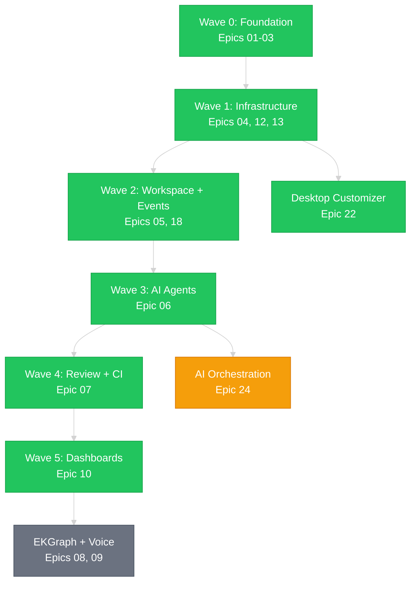

# Project Roadmap
{: .no_toc }

RobOS is under heavy active development. This is an early-stage project with an ambitious vision — what you see today is the foundation, and there's a mountain of work ahead. New epics are being added weekly.
{: .fs-6 .fw-300 }

{: .warning }
> **Early Stage.** RobOS is pre-1.0 software. Apps are functional but rough around the edges. APIs will change. Things will break. If that excites you rather than scares you, you're in the right place.

## Table of contents
{: .no_toc .text-delta }

1. TOC
{:toc}

---

## Current Status: v0.0.4

**24 epics planned.** 40+ Electron apps built. 440+ tests passing. Installer shipping for Linux, macOS, and Windows. Moving fast.

| Metric | Count |
|:-------|:------|
| Epics total | 24 |
| Epics complete | 14 |
| Epics in progress | 4 |
| Epics planned | 6 |
| Electron apps | 40+ |
| Unit tests | 440+ |
| E2E test suites | 22 |

---

## MVP — Model Problem End-to-End

The MVP goal: a developer picks up a story and drives it from backlog to deployed, with every status transition, notification, and dashboard update happening automatically.

### Wave 0: Foundation (Complete)

| # | Epic | Stories | Status |
|:--|:-----|:--------|:-------|
| 01 | Desktop Foundation | 8 | **Complete** |
| 02 | App Framework | 7 | **Complete** |
| 03 | Dev Tools | 5 | **Complete** |

VM build system, cloud-init provisioning, GNOME theme, Electron runtime, app launcher, shared libraries, icon registry, Claude Code slash commands, and deploy pipeline.

### Wave 1: Core Infrastructure (Complete)

| # | Epic | Stories | Status |
|:--|:-----|:--------|:-------|
| 13 | Security & Auth | 4 | **Complete** |
| 04 | Task Management | 8 | **Complete** |
| 12 | System Services | 7 | **Complete** |

Security Setup (GPG/SSH keys), Pass Manager, Task Servers (Jira/GitHub), Workflow Studio, Task Board, Desktop Manager, Toast Daemon, Notifications, CLI tools.

### Wave 2: Workspace & Events (Complete)

| # | Epic | Stories | Status |
|:--|:-----|:--------|:-------|
| 05 | Workspace Management | 6 | **Complete** |
| 18 | Event Engine | 6 | **Complete** |

Workspace auto-provisioning, Event Bus, Rule Engine, Action Registry, Agent Scheduler.

### Wave 3: AI Agents (Complete)

| # | Epic | Stories | Status |
|:--|:-----|:--------|:-------|
| 06 | AI Agent Integration | 8 | **Complete** |

Agent session manager, Claude Code integration, Context Manager, AI Questionnaire, Draft, Quiz, and Review-Fix stages.

### Wave 4: Code Review & CI (Complete)

| # | Epic | Stories | Status |
|:--|:-----|:--------|:-------|
| 07 | Code Review & CI/CD | 6 | **Complete** |

PR Review Board (AI summary, breakpoint review), CI Monitor, Stage Demo Viewer.

### Wave 5: Dashboards & Reporting (Complete)

| # | Epic | Stories | Status |
|:--|:-----|:--------|:-------|
| 10 | Management & Reporting | 4 | **Complete** |

Dev Central, Manager Dashboard, Report Builder, Deploy Tracker.

---

## Platform Epics (Complete / In Progress)

| # | Epic | Stories | Status |
|:--|:-----|:--------|:-------|
| 15 | MCP Servers | 11 | **Complete** |
| 16 | Test Framework | 8 | **Complete** |
| 17 | Work Journal | 9 | **Complete** |
| 20 | Deep Test Coverage | 8 | **In Progress** |
| 21 | GitHub Pages Docs | 6 | **Complete** |
| 22 | Desktop Customizer | 10 | **Complete** |
| 23 | Release Pipeline & Versioning | 5 | **Complete** |

---

## Next Up

### Epic 24: AI Agent Orchestration (65 pts, 12 stories)

The big one. Inspired by [gstack](https://github.com/garrytan/gstack) and [Paperclip](https://github.com/paperclipai/paperclip). Multi-agent teams with role specialization (architect, implementer, reviewer, tester), org charts, budget controls, human approval gates, and a live Agent Command Center dashboard. Run an entire sprint autonomously with 5 agents working 5 stories in parallel.

| Story | Points |
|:------|:-------|
| Agent Role system | 5 |
| Org Chart with delegation | 5 |
| Parallel agent execution | 8 |
| Budget system (per-sprint/task/agent) | 5 |
| Human approval gates | 5 |
| Agent Command Center app | 8 |
| Role templates (gstack-style presets) | 3 |
| Multi-provider (Claude, Copilot, Codex, Gemini, Ollama) | 5 |
| Sprint automation | 8 |
| Agent memory and context handoff | 5 |
| Marketplace (downloadable team templates) | 5 |
| Event Bus integration | 3 |

---

## Future Epics

| # | Epic | Description | Status |
|:--|:-----|:------------|:-------|
| 08 | EKGraph | Enterprise knowledge graph — structured company wiki with AI indexing, search, and cross-linking | Not started |
| 09 | Voice Input | Local STT engine (Whisper/Vosk), push-to-talk, voice-to-text in any AI textarea | Not started |
| 11 | Release Packaging | Automated full VM build, OVA/qcow2 cloud export, RobOS update mechanism | Not started |
| 14 | Developer Experience | robos-ui shared Web Components library, IntelliJ plugin, People Directory | Not started |
| 19 | OAuth Providers | OAuth 2.0 provider support for Jira, GitHub, GitLab, Linear | Not started |

---

## Content & Community Roadmap

Beyond code, there's a content plan to make RobOS accessible:

### YouTube Demo Series

Individual video walkthroughs of every RobOS Electron app — what it does, how it works, and how it fits into the SDLC workflow. Subscribe on the [RobOS YouTube channel](https://www.youtube.com/@RobOS-e5i).

| Video | Status |
|:------|:-------|
| [Git Login Manager — the silent safety net for your git credentials](https://youtube.com/shorts/vO7pY9c_b2Q) | **Published** |
| [Stage Demo Viewer — AI walkthroughs of every merged PR](https://youtu.be/n3TUdYDd5e4) | **Published** |
| [Report Builder — AI-generated sprint reports in plain English](https://youtu.be/jzUt2vsZ5-I) | **Published** |
| [Deploy Tracker — timeline, frequency, and MTTR in one view](https://www.youtube.com/watch?v=-X5xDypHatQ) | **Published** |
| [Context Manager — ground every AI agent in what your team knows](https://youtu.be/w5HmwQvfBPE) | **Published** |
| [Task Servers — one config for GitHub, Jira, and Linear](https://youtu.be/vyMGbo_-qk0) | **Published** |
| [Workflow Studio — design ticket workflows in plain English](https://youtu.be/gqRYI6ja-q8) | **Published** |
| [Pass Manager — GPG-encrypted secrets in a GUI](https://youtu.be/RhVt-ch2rIA) | **Published** |
| [Desktop Customizer — reshape GNOME in plain English](https://youtu.be/P8dPsploaks) | **Published** |
| [Manager Dashboard — sprint metrics, velocity, and deploy frequency](https://www.youtube.com/watch?v=RgMbLzuV9rY) | **Published** |
| [Automation Studio — event-driven rules and scheduled jobs](https://youtu.be/XCpE7CDKDqk) | **Published** |
| [AI Agent Manager — one console for Claude, Copilot, and every agent](https://youtu.be/fomJ99guQY8) | **Published** |
| [Workspace Manager — every project, every IDE, one click away](https://youtu.be/TZvC7Ii6nPg) | **Published** |
| [Dev Central — your daily developer dashboard](https://youtu.be/vs6Grzfd074) | **Published** |
| [CI Monitor — AI-diagnosed pipeline failures](https://youtu.be/Xs89Tea-mNE) | **Published** |
| [PR Review Board — AI-assisted code review](https://youtu.be/gV0vsmR5I7E) | **Published** |
| [Issue Manager — focused, AI-assisted view of any ticket](https://youtu.be/3awlQtEaWmE) | **Published** |
| [Task Board — your whole backlog on one screen](https://youtu.be/BnbGA7ivVJM) | **Published** |
| [Security Setup — GPG, SSH, and pass store in 90 seconds](https://www.youtube.com/shorts/QGmIybkj878) | **Published** |
| [Notifications — unified workflow signals](https://www.youtube.com/watch?v=6iQgeIIvTH0) | **Published** |
| App Launcher + Desktop Tour | Planned |
| Dev Tools — install IDEs and CLI tools | Planned |
| Toast Daemon — system-wide overlay toasts | Planned |

### Full Model Problem Video (Coming Soon)

A complete end-to-end video walkthrough of the Model Problem: a team of four builds the buildbarn-forms project using RobOS from start to finish.

- Company setup (Jira, workflows, Git projects)
- Developer onboarding (3-minute zero-to-productive)
- Story implementation with AI (questionnaire → draft → PR)
- Code review with AI assistance (breakpoint review, "start the app")
- Merge, deploy, and automatic status transitions
- Dashboard visibility for all four personas

This will be the definitive demo of what RobOS can do.

---

## Dependency Graph

**Green** = complete | **Yellow** = next up | **Grey** = planned
