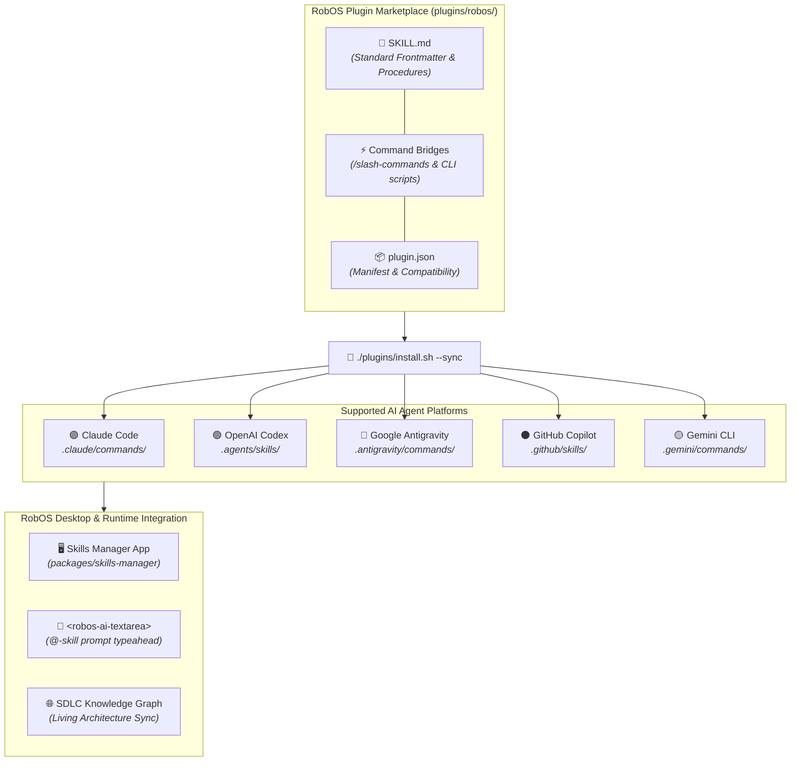

# RobOS Skills & AI Agent Capabilities
{: .no_toc }

How autonomous AI coding agents and human developers use standardized, cross-platform skills to automate the Software Delivery Lifecycle across Claude Code, OpenAI Codex, Google Antigravity, GitHub Copilot, and Gemini CLI.
{: .fs-6 .fw-300 }

## Table of contents
{: .no_toc .text-delta }

1. TOC
{:toc}

<div style="margin: 1.5rem 0 0.5rem; display: flex; flex-wrap: wrap; gap: 0.5rem;">
  <a href="{{ site.baseurl }}" class="btn fs-3">📚 Complete Skills Catalog</a>
  <a href="{{ site.baseurl }}" class="btn fs-3">🌐 Company KGraph Import Skill</a>
  <a href="{{ site.baseurl }}" class="btn fs-3">🖥️ Skills Manager Desktop App</a>
</div>

---

## Overview: The RobOS Skills Architecture

In conventional development setups, AI coding assistants are trapped in vendor-specific silos. An instruction written for one CLI tool cannot be executed by another agent, and procedural knowledge on how to build, test, deploy, or inspect software is repeatedly lost.

**RobOS unifies developer capabilities through the RobOS Skills Standard.**

A RobOS Skill is an executable, portable capability packaged as open, plain-text markdown specifications (`SKILL.md`) and companion CLI engines. Skills provide deterministic, cross-agent workflows that teach any AI agent—as well as human engineers—how to carry out complex SDLC operations with zero guesswork.



---

## Two Interconnected Skill Layers

RobOS provides two complementary layers of skills designed for developer productivity:

| Layer | Purpose | Target Audience | Storage Location | Examples |
|:---|:---|:---|:---|:---|
| **AI Agent Skills (Plugin Marketplace)** | Complex, multi-step SDLC operations, code scaffolding, automated testing, E2E video proof-of-work, and Knowledge Graph synchronization | Autonomous AI Coding Agents & Devs via CLI | `plugins/robos/skills/` and `.agents/skills/` | `import-company-kgraph`, `sync-kgraph-docs`, `create-robos-app`, `e2e-driven-dev` |
| **Desktop Shell Skills (Skills Manager)** | Fast, parameterized bash commands and workstation diagnostic utilities | Developers via GUI and `<robos-ai-textarea>` | `packages/skills-manager/skills-data.js` | 74+ shell skills across Git, Docker, Networking, Memory, and Storage |

---

## Complete AI Agent Skills Catalog

The RobOS Plugin Marketplace ships with standard skills categorized across the entire Software Delivery Lifecycle:

### 1. Knowledge Graph & Architecture Ingestion

| Skill | Slash Command | Description | What It Accomplishes |
|:---|:---|:---|:---|
| **`import-company-kgraph`** | `/import-company-kgraph` | Ingest company repository catalogs from HTTP, FileSystem, AWS S3, or Git forges | Scans company inventories across HTTP REST APIs (Spotify Backstage), AWS S3 buckets, or local directory clones. Auto-classifies components into 9 archetypes, synthesizes OpenAPI 3.1 contracts, and generates valid OSLC JSON-LD package files ready to import directly into RobOS. |
| **`sync-kgraph-docs`** | `/sync-kgraph-docs` | Synchronize living documentation with Knowledge Graph object updates | Monitors additions, modifications, or deletions in `.robos/knowledge-graph.jsonld` and `.robos/packages.yaml`. Discovers impacted user documentation, architecture diagrams, and API guides, and automatically updates documentation in lockstep. |

#### Ingesting Company Architecture Example:
```bash
# Ingest an entire company repository catalog from an AWS S3 bucket
node plugins/robos/skills/import-company-kgraph/scripts/import-company-kgraph.js \
  --source s3://company-cloud-bucket/inventories/repos.json \
  --company-name "Acme Global" \
  --company-slug "acme" \
  --import-to-robos
```

---

### 2. Application Scaffolding & Component Lifecycle

| Skill | Slash Command | Description | What It Accomplishes |
|:---|:---|:---|:---|
| **`create-robos-app`** | `/create-robos-app <Name>` | Scaffold a new Electron desktop application | Generates application workspace, main process, preload bridge, renderer UI, Lucide vector icon, DOM snapshot debug port, and registers across all 10 system manifests. |
| **`create-feature-spec`** | `/create-feature-spec <Idea>` | Convert a raw idea note into a structured specification | Analyzes natural language ideas or prompts and generates rigorous engineering specifications in `docs/ideas/specs/` with user personas, C4 models, and BDD scenarios. |
| **`create-test`** | `/create-test <Component>` | Generate unit and E2E test suites | Author automated tests using the native `robos-test` framework, covering headless GUI testing and assertions. |
| **`add-ai-text-area-to-app`** | `/add-ai-text-area-to-app` | Embed `<robos-ai-textarea>` widget | Integrates the streaming AI prompt bar with `@`-mention typeahead for files, repos, and shell skills. |
| **`update-app-icon`** | `/update-app-icon <App> <SVG>` | Update 48x48 Lucide vector SVG icon | Validates 48x48 cyan vector graphics and synchronizes across `robos-icons`, `icon-lib`, and desktop shortcuts. |
| **`rename-robos-app`** | `/rename-robos-app <Old> <New>` | Safely rename an existing Electron app | Propagates name changes across package directories, process managers, icon registries, and desktop files without breaking references. |
| **`remove-robos-app`** | `/remove-robos-app <App>` | Safely decommission and deregister an app | Deregisters the application cleanly across all desktop managers, panels, and icon registries. |

---

### 3. Automated E2E Testing & Proof-of-Work

| Skill | Slash Command | Description | What It Accomplishes |
|:---|:---|:---|:---|
| **`e2e-driven-dev`** | `/e2e-driven-dev`, `/do-e2e-driven-dev` | Text-narrated E2E driven development | Executes feature development verified by automated end-to-end testing with audio narration and video capture. |
| **`record-demo`** | `/record-demo <Script>` | Record 1080p narrated video walkthrough | Uses headless Xvfb, FFmpeg, and neural TTS (Piper) to record high-definition video walkthroughs with WebVTT captions, archived to `~/.robos/development/walkthroughs/`. |
| **`test-container`** | `/test-container` | Run headless containerized E2E tests | Launches isolated containerized E2E test suites inside Docker with Xvfb virtual framebuffers and Picom compositors. |
| **`app-snapshot`** | `/app-snapshot <App>` | Capture DOM text/JSON/screenshot snapshots | Connects to running Electron applications via snapshot debug ports (19100–19121) to capture live UI states and DOM trees. |

---

### 4. VM & Operating System Control

| Skill | Slash Command | Description | What It Accomplishes |
|:---|:---|:---|:---|
| **`build-vm`** | `/build-vm` | Build QEMU VM disk image & cloud-init ISO | Creates sparse qcow2 virtual disks and stateless cloud-init ISOs for Ubuntu 26.04 LTS RobOS desktop. |
| **`start-vm` / `stop-vm`** | `/start-vm`, `/stop-vm` | Start or stop the RobOS virtual machine | Launches QEMU with hardware KVM acceleration, GTK/VNC displays, and forwarded SSH ports (2224). |
| **`vm-status`** | `/vm-status` | Inspect running VM state and diagnostics | Queries SSH connectivity, memory usage, and hypervisor process state. |
| **`vm-ssh`** | `/vm-ssh "<Command>"` | Execute shell commands inside the VM | Executes remote administrative commands inside the virtual machine with non-interactive authentication. |
| **`deploy-to-vm`** | `/deploy-to-vm <Package>` | Deploy packages directly to the running VM | Transfers code via SCP to `/usr/local/share/robos/`, fixes permissions (`chmod -R a+rX`), and rebuilds node modules. |
| **`add-install-step`** | `/add-install-step` | Add cloud-init provisioning step | Extends first-boot automated provisioning and updates the terminal splash screen. |
| **`restart-taskbar`** | `/restart-taskbar` | Restart desktop dock and manager | Sends IPC signals to `/run/user/<uid>/robos-dm.sock` to reload the GNOME desktop taskbar without terminating active applications. |

---

### 5. System Diagnostics & Marketplace Management

| Skill | Slash Command | Description | What It Accomplishes |
|:---|:---|:---|:---|
| **`install-dev-deps`** | `/install-dev-deps` | Audit and install host dev dependencies | Audits and installs host packages: QEMU, KVM, Node.js, Electron, JDK 17+, and Piper TTS. |
| **`read-error-logs`** | `/read-error-logs` | Inspect centralized RobOS error stream | Queries centralized JSON error logs and Electron crash dumps for rapid root-cause analysis. |
| **`report-issue`** | `/report-issue` | Convert bug reports into structured issue specs | Structures user reports into markdown issue files in `docs/issues/reported/` with reproduction steps and logs. |
| **`manage-robos-skill`** | `/manage-robos-skill` | Add, update, or remove marketplace skills | Scaffolds new skills, manages manifests, and synchronizes across all agent platforms. |

---

## Universal Cross-Agent Installation & Sync

RobOS skills adhere to an agent-agnostic format that allows any modern AI coding assistant to discover and execute them immediately.

### One-Click Synchronization
Whenever you add, modify, or update a skill in `plugins/robos/skills/`, run:

```bash
./plugins/install.sh --sync
```

This automatically synchronizes manifests and command bridges across:
- **Claude Code**: `.claude/commands/<skill-name>.md`
- **OpenAI Codex**: `.agents/skills/<skill-name>/SKILL.md` and `AGENTS.md`
- **Google Antigravity**: `.antigravity/commands/<skill-name>.md` and `.agents/skills/`
- **GitHub Copilot**: `.github/skills/<skill-name>/SKILL.md`
- **Gemini CLI**: `.gemini/commands/<skill-name>.md`

### Installing Globally
To make RobOS skills available across all workspaces on your development machine:
```bash
./plugins/install.sh --global
```

---

## Anatomy of a RobOS Skill (`SKILL.md`)

Every RobOS skill is defined in a standard directory structure:

```
plugins/robos/skills/<skill-name>/
├── SKILL.md                 # Primary instruction document with YAML frontmatter
└── scripts/                 # Optional companion CLI scripts and automation engines
    └── <skill-name>.js
```

### Example: Standard `SKILL.md` Format
```markdown
---
name: import-company-kgraph
description: Import company, organization, or team Knowledge Graph entries from any source (HTTP, FileSystem, S3, or Git) and generate validated OSLC JSON-LD files.
---

# Import Company Knowledge Graph

<Overview of what the skill accomplishes>

## When to Use
<Scenarios and triggers when an agent should execute this skill>

## Input
$ARGUMENTS — Parameter flags:
- `--source <path|url|s3-uri>`: Ingestion endpoint
- `--company-name <name>`: Organization title
- `--import-to-robos`: Merge directly into workspace

## Procedure
1. Parse and validate source input.
2. Execute companion script: `node scripts/import-company-kgraph.js $ARGUMENTS`.
3. Verify generated JSON-LD output files.

## Validation Checklist
- [ ] Output conforms to OSLC JSON-LD and C4 schema.
- [ ] No plaintext credentials stored in graph files.
```

---

## Authoring New Skills with `/manage-robos-skill`

RobOS provides the `manage-robos-skill` skill to automate creating and registering new skills:

```bash
# Scaffold and register a new skill in one command:
/manage-robos-skill add inspect-k8s-logs "Stream and analyze Kubernetes pod logs for microservice crashes"
```

This automatically:
1. Validates the lowercase kebab-case naming convention.
2. Scaffolds `plugins/robos/skills/inspect-k8s-logs/SKILL.md`.
3. Generates the command bridge `plugins/robos/commands/inspect-k8s-logs.md`.
4. Registers the skill in `plugins/robos/plugin.json`.
5. Syncs across all agent platforms via `./plugins/install.sh --sync`.

---

## The Skills Manager Desktop App (`packages/skills-manager`)

In addition to AI agent skills, RobOS includes the **Skills Manager** application (`packages/skills-manager`), which equips developers with an interactive GUI library of 74+ shell and system diagnostic commands:

- **10 Categorized Packs**: File Operations, Process Management, Git Operations, Networking, Docker / Containers, System Info, Package Management, Text Processing, Security, and Development Runtimes.
- **Instant Search & Parameterization**: Search by tag, keyword, or command name, with customizable argument fields.
- **Custom Skill Creation**: Add personal terminal macros and scripts stored in `~/.config/robos/skills.json`.
- **Integration with `<robos-ai-textarea>`**: Every skill in the manager is available via `@`-mention typeahead in AI prompt boxes throughout RobOS applications.

To launch the Skills Manager:
```bash
# Launch from terminal or desktop dock:
node packages/robos-test/lib/harness.js --app skills-manager
```

---

## Verification & Automated Testing

All skills are verified using automated tests in the `packages/robos-test` framework:

```bash
# Test the company KGraph import skill:
node --test packages/robos-test/tests/skills/import-company-kgraph.test.js

# Test the Skills Manager desktop app:
node --test packages/robos-test/tests/skills-manager/smoke.test.js

# Run the narrated Skills Manager walkthrough demo:
node packages/robos-test/demos/skills-manager-demo.js
```
