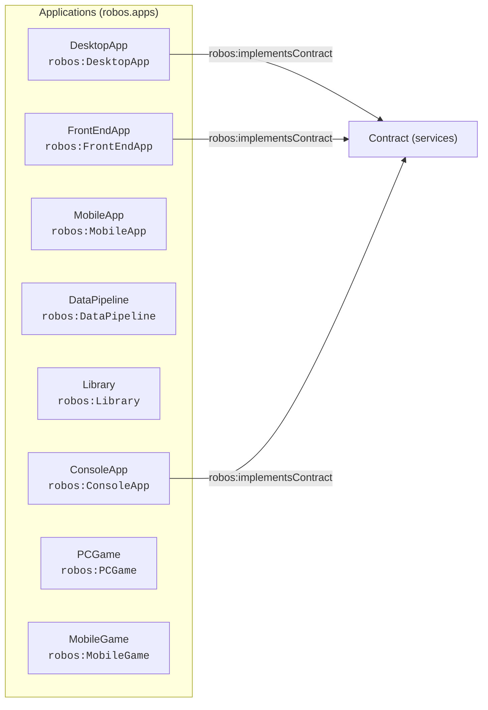

# Applications (robos.apps)
{: .no_toc }

Front-end SPAs, desktop workstations, PC & mobile games, mobile apps, and CLI tools.
{: .fs-6 .fw-300 }

## Table of contents
{: .no_toc .text-delta }

1. TOC
{:toc}

---

## Package Metadata

- **Package Store ID**: `applications`
- **Ontology Namespace**: `robos.apps`
- **GitOps Package File**: `.robos/kgraphs/applications/package.jsonld`
- **Schemas Defined**: 8

---

## Package Schemas & Constraint Shapes

| Schema Class | Target Shape URI | Required Properties (minCount ≥ 1) | Specification |
|---|---|---|---|
| [**Desktop App** (`robos:DesktopApp`)]({{ '/schemas/applications/desktop-app.html' | relative_url }}) | `urn:robos:shape:DesktopAppShape` | `dcterms:title`, `robos:repository`, `robos:technology`, `robos:desktopFramework` | [View Schema &rarr;]({{ '/schemas/applications/desktop-app.html' | relative_url }}) |
| [**Console App** (`robos:ConsoleApp`)]({{ '/schemas/applications/console-app.html' | relative_url }}) | `urn:robos:shape:ConsoleAppShape` | `dcterms:title`, `robos:repository`, `robos:technology`, `robos:cliCommand` | [View Schema &rarr;]({{ '/schemas/applications/console-app.html' | relative_url }}) |
| [**Mobile App** (`robos:MobileApp`)]({{ '/schemas/applications/mobile-app.html' | relative_url }}) | `urn:robos:shape:MobileAppShape` | `dcterms:title`, `robos:repository`, `robos:technology`, `robos:platform` | [View Schema &rarr;]({{ '/schemas/applications/mobile-app.html' | relative_url }}) |
| [**Data Pipeline** (`robos:DataPipeline`)]({{ '/schemas/applications/data-pipeline.html' | relative_url }}) | `urn:robos:shape:DataPipelineShape` | `dcterms:title`, `robos:repository`, `robos:technology`, `robos:pipelineEngine` | [View Schema &rarr;]({{ '/schemas/applications/data-pipeline.html' | relative_url }}) |
| [**Library** (`robos:Library`)]({{ '/schemas/applications/library.html' | relative_url }}) | `urn:robos:shape:LibraryShape` | `dcterms:title`, `robos:repository`, `robos:technology` | [View Schema &rarr;]({{ '/schemas/applications/library.html' | relative_url }}) |
| [**Front End App** (`robos:FrontEndApp`)]({{ '/schemas/applications/front-end-app.html' | relative_url }}) | `urn:robos:shape:FrontEndAppShape` | `dcterms:title`, `robos:repository`, `robos:technology`, `robos:frontendFramework` | [View Schema &rarr;]({{ '/schemas/applications/front-end-app.html' | relative_url }}) |
| [**PCGame** (`robos:PCGame`)]({{ '/schemas/applications/pcgame.html' | relative_url }}) | `urn:robos:shape:PCGameShape` | `dcterms:title`, `robos:repository`, `robos:technology`, `robos:gameEngine`, `robos:targetPlatform` | [View Schema &rarr;]({{ '/schemas/applications/pcgame.html' | relative_url }}) |
| [**Mobile Game** (`robos:MobileGame`)]({{ '/schemas/applications/mobile-game.html' | relative_url }}) | `urn:robos:shape:MobileGameShape` | `dcterms:title`, `robos:repository`, `robos:technology`, `robos:gameEngine`, `robos:platform` | [View Schema &rarr;]({{ '/schemas/applications/mobile-game.html' | relative_url }}) |

---

## Package Entity Relationships

