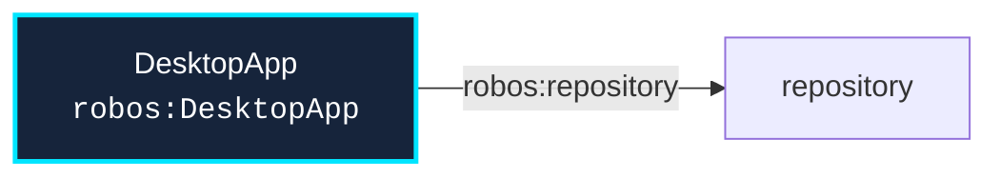

# Schema: `robos:DesktopApp`
{: .no_toc }

Formal W3C SHACL constraint shape and OSLC JSON-LD specification for `robos:DesktopApp` in the `applications` package store.
{: .fs-6 .fw-300 }

## Table of contents
{: .no_toc .text-delta }

1. TOC
{:toc}

---

## Specification Metadata

- **RDF / OWL Class**: `robos:DesktopApp`
- **Aliases / Target Classes**: `robos:DesktopApp`
- **SHACL Shape ID**: `urn:robos:shape:DesktopAppShape`
- **Governing Package**: [Applications (robos.apps)]({{ '/schemas/applications.html' | relative_url }}) (`applications`)
- **Namespace**: `robos.apps`

---

## Entity Relationship Diagram



---

## Property Constraints & SHACL Rules

| Property Path | Name | Multiplicity | Data Type | Constraint Rule / Validation Message |
|---|---|---|---|---|
| **`dcterms:title`** | Title / Display Name | `1..*` | `xsd:string` | Desktop App must have a title. |
| **`robos:repository`** | Git Repository | `1..*` | `xsd:string` | Desktop App must define a repository. |
| **`robos:technology`** | Technology Stack | `1..*` | `xsd:string` | Desktop App must specify technology stack. |
| **`robos:desktopFramework`** | Desktop Framework | `1..*` | `xsd:string` | Desktop App must declare desktop framework (Electron, Tauri, Qt, GTK). |

---

## Canonical OSLC JSON-LD Example

```json
{
  "@id": "urn:robos:applications:desktop-app-sample",
  "@type": [
    "robos:DesktopApp",
    "oslc:Resource"
  ],
  "dcterms:title": "Sample Desktop App",
  "dcterms:description": "Canonical reference instance for robos:DesktopApp.",
  "robos:package": "applications",
  "robos:namespace": "robos.apps",
  "robos:repository": "github.com/acme/sample-repo",
  "robos:technology": "Node.js / TypeScript",
  "robos:desktopFramework": "Electron"
}
```

---

## Programmatic SHACL Validation

```javascript
const { SHACLValidator } = require('/usr/local/share/robos/robos-graph/lib/shacl-validator');
const { OSLCGraphParser, OSLC_CONTEXT } = require('/usr/local/share/robos/robos-graph/lib/oslc-parser');

const validator = new SHACLValidator();
const result = validator.validateGraph(new OSLCGraphParser({
  "@context": OSLC_CONTEXT,
  "robos:nodes": [
    {
        "@id": "urn:robos:applications:desktop-app-sample",
        "@type": [
            "robos:DesktopApp",
            "oslc:Resource"
        ],
        "dcterms:title": "Sample Desktop App",
        "dcterms:description": "Canonical reference instance for robos:DesktopApp.",
        "robos:package": "applications",
        "robos:namespace": "robos.apps",
        "robos:repository": "github.com/acme/sample-repo",
        "robos:technology": "Node.js / TypeScript",
        "robos:desktopFramework": "Electron"
    }
  ],
}));

console.log("Conforms:", result.conforms); // Expected: true
```