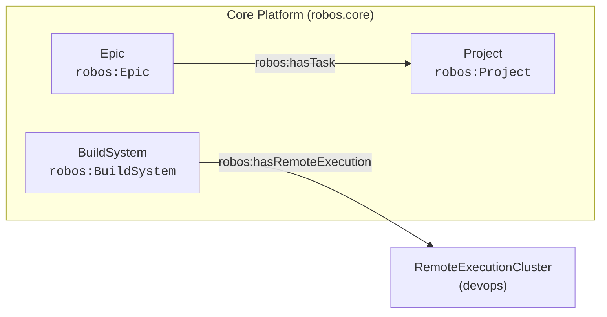

# Core Platform (robos.core)
{: .no_toc }

Foundational architectural graph, system roots, and platform configuration.
{: .fs-6 .fw-300 }

## Table of contents
{: .no_toc .text-delta }

1. TOC
{:toc}

---

## Package Metadata

- **Package Store ID**: `core-platform`
- **Ontology Namespace**: `robos.platform`
- **GitOps Package File**: `.robos/kgraphs/core-platform/package.jsonld`
- **Schemas Defined**: 3

---

## Package Schemas & Constraint Shapes

| Schema Class | Target Shape URI | Required Properties (minCount ≥ 1) | Specification |
|---|---|---|---|
| [**Project** (`robos:Project`)]({{ '/schemas/core-platform/project.html' | relative_url }}) | `urn:robos:shape:ProjectShape` | `dcterms:title`, `robos:status` | [View Schema &rarr;]({{ '/schemas/core-platform/project.html' | relative_url }}) |
| [**Epic** (`robos:Epic`)]({{ '/schemas/core-platform/epic.html' | relative_url }}) | `urn:robos:shape:EpicShape` | `dcterms:title` | [View Schema &rarr;]({{ '/schemas/core-platform/epic.html' | relative_url }}) |
| [**Build System** (`robos:BuildSystem`)]({{ '/schemas/core-platform/build-system.html' | relative_url }}) | `urn:robos:shape:BuildSystemShape` | `dcterms:title`, `robos:buildTool`, `robos:configFile` | [View Schema &rarr;]({{ '/schemas/core-platform/build-system.html' | relative_url }}) |

---

## Package Entity Relationships

