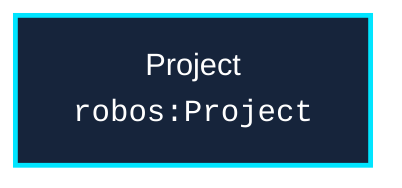

# Schema: `robos:Project`
{: .no_toc }

Formal W3C SHACL constraint shape and OSLC JSON-LD specification for `robos:Project` in the `core-platform` package store.
{: .fs-6 .fw-300 }

## Table of contents
{: .no_toc .text-delta }

1. TOC
{:toc}

---

## Specification Metadata

- **RDF / OWL Class**: `robos:Project`
- **Aliases / Target Classes**: `robos:Project`
- **SHACL Shape ID**: `urn:robos:shape:ProjectShape`
- **Governing Package**: [Core Platform (robos.core)]({{ '/schemas/core-platform.html' | relative_url }}) (`core-platform`)
- **Namespace**: `robos.platform`

---

## Entity Relationship Diagram



---

## Property Constraints & SHACL Rules

| Property Path | Name | Multiplicity | Data Type | Constraint Rule / Validation Message |
|---|---|---|---|---|
| **`dcterms:title`** | Title / Display Name | `1..*` | `xsd:string` | Project must have a title / name. |
| **`robos:status`** | Lifecycle Status | `1..*` | `xsd:string` | Project must declare a lifecycle status. |

---

## Canonical OSLC JSON-LD Example

```json
{
  "@id": "urn:robos:core-platform:project-sample",
  "@type": [
    "robos:Project",
    "oslc:Resource"
  ],
  "dcterms:title": "Sample Project",
  "dcterms:description": "Canonical reference instance for robos:Project.",
  "robos:package": "core-platform",
  "robos:namespace": "robos.platform",
  "robos:status": "active"
}
```

---

## Programmatic SHACL Validation

```javascript
const { SHACLValidator } = require('/usr/local/share/robos/robos-graph/lib/shacl-validator');
const { OSLCGraphParser, OSLC_CONTEXT } = require('/usr/local/share/robos/robos-graph/lib/oslc-parser');

const validator = new SHACLValidator();
const result = validator.validateGraph(new OSLCGraphParser({
  "@context": OSLC_CONTEXT,
  "robos:nodes": [
    {
        "@id": "urn:robos:core-platform:project-sample",
        "@type": [
            "robos:Project",
            "oslc:Resource"
        ],
        "dcterms:title": "Sample Project",
        "dcterms:description": "Canonical reference instance for robos:Project.",
        "robos:package": "core-platform",
        "robos:namespace": "robos.platform",
        "robos:status": "active"
    }
  ],
}));

console.log("Conforms:", result.conforms); // Expected: true
```