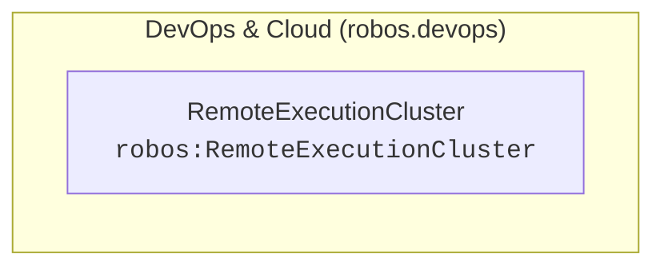

# DevOps & Cloud (robos.devops)
{: .no_toc }

Cloud providers, CI/CD pipelines, container registries, OAuth apps, DNS domains, and secure GPG pass credentials.
{: .fs-6 .fw-300 }

## Table of contents
{: .no_toc .text-delta }

1. TOC
{:toc}

---

## Package Metadata

- **Package Store ID**: `devops`
- **Ontology Namespace**: `robos.devops`
- **GitOps Package File**: `.robos/kgraphs/devops/package.jsonld`
- **Schemas Defined**: 1

---

## Package Schemas & Constraint Shapes

| Schema Class | Target Shape URI | Required Properties (minCount ≥ 1) | Specification |
|---|---|---|---|
| [**Remote Execution Cluster** (`robos:RemoteExecutionCluster`)]({{ '/schemas/devops/remote-execution-cluster.html' | relative_url }}) | `urn:robos:shape:RemoteExecutionClusterShape` | `dcterms:title`, `robos:protocol`, `robos:provider`, `robos:executionEndpoint`, `robos:casEndpoint` | [View Schema &rarr;]({{ '/schemas/devops/remote-execution-cluster.html' | relative_url }}) |

---

## Package Entity Relationships

