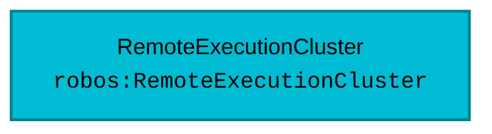

# Schema: `robos:RemoteExecutionCluster`
{: .no_toc }

Formal W3C SHACL constraint shape and OSLC JSON-LD specification for `robos:RemoteExecutionCluster` in the `devops` package store.
{: .fs-6 .fw-300 }

## Table of contents
{: .no_toc .text-delta }

1. TOC
{:toc}

---

## Specification Metadata

- **RDF / OWL Class**: `robos:RemoteExecutionCluster`
- **Aliases / Target Classes**: `robos:RemoteExecutionCluster`, `robos:RemoteBuildCluster`
- **SHACL Shape ID**: `urn:robos:shape:RemoteExecutionClusterShape`
- **Governing Package**: [DevOps & Cloud (robos.devops)]({{ '/schemas/devops.html' | relative_url }}) (`devops`)
- **Namespace**: `robos.devops`

---

## Entity Relationship Diagram



---

## Property Constraints & SHACL Rules

| Property Path | Name | Multiplicity | Data Type | Constraint Rule / Validation Message |
|---|---|---|---|---|
| **`dcterms:title`** | Title / Display Name | `1..*` | `xsd:string` | Remote Execution Cluster must have a title. |
| **`robos:protocol`** | Protocol / Standard | `1..*` | `xsd:string` | Remote Execution Cluster must declare protocol standard (e.g. REAPI_v2). |
| **`robos:provider`** | Backend Provider | `1..*` | `xsd:string` | Remote Execution Cluster must declare backend provider engine (e.g. buildbarn, nativelink, buildgrid). |
| **`robos:executionEndpoint`** | Execution Endpoint | `1..*` | `xsd:anyURI` | Remote Execution Cluster must specify execution endpoint URI. |
| **`robos:casEndpoint`** | CAS Endpoint | `1..*` | `xsd:anyURI` | Remote Execution Cluster must specify Content Addressable Storage (CAS) endpoint URI. |

---

## Canonical OSLC JSON-LD Example

```json
{
  "@id": "urn:robos:remote-execution:acme-buildbarn-cluster",
  "@type": [
    "robos:RemoteExecutionCluster",
    "robos:RemoteBuildCluster",
    "oslc:Resource"
  ],
  "dcterms:title": "Acme Production Buildbarn REAPI Cluster",
  "dcterms:description": "High-performance distributed remote execution & CAS caching cluster using Buildbarn suite.",
  "robos:protocol": "REAPI_v2",
  "robos:provider": "buildbarn",
  "robos:instanceName": "main",
  "robos:executionEndpoint": "grpc://re-execution.buildbarn.internal:8980",
  "robos:casEndpoint": "grpc://re-cas.buildbarn.internal:8980",
  "robos:actionCacheEndpoint": "grpc://re-cas.buildbarn.internal:8980",
  "robos:browserEndpoint": "http://re-browser.buildbarn.internal:7984",
  "robos:tlsEnabled": false,
  "robos:status": "active",
  "robos:workerPools": [
    {
      "name": "linux-x86_64-large",
      "osFamily": "linux",
      "isa": "x86-64",
      "containerImage": "docker://gcr.io/cloud-marketplace/google/debian11:latest",
      "concurrency": 64
    }
  ],
  "robos:cacheSettings": {
    "maxSizeBytes": "500GB",
    "retentionDays": 14,
    "evictionPolicy": "lru"
  },
  "robos:package": "devops",
  "robos:namespace": "robos.devops"
}
```

---

## Programmatic SHACL Validation

```javascript
const { SHACLValidator } = require('/usr/local/share/robos/robos-graph/lib/shacl-validator');
const { OSLCGraphParser, OSLC_CONTEXT } = require('/usr/local/share/robos/robos-graph/lib/oslc-parser');

const validator = new SHACLValidator();
const result = validator.validateGraph(new OSLCGraphParser({
  "@context": OSLC_CONTEXT,
  "robos:nodes": [
    {
        "@id": "urn:robos:remote-execution:acme-buildbarn-cluster",
        "@type": [
            "robos:RemoteExecutionCluster",
            "robos:RemoteBuildCluster",
            "oslc:Resource"
        ],
        "dcterms:title": "Acme Production Buildbarn REAPI Cluster",
        "dcterms:description": "High-performance distributed remote execution & CAS caching cluster using Buildbarn suite.",
        "robos:protocol": "REAPI_v2",
        "robos:provider": "buildbarn",
        "robos:instanceName": "main",
        "robos:executionEndpoint": "grpc://re-execution.buildbarn.internal:8980",
        "robos:casEndpoint": "grpc://re-cas.buildbarn.internal:8980",
        "robos:actionCacheEndpoint": "grpc://re-cas.buildbarn.internal:8980",
        "robos:browserEndpoint": "http://re-browser.buildbarn.internal:7984",
        "robos:tlsEnabled": false,
        "robos:status": "active",
        "robos:workerPools": [
            {
                "name": "linux-x86_64-large",
                "osFamily": "linux",
                "isa": "x86-64",
                "containerImage": "docker://gcr.io/cloud-marketplace/google/debian11:latest",
                "concurrency": 64
            }
        ],
        "robos:cacheSettings": {
            "maxSizeBytes": "500GB",
            "retentionDays": 14,
            "evictionPolicy": "lru"
        },
        "robos:package": "devops",
        "robos:namespace": "robos.devops"
    }
  ],
}));

console.log("Conforms:", result.conforms); // Expected: true
```