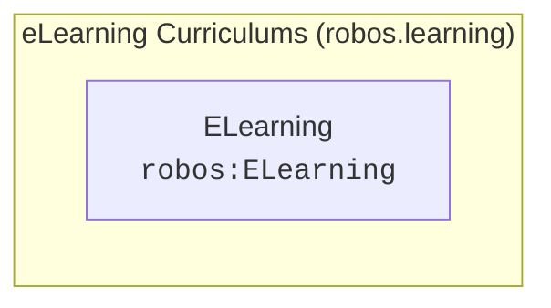

# eLearning Curriculums (robos.learning)
{: .no_toc }

Interactive developer courses, tutorials, and architectural training modules.
{: .fs-6 .fw-300 }

## Table of contents
{: .no_toc .text-delta }

1. TOC
{:toc}

---

## Package Metadata

- **Package Store ID**: `learning`
- **Ontology Namespace**: `robos.learning`
- **GitOps Package File**: `.robos/kgraphs/learning/package.jsonld`
- **Schemas Defined**: 1

---

## Package Schemas & Constraint Shapes

| Schema Class | Target Shape URI | Required Properties (minCount ≥ 1) | Specification |
|---|---|---|---|
| [**ELearning** (`robos:ELearning`)]({{ '/schemas/learning/elearning.html' | relative_url }}) | `urn:robos:shape:ELearningShape` | `dcterms:title`, `robos:topic`, `robos:modules`, `robos:gitopsFile` | [View Schema &rarr;]({{ '/schemas/learning/elearning.html' | relative_url }}) |

---

## Package Entity Relationships

