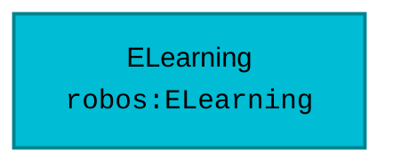

# Schema: `robos:ELearning`
{: .no_toc }

Formal W3C SHACL constraint shape and OSLC JSON-LD specification for `robos:ELearning` in the `learning` package store.
{: .fs-6 .fw-300 }

## Table of contents
{: .no_toc .text-delta }

1. TOC
{:toc}

---

## Specification Metadata

- **RDF / OWL Class**: `robos:ELearning`
- **Aliases / Target Classes**: `robos:ELearning`
- **SHACL Shape ID**: `urn:robos:shape:ELearningShape`
- **Governing Package**: [eLearning Curriculums (robos.learning)]({{ '/schemas/learning.html' | relative_url }}) (`learning`)
- **Namespace**: `robos.learning`

---

## Entity Relationship Diagram



---

## Property Constraints & SHACL Rules

| Property Path | Name | Multiplicity | Data Type | Constraint Rule / Validation Message |
|---|---|---|---|---|
| **`dcterms:title`** | Title / Display Name | `1..*` | `xsd:string` | eLearning course must have a title. |
| **`robos:topic`** | Knowledge Domain Topic | `1..*` | `xsd:string` | eLearning course must specify a topic domain. |
| **`robos:modules`** | Learning Modules | `1..*` | `Array<robos:LearningModule>` | eLearning course must have at least one learning module. |
| **`robos:gitopsFile`** | GitOps Declarative File | `1..*` | `xsd:string` | eLearning course must declare its GitOps file location (.robos/elearning.yaml). |

---

## Canonical OSLC JSON-LD Example

```json
{
  "@id": "urn:robos:learning:elearning-sample",
  "@type": [
    "robos:ELearning",
    "oslc:Resource"
  ],
  "dcterms:title": "Sample ELearning",
  "dcterms:description": "Canonical reference instance for robos:ELearning.",
  "robos:package": "learning",
  "robos:namespace": "robos.learning",
  "robos:topic": "Distributed Architecture",
  "robos:modules": [
    {
      "title": "Module 1: Fundamentals",
      "labFile": "labs/01.md"
    }
  ],
  "robos:gitopsFile": ".robos/elearning.yaml"
}
```

---

## Programmatic SHACL Validation

```javascript
const { SHACLValidator } = require('/usr/local/share/robos/robos-graph/lib/shacl-validator');
const { OSLCGraphParser, OSLC_CONTEXT } = require('/usr/local/share/robos/robos-graph/lib/oslc-parser');

const validator = new SHACLValidator();
const result = validator.validateGraph(new OSLCGraphParser({
  "@context": OSLC_CONTEXT,
  "robos:nodes": [
    {
        "@id": "urn:robos:learning:elearning-sample",
        "@type": [
            "robos:ELearning",
            "oslc:Resource"
        ],
        "dcterms:title": "Sample ELearning",
        "dcterms:description": "Canonical reference instance for robos:ELearning.",
        "robos:package": "learning",
        "robos:namespace": "robos.learning",
        "robos:topic": "Distributed Architecture",
        "robos:modules": [
            {
                "title": "Module 1: Fundamentals",
                "labFile": "labs/01.md"
            }
        ],
        "robos:gitopsFile": ".robos/elearning.yaml"
    }
  ],
}));

console.log("Conforms:", result.conforms); // Expected: true
```