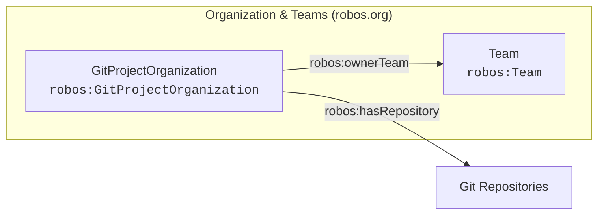

# Organization & Teams (robos.org)
{: .no_toc }

People, developer profiles, team topologies, and cross-team communication channels.
{: .fs-6 .fw-300 }

## Table of contents
{: .no_toc .text-delta }

1. TOC
{:toc}

---

## Package Metadata

- **Package Store ID**: `organization`
- **Ontology Namespace**: `robos.org`
- **GitOps Package File**: `.robos/kgraphs/organization/package.jsonld`
- **Schemas Defined**: 2

---

## Package Schemas & Constraint Shapes

| Schema Class | Target Shape URI | Required Properties (minCount ≥ 1) | Specification |
|---|---|---|---|
| [**Team** (`robos:Team`)]({{ '/schemas/organization/team.html' | relative_url }}) | `urn:robos:shape:TeamShape` | `dcterms:title` | [View Schema &rarr;]({{ '/schemas/organization/team.html' | relative_url }}) |
| [**Git Project Organization** (`robos:GitProjectOrganization`)]({{ '/schemas/organization/git-project-organization.html' | relative_url }}) | `urn:robos:shape:GitProjectOrganizationShape` | `dcterms:title`, `robos:url`, `robos:orgName`, `robos:forgeType` | [View Schema &rarr;]({{ '/schemas/organization/git-project-organization.html' | relative_url }}) |

---

## Package Entity Relationships

