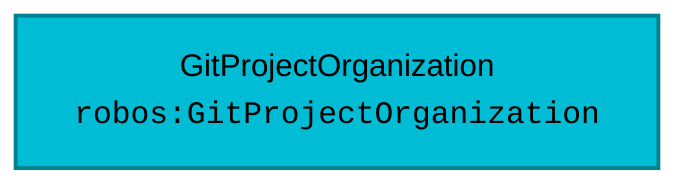

# Schema: `robos:GitProjectOrganization`
{: .no_toc }

Formal W3C SHACL constraint shape and OSLC JSON-LD specification for `robos:GitProjectOrganization` in the `organization` package store.
{: .fs-6 .fw-300 }

## Table of contents
{: .no_toc .text-delta }

1. TOC
{:toc}

---

## Specification Metadata

- **RDF / OWL Class**: `robos:GitProjectOrganization`
- **Aliases / Target Classes**: `robos:GitProjectOrganization`, `robos:GitOrganization`
- **SHACL Shape ID**: `urn:robos:shape:GitProjectOrganizationShape`
- **Governing Package**: [Organization & Teams (robos.org)]({{ '/schemas/organization.html' | relative_url }}) (`organization`)
- **Namespace**: `robos.org`

---

## Entity Relationship Diagram



---

## Property Constraints & SHACL Rules

| Property Path | Name | Multiplicity | Data Type | Constraint Rule / Validation Message |
|---|---|---|---|---|
| **`dcterms:title`** | Title / Display Name | `1..*` | `xsd:string` | Git Project Organization must have a title or display name. |
| **`robos:url`** | Forge / Web URL | `1..*` | `xsd:anyURI` | Git Project Organization must specify forge URL (e.g. https://github.com/apache). |
| **`robos:orgName`** | Organization Slug | `1..*` | `xsd:string` | Git Project Organization must specify organization handle/slug. |
| **`robos:forgeType`** | Forge Type | `1..*` | `xsd:string` | Git Project Organization must declare forge type (github, gitlab, bitbucket, etc.). |

---

## Canonical OSLC JSON-LD Example

```json
{
  "@id": "urn:robos:git-org:apache",
  "@type": [
    "robos:GitProjectOrganization",
    "robos:GitOrganization",
    "schema:Organization",
    "oslc:Resource"
  ],
  "dcterms:title": "Apache Software Foundation",
  "dcterms:description": "The Apache Software Foundation provides software for the public good, with over 350 open-source projects and initiatives.",
  "robos:orgName": "apache",
  "robos:url": "https://github.com/apache",
  "robos:forgeType": "github",
  "robos:avatarUrl": "https://avatars.githubusercontent.com/u/47359?s=200&v=4",
  "robos:visibility": "public",
  "robos:isEnterprise": false,
  "robos:verified": true,
  "robos:defaultBranch": "main",
  "robos:memberCount": 1100,
  "robos:repoCount": 350,
  "robos:hasRepository": [
    "github.com/apache/kafka",
    "github.com/apache/spark",
    "github.com/apache/lucene",
    "github.com/apache/airflow",
    "github.com/apache/arrow"
  ],
  "robos:documentation": {
    "docsUrl": "https://www.apache.org/dev/",
    "docsPaths": [
      "docs/index.md",
      "README.md",
      "CONTRIBUTING.md",
      "GOVERNANCE.md",
      "SECURITY.md"
    ],
    "architectureGuidelines": "The Apache Way: vendor-neutral open governance, consensus-driven decisions, public mailing list discussions, and reproducible builds.",
    "license": "Apache-2.0"
  },
  "robos:agentRules": [
    {
      "ruleId": "RULE-APACHE-001",
      "title": "ASF License Header & Notice Verification",
      "severity": "mandatory",
      "description": "Every source file must contain the standard Apache 2.0 license header. Agents must NEVER introduce GPL or copyleft dependencies into ASF codebases.",
      "ruleFile": "AGENTS.md",
      "enforcement": "pre-commit"
    },
    {
      "ruleId": "RULE-APACHE-002",
      "title": "Public Discussion & Consensus Tracing",
      "severity": "mandatory",
      "description": "All architectural alterations and pull requests generated by agents must cite a valid dev@ mailing list discussion thread or associated Apache Jira/GitHub issue.",
      "ruleFile": "docs/governance.md",
      "enforcement": "agent-review"
    },
    {
      "ruleId": "RULE-APACHE-003",
      "title": "Cryptographic Commit Signing",
      "severity": "mandatory",
      "description": "All git commits generated by agents must be GPG signed with verified committer keys.",
      "enforcement": "git-commit"
    },
    {
      "ruleId": "RULE-APACHE-004",
      "title": "Backward-Compatible SemVer Contracts",
      "severity": "recommended",
      "description": "Public APIs must not break binary or source compatibility without a documented deprecation cycle across at least one minor release.",
      "enforcement": "pr-audit"
    }
  ],
  "robos:agentRulesDoc": "AGENTS.md",
  "robos:package": "organization",
  "robos:namespace": "robos.org"
}
```

---

## Programmatic SHACL Validation

```javascript
const { SHACLValidator } = require('/usr/local/share/robos/robos-graph/lib/shacl-validator');
const { OSLCGraphParser, OSLC_CONTEXT } = require('/usr/local/share/robos/robos-graph/lib/oslc-parser');

const validator = new SHACLValidator();
const result = validator.validateGraph(new OSLCGraphParser({
  "@context": OSLC_CONTEXT,
  "robos:nodes": [
    {
        "@id": "urn:robos:git-org:apache",
        "@type": [
            "robos:GitProjectOrganization",
            "robos:GitOrganization",
            "schema:Organization",
            "oslc:Resource"
        ],
        "dcterms:title": "Apache Software Foundation",
        "dcterms:description": "The Apache Software Foundation provides software for the public good, with over 350 open-source projects and initiatives.",
        "robos:orgName": "apache",
        "robos:url": "https://github.com/apache",
        "robos:forgeType": "github",
        "robos:avatarUrl": "https://avatars.githubusercontent.com/u/47359?s=200&v=4",
        "robos:visibility": "public",
        "robos:isEnterprise": false,
        "robos:verified": true,
        "robos:defaultBranch": "main",
        "robos:memberCount": 1100,
        "robos:repoCount": 350,
        "robos:hasRepository": [
            "github.com/apache/kafka",
            "github.com/apache/spark",
            "github.com/apache/lucene",
            "github.com/apache/airflow",
            "github.com/apache/arrow"
        ],
        "robos:documentation": {
            "docsUrl": "https://www.apache.org/dev/",
            "docsPaths": [
                "docs/index.md",
                "README.md",
                "CONTRIBUTING.md",
                "GOVERNANCE.md",
                "SECURITY.md"
            ],
            "architectureGuidelines": "The Apache Way: vendor-neutral open governance, consensus-driven decisions, public mailing list discussions, and reproducible builds.",
            "license": "Apache-2.0"
        },
        "robos:agentRules": [
            {
                "ruleId": "RULE-APACHE-001",
                "title": "ASF License Header & Notice Verification",
                "severity": "mandatory",
                "description": "Every source file must contain the standard Apache 2.0 license header. Agents must NEVER introduce GPL or copyleft dependencies into ASF codebases.",
                "ruleFile": "AGENTS.md",
                "enforcement": "pre-commit"
            },
            {
                "ruleId": "RULE-APACHE-002",
                "title": "Public Discussion & Consensus Tracing",
                "severity": "mandatory",
                "description": "All architectural alterations and pull requests generated by agents must cite a valid dev@ mailing list discussion thread or associated Apache Jira/GitHub issue.",
                "ruleFile": "docs/governance.md",
                "enforcement": "agent-review"
            },
            {
                "ruleId": "RULE-APACHE-003",
                "title": "Cryptographic Commit Signing",
                "severity": "mandatory",
                "description": "All git commits generated by agents must be GPG signed with verified committer keys.",
                "enforcement": "git-commit"
            },
            {
                "ruleId": "RULE-APACHE-004",
                "title": "Backward-Compatible SemVer Contracts",
                "severity": "recommended",
                "description": "Public APIs must not break binary or source compatibility without a documented deprecation cycle across at least one minor release.",
                "enforcement": "pr-audit"
            }
        ],
        "robos:agentRulesDoc": "AGENTS.md",
        "robos:package": "organization",
        "robos:namespace": "robos.org"
    }
  ],
}));

console.log("Conforms:", result.conforms); // Expected: true
```