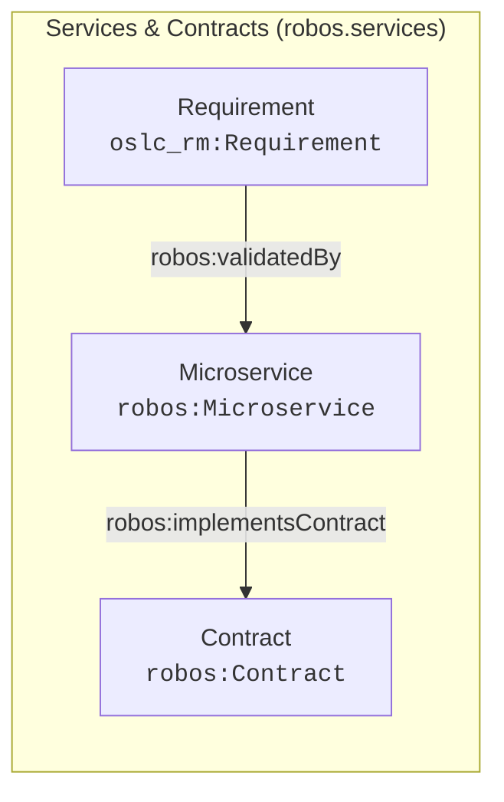

# Services & Contracts (robos.services)
{: .no_toc }

Backend microservices, OpenAPI 3.1 specifications, gRPC reflection stubs, and BDD verification features.
{: .fs-6 .fw-300 }

## Table of contents
{: .no_toc .text-delta }

1. TOC
{:toc}

---

## Package Metadata

- **Package Store ID**: `services`
- **Ontology Namespace**: `robos.services`
- **GitOps Package File**: `.robos/kgraphs/services/package.jsonld`
- **Schemas Defined**: 3

---

## Package Schemas & Constraint Shapes

| Schema Class | Target Shape URI | Required Properties (minCount ≥ 1) | Specification |
|---|---|---|---|
| [**Microservice** (`robos:Microservice`)]({{ '/schemas/services/microservice.html' | relative_url }}) | `urn:robos:shape:MicroserviceShape` | `robos:repository`, `robos:ownerTeam`, `dcterms:title` | [View Schema &rarr;]({{ '/schemas/services/microservice.html' | relative_url }}) |
| [**Contract** (`robos:Contract`)]({{ '/schemas/services/contract.html' | relative_url }}) | `urn:robos:shape:ContractShape` | `robos:specFile`, `robos:protocol` | [View Schema &rarr;]({{ '/schemas/services/contract.html' | relative_url }}) |
| [**Requirement** (`oslc_rm:Requirement`)]({{ '/schemas/services/requirement.html' | relative_url }}) | `urn:robos:shape:RequirementShape` | `dcterms:title`, `robos:featureFile` | [View Schema &rarr;]({{ '/schemas/services/requirement.html' | relative_url }}) |

---

## Package Entity Relationships

