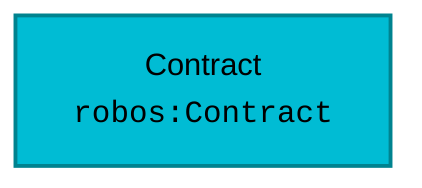

# Schema: `robos:Contract`
{: .no_toc }

Formal W3C SHACL constraint shape and OSLC JSON-LD specification for `robos:Contract` in the `services` package store.
{: .fs-6 .fw-300 }

## Table of contents
{: .no_toc .text-delta }

1. TOC
{:toc}

---

## Specification Metadata

- **RDF / OWL Class**: `robos:Contract`
- **Aliases / Target Classes**: `robos:Contract`
- **SHACL Shape ID**: `urn:robos:shape:ContractShape`
- **Governing Package**: [Services & Contracts (robos.services)]({{ '/schemas/services.html' | relative_url }}) (`services`)
- **Namespace**: `robos.services`

---

## Entity Relationship Diagram



---

## Property Constraints & SHACL Rules

| Property Path | Name | Multiplicity | Data Type | Constraint Rule / Validation Message |
|---|---|---|---|---|
| **`robos:specFile`** | Specification File | `1..*` | `xsd:string` | Contract must specify a specification file path. |
| **`robos:protocol`** | Protocol / Standard | `1..*` | `xsd:string` | Contract must declare a protocol (OpenAPI, Pact, etc.). |

---

## Canonical OSLC JSON-LD Example

```json
{
  "@id": "urn:robos:services:contract-sample",
  "@type": [
    "robos:Contract",
    "oslc:Resource"
  ],
  "dcterms:title": "Sample Contract",
  "dcterms:description": "Canonical reference instance for robos:Contract.",
  "robos:package": "services",
  "robos:namespace": "robos.services",
  "robos:specFile": "specs/contracts/sample-v1.yaml",
  "robos:protocol": "OpenAPI 3.1"
}
```

---

## Programmatic SHACL Validation

```javascript
const { SHACLValidator } = require('/usr/local/share/robos/robos-graph/lib/shacl-validator');
const { OSLCGraphParser, OSLC_CONTEXT } = require('/usr/local/share/robos/robos-graph/lib/oslc-parser');

const validator = new SHACLValidator();
const result = validator.validateGraph(new OSLCGraphParser({
  "@context": OSLC_CONTEXT,
  "robos:nodes": [
    {
        "@id": "urn:robos:services:contract-sample",
        "@type": [
            "robos:Contract",
            "oslc:Resource"
        ],
        "dcterms:title": "Sample Contract",
        "dcterms:description": "Canonical reference instance for robos:Contract.",
        "robos:package": "services",
        "robos:namespace": "robos.services",
        "robos:specFile": "specs/contracts/sample-v1.yaml",
        "robos:protocol": "OpenAPI 3.1"
    }
  ],
}));

console.log("Conforms:", result.conforms); // Expected: true
```