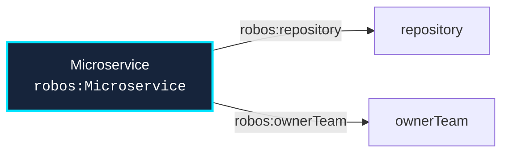

# Schema: `robos:Microservice`
{: .no_toc }

Formal W3C SHACL constraint shape and OSLC JSON-LD specification for `robos:Microservice` in the `services` package store.
{: .fs-6 .fw-300 }

## Table of contents
{: .no_toc .text-delta }

1. TOC
{:toc}

---

## Specification Metadata

- **RDF / OWL Class**: `robos:Microservice`
- **Aliases / Target Classes**: `robos:Microservice`
- **SHACL Shape ID**: `urn:robos:shape:MicroserviceShape`
- **Governing Package**: [Services & Contracts (robos.services)]({{ '/schemas/services.html' | relative_url }}) (`services`)
- **Namespace**: `robos.services`

---

## Entity Relationship Diagram



---

## Property Constraints & SHACL Rules

| Property Path | Name | Multiplicity | Data Type | Constraint Rule / Validation Message |
|---|---|---|---|---|
| **`robos:repository`** | Git Repository | `1..1` | `xsd:string` | Microservice must define exactly one repository. |
| **`robos:ownerTeam`** | Owner Team | `1..*` | `URI (robos:Team)` | Microservice must define an owner team. |
| **`dcterms:title`** | Title / Display Name | `1..*` | `xsd:string` | Microservice must have a title. |

---

## Canonical OSLC JSON-LD Example

```json
{
  "@id": "urn:robos:service:billing-api",
  "@type": [
    "oslc_am:Resource",
    "robos:Microservice"
  ],
  "dcterms:title": "Billing API Service",
  "robos:technology": "Go 1.22 / Gin",
  "robos:repository": "github.com/acme/billing-api",
  "robos:package": "services",
  "robos:namespace": "robos.services"
}
```

---

## Programmatic SHACL Validation

```javascript
const { SHACLValidator } = require('/usr/local/share/robos/robos-graph/lib/shacl-validator');
const { OSLCGraphParser, OSLC_CONTEXT } = require('/usr/local/share/robos/robos-graph/lib/oslc-parser');

const validator = new SHACLValidator();
const result = validator.validateGraph(new OSLCGraphParser({
  "@context": OSLC_CONTEXT,
  "robos:nodes": [
    {
        "@id": "urn:robos:service:billing-api",
        "@type": [
            "oslc_am:Resource",
            "robos:Microservice"
        ],
        "dcterms:title": "Billing API Service",
        "robos:technology": "Go 1.22 / Gin",
        "robos:repository": "github.com/acme/billing-api",
        "robos:package": "services",
        "robos:namespace": "robos.services"
    }
  ],
}));

console.log("Conforms:", result.conforms); // Expected: true
```