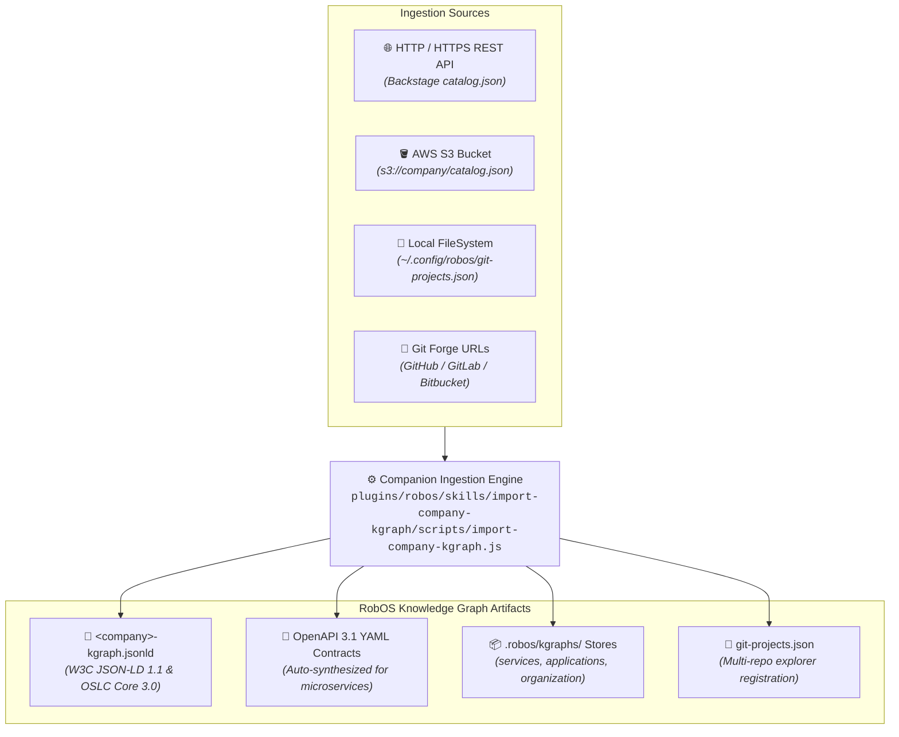

# Company KGraph Import Skill (`import-company-kgraph`)
{: .no_toc }

Deep guide on using the `import-company-kgraph` AI agent skill to ingest an entire organization's repository inventory across HTTP REST APIs, AWS S3 buckets, local file trees, or Git forges into RobOS Knowledge Graph package stores.
{: .fs-6 .fw-300 }

## Table of contents
{: .no_toc .text-delta }

1. TOC
{:toc}

---

## Overview: Enterprise Knowledge Graph Ingestion

When engineering teams and organizations adopt RobOS, they typically have dozens or hundreds of existing repositories. These codebases and architectural components are cataloged across different systems:
- **Internal Developer Portals**: Spotify Backstage catalogs (`catalog-entities.json`, `catalog-info.yaml`) or corporate microservice inventories.
- **Cloud Object Storage**: Centralized inventory dumps on **AWS S3** (`s3://company-sdlc-bucket/inventories/repos.json`).
- **Local Filesystems**: Cloned workspaces or existing `~/.config/robos/git-projects.json` files.
- **Git Forges**: Enterprise GitHub, GitLab, or Bitbucket organizations.

The **`import-company-kgraph`** skill enables autonomous AI coding agents (Claude Code, OpenAI Codex, Google Antigravity, GitHub Copilot, Gemini CLI) to automatically scan, normalize, classify, and synthesize these inventories into standard **Dual-State OSLC JSON-LD Knowledge Graph** package files.



---

## Command Syntax & Parameters

Execute the companion engine via your AI agent or directly from the terminal:

```bash
node plugins/robos/skills/import-company-kgraph/scripts/import-company-kgraph.js --source <source> [options]
```

### Supported Flags

| Flag | Shorthand | Type | Default | Description |
|:---|:---|:---|:---|:---|
| `--source` | `-s` | String | *Required* | Path, HTTP URL, or S3 URI of the source repository inventory. |
| `--source-type` | `-t` | String | `auto` | Parser type: `auto`, `http`, `file`, `s3`, or `git-list`. |
| `--output` | `-o` | String | `./<slug>-kgraph.jsonld` | Destination path for the generated standalone JSON-LD file. |
| `--company-name` | `-n` | String | `"Acme Global"` | Enterprise or organization display title. |
| `--company-slug` | | String | `"acme"` | Lowercase hyphenated slug for URN and package generation. |
| `--default-team` | | String | `"urn:robos:team:core-platform"` | Default team ownership URN assigned to imported nodes. |
| `--import-to-robos` | | Flag | `false` | When set, automatically merges nodes into `.robos/kgraphs/` package stores and registers repos in `~/.config/robos/git-projects.json`. |
| `--dry-run` | | Flag | `false` | Simulates ingestion and prints node counts without writing to disk. |
| `--verbose` | `-v` | Flag | `false` | Enables detailed discovery and parsing telemetry logs. |

---

## Real-World Ingestion Examples

### 1. Ingesting from an AWS S3 Bucket Inventory
Organizations storing service inventories or CI/CD catalogs in AWS S3 can ingest directly:
```bash
node plugins/robos/skills/import-company-kgraph/scripts/import-company-kgraph.js \
  --source s3://acme-cloud-governance/sdlc-catalog/enterprise-repos.json \
  --company-name "Acme Global" \
  --company-slug "acme" \
  --import-to-robos
```

### 2. Ingesting from an HTTP REST API or Spotify Backstage Catalog
Fetch live service catalogs from corporate developer portals:
```bash
node plugins/robos/skills/import-company-kgraph/scripts/import-company-kgraph.js \
  --source https://developer.internal.acme.com/api/catalog-entities.json \
  --company-name "Acme Global" \
  --output ./acme-kgraph.jsonld
```

### 3. Ingesting from a Local File or Directory
Scan existing local projects or registered git projects:
```bash
# Ingest from existing git-projects.json:
node plugins/robos/skills/import-company-kgraph/scripts/import-company-kgraph.js \
  --source ~/.config/robos/git-projects.json \
  --company-name "Acme Global" \
  --output ./acme-kgraph.jsonld

# Scan a folder containing cloned Git repositories:
node plugins/robos/skills/import-company-kgraph/scripts/import-company-kgraph.js \
  --source /home/developer/source/repos \
  --company-name "Acme Global" \
  --import-to-robos
```

---

## Heuristic Archetype & Tech Stack Inference

The engine inspects repository names and manifest build files (`package.json`, `pom.xml`, `go.mod`, `Cargo.toml`, `pyproject.toml`) to classify components across all 9 RobOS archetypes:

| Inferred Archetype | URN Format | Supported Frameworks | Scaffolding / Synthesis |
|:---|:---|:---|:---|
| **`robos:Microservice`** | `urn:robos:microservice:<slug>` | Java Spring Boot, Go Gin, Python FastAPI, Express | Generates OpenAPI 3.1 YAML contract, health check probes (`/healthz`), and CRUD paths. |
| **`robos:FrontEndApp`** | `urn:robos:frontend-app:<slug>` | React 18, Vite, Next.js, Vue, Svelte | SPA/SSR application metadata and client bindings. |
| **`robos:DesktopApp`** | `urn:robos:desktop-app:<slug>` | Electron 29, Tauri | Local workstation desktop application metadata. |
| **`robos:PCGame`** | `urn:robos:pc-game:<slug>` | Unreal Engine 5, Unity 6, Godot 4.2, Bevy | Desktop PC game manifest and engine build profiles. |
| **`robos:MobileGame`** | `urn:robos:mobile-game:<slug>` | Unity 6, Unreal Engine 5, Godot 4.2 | Mobile game workspace and touch binding metadata. |
| **`robos:ConsoleApp`** | `urn:robos:console-app:<slug>` | Go Cobra, Rust Clap, Python Click | Command-line terminal utility metadata. |
| **`robos:MobileApp`** | `urn:robos:mobile-app:<slug>` | React Native, Flutter, Swift, Kotlin | Mobile client metadata. |
| **`robos:DataPipeline`** | `urn:robos:pipeline:<slug>` | Kafka Streams, Celery, Spark | Stream processing and worker job metadata. |
| **`robos:Library`** | `urn:robos:library:<slug>` | TypeScript, Python, Rust, Maven | Shared module and client SDK metadata. |

---

## Integration with "Use Existing Git Projects" Workflow

RobOS highlights the `import-company-kgraph` skill across all user touchpoints when onboarding existing codebases:

1. **Git Projects (`packages/git-projects`)**:
   - In `#modal-add` ("Add Git Project"): Tip banner directs users to ask their AI agent to run `/import-company-kgraph` to extract company repositories into KGraph entries and import them into RobOS.
   - In `#modal-org-picker` ("Add Repos from GitHub Org"): Prompts users to run `/import-company-kgraph --source <github-org-url>` to extract full organization portfolios.
2. **App Wizard (`packages/app-wizard`)**:
   - In `#panel-import-1` ("Existing App Import"): Tip card assists teams onboarding multiple projects simultaneously.
3. **RobOS Graph (`packages/robos-graph`)**:
   - In `#packages-modal` ("KGraph Packages & Multi-Repo Manager"): Guides developers on generating ready-to-import KGraph package files.
