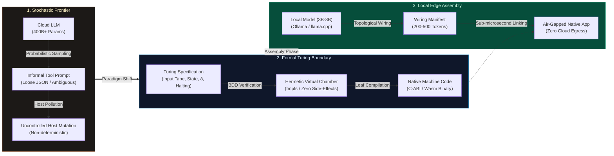
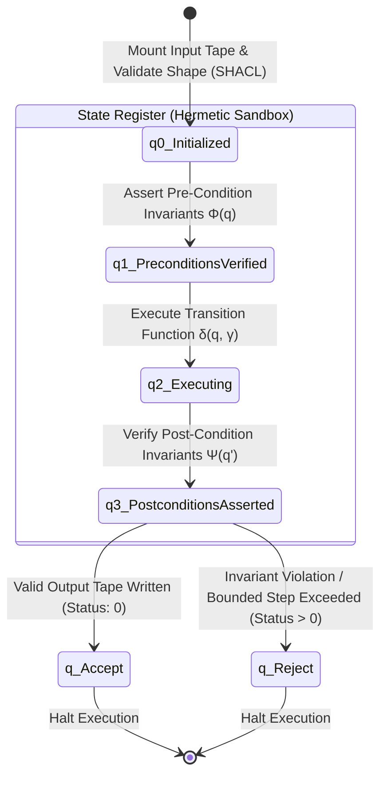
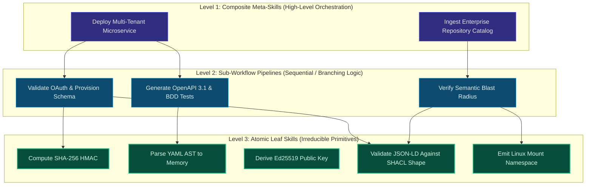
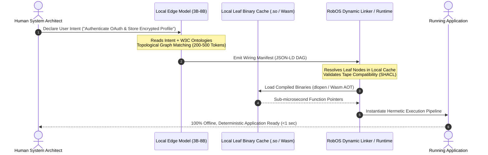
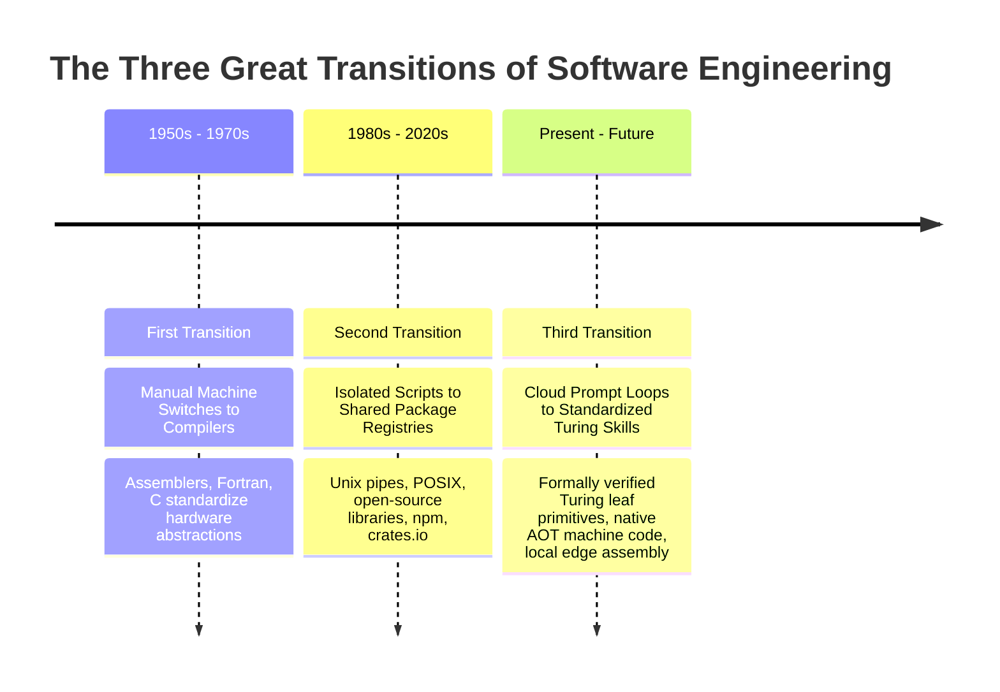
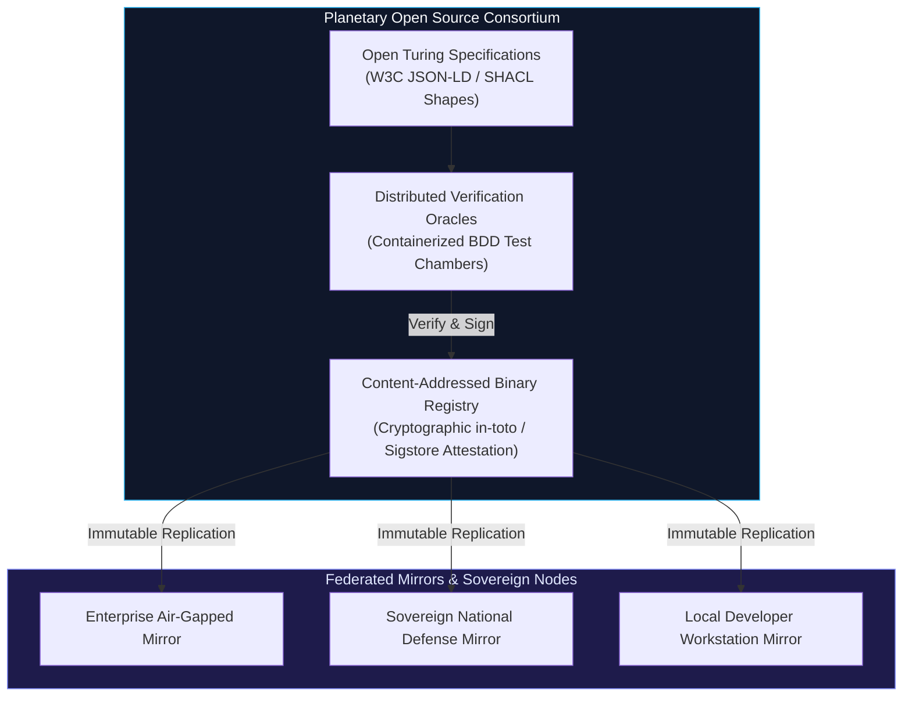
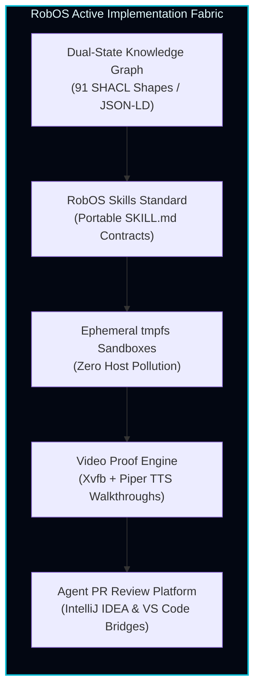

# Standardized Turing Skills: Grounding AI Agent Capabilities in Automata Theory, Bounded State Invariants, and Native Machine Code Leaf Compilation
{: .no_toc }

**A Formal RobOS Architectural Whitepaper on the Post-Cloud Equilibrium of Software Development**
{: .fs-5 .fw-300 .text-grey-dk-000 }

*Author: RobOS Architectural Working Group & Planetary Commons Initiative*  
*Classification: Foundational Theory & Systems Architecture*  
*Companion Document: [The Future of Software Development: Turing Skills, Compiled Machine Code & Local Edge Assembly]({{ site.baseurl }})*

---

<div style="margin: 1.5rem 0 2rem; padding: 1.25rem 1.5rem; background: #0d1117; border: 1px solid #30363d; border-radius: 8px; border-left: 4px solid #38bdf8;">
  <div style="font-weight: 700; color: #58a6ff; font-size: 1.05rem; margin-bottom: 0.5rem;">Executive Summary</div>
  <p style="margin: 0; color: #c9d1d9; font-size: 0.95rem; line-height: 1.6;">
    Contemporary autonomous agent architectures remain trapped on a <strong>hyperscaler data center treadmill</strong>: stochastic inference models predict tool invocations and regenerate identical boilerplate algorithms billions of times daily over high-latency network boundaries. This whitepaper establishes the theoretical and mechanical foundations of the <strong>Standardized Turing Skill</strong>—grounding agent capabilities in formal automata theory (&delta; : Q &times; &Gamma; &rarr; Q &times; &Gamma; &times; {L, R}), strictly typed W3C JSON-LD/SHACL input tapes, hermetic state registers, and decidable halting guarantees. Furthermore, we articulate the <strong>Law of Leaf Compilation</strong>, demonstrating how verified atomic primitives compile into deterministic C-ABI machine code binaries, inverting the role of local consumer-grade language models from code typists into topological semantic linkers operating fully air-gapped without cloud dependencies.
  </p>
</div>

## Table of Contents
{: .no_toc .text-delta }

1. TOC
{:toc}

---

## 1. Abstract

Modern artificial intelligence coding agents (such as OpenAI Assistants, Anthropic Claude Code, LangChain agents, and early Model Context Protocol implementations) rely on an architectural paradigm rooted in *stochastic tool sampling*. Capabilities are presented to Large Language Models (LLMs) as loose natural-language prompt instructions and unconstrained JSON schemas, which the model attempts to invoke through text token generation. This approach suffers from four fatal structural defects:

1. **Non-deterministic state transitions** resulting in divergent execution paths and hallucinated parameters.
2. **Ambient environment pollution** caused by uncontrolled side effects on host filesystems and processes.
3. **The Agent Halting Problem**, wherein recursive agent reasoning loops run unbounded, consuming computational credits without termination proofs.
4. **Catastrophic computational inefficiency**, where multi-hundred-billion-parameter cloud models burning megawatts of electrical energy are repeatedly queried to synthesize elementary, solved computational primitives.

This paper presents the **Standardized Turing Skill Architecture**, a mathematically rigorous formulation that maps AI agent tools to the classical 7-tuple Turing Machine. We prove that by restricting atomic leaf skills to sub-Turing primitive recursive deciders with bounded step budgets ($K_{\max}$), we resolve the Agent Halting Problem while preserving universal computational power across composed skill Directed Acyclic Graphs (DAGs). 

We define the **Compilation Boundary**: once an atomic capability's Turing contract is formally verified via automated Behavior-Driven Development (BDD) verification chambers, it is compiled ahead-of-time (AOT) into signed native machine code (`.so`, `.dylib`, ELF, WebAssembly) exporting a zero-overhead C-Application Binary Interface (C-ABI). Finally, we demonstrate how lightweight, quantized open-weight models (3B–8B parameters) running locally on commodity consumer hardware act as **Semantic Graph Linkers**, assembling verified leaf binaries into full-scale applications with zero cloud egress, sub-microsecond invocation latency, and mathematical determinism.



---

## 2. The Pathology of Contemporary Agentic Tool Use

To understand why software engineering must transition to Turing-grounded skills, we must first diagnose the foundational failure modes of current LLM tool execution models.

### 2.1 The LLM as Stochastic Typist

In the prevailing paradigm, developers and autonomous agents interact with LLMs by sending expansive natural language prompts and receiving character-by-character token streams:

```
LLM Inference: P(w_t | w_1, w_2, ..., w_{t-1})
```

When generating an HTTP handler, a cryptographic hash calculation, or an AST traversal, the model burns thousands of floating-point operations (FLOPs) predicting character transitions (`f`, `u`, `n`, `c`, `t`, `i`, `o`, `n`, ` `...). This approach is computationally perverse:
- The underlying algorithmic problem is completely deterministic and has been formally solved for decades.
- Sampling from a probabilistic distribution introduces non-zero entropy into an operation where zero entropy is required.
- The cloud model acts as a slow, expensive, energy-intensive typist rather than a high-level system architect.

### 2.2 Structural Deficiencies of Heuristic Tool Calling

Contemporary agent frameworks introduce "tools" or "skills" by providing a JSON schema definition alongside the system prompt. During inference, if the model predicts a specific function-call token sequence, the client runtime pauses generation, executes the corresponding script (typically written in Python or Node.js), stringifies the return value, and appends it back to the prompt context.

This architecture exhibits four major structural pathologies:

#### Pathology I: Loose Schemas and Type Divergence
JSON Schema allows partial definitions, untyped `object` blobs, and implicit type coercions. When an LLM generates arguments for a tool, it regularly omits mandatory properties, invents non-existent flags, or supplies malformed values. The tool runtime either crashes or silently coerces the input, propagating corrupt state downstream.

#### Pathology II: Ambient Environment Mutation & Lack of Hermeticity
Conventional agent tools run with the ambient credentials and file access of the host developer workstation. A tool instructed to "clean build artifacts" executes `rm -rf` commands directly on the developer's physical filesystem. There are no hermetic sandbox boundaries, no pre-condition checks, and no post-condition validation. A single errant token can destroy uncommitted work or compromise machine security.

#### Pathology III: The Agent Halting Problem
When an agent encounters an unexpected error code or malformed output from a tool, it feeds the stack trace back into its next inference cycle. If the tool lacks formal state invariants and explicit halting contracts, the agent frequently enters an **infinite repair loop**—continually hallucinating alternate non-working arguments, escalating token expenditure, and never reaching a terminal state.

#### Pathology IV: High Latency and Energetic Waste
Each step in an agent tool loop requires:
1. Serializing the entire conversation history into an HTTP payload.
2. Transmitting hundreds of kilobytes over public internet backbones to a centralized GPU cluster.
3. Queueing in cloud inference schedulers.
4. Generating output tokens at 30–80 tokens per second.
5. Returning the response over the wire and deserializing JSON.

A multi-step agent workflow routinely takes several minutes and consumes dozens of kilowatt-hours of electrical energy in data centers—all to perform operations that should execute in nanoseconds on local silicon.

---

## 3. Theoretical Formulation of the Standardized Turing Skill

To eliminate these pathologies, RobOS discards informal prompt-based tooling in favor of computation theory. We ground every agent capability in Alan Turing's seminal 1936 abstraction: the **Turing Machine**.

### 3.1 The Classical Machine Formalism

Recall that a deterministic Turing Machine is formally defined as a 7-tuple:

<div style="margin: 1.25rem 0; padding: 1.25rem 1.5rem; background: #0d1117; border: 1px solid #30363d; border-radius: 8px; text-align: center;">
  <span style="font-family: 'SF Pro Display', -apple-system, monospace; font-size: 1.45rem; font-weight: 700; color: #38bdf8; letter-spacing: 0.05em;">
    &Mscr; = &langle; Q, &Sigma;, &Gamma;, &delta;, q<sub>0</sub>, B, F &rangle;
  </span>
  <div style="margin-top: 0.5rem; font-size: 0.88rem; color: #8b949e; line-height: 1.5;">
    where <code>Q</code> is the finite set of states, <code>&Sigma;</code> is the input alphabet, <code>&Gamma;</code> is the tape alphabet (&Sigma; &sub; &Gamma;),<br/>
    <code>&delta; : Q &times; &Gamma; &rarr; Q &times; &Gamma; &times; {L, R}</code> is the deterministic transition function, <code>q<sub>0</sub> &isin; Q</code> is the initial state,<br/>
    <code>B &isin; &Gamma; \ &Sigma;</code> is the blank symbol, and <code>F &sube; Q</code> is the set of halting states.
  </div>
</div>

### 3.2 The RobOS Turing Skill Mapping

In the RobOS architecture, an agent capability is not an arbitrary script. It is an instantiated, hermetic Turing Skill $\mathcal{T}_{\text{skill}}$ strictly mapped to the formal 7-tuple:



### 3.3 The 4 Formal Pillars of a Turing Skill

Every RobOS skill is constructed upon four immutable structural pillars:

#### Pillar I: The Input Tape ($\Sigma \subset \Gamma$)
- **Formal Mapping**: The symbols written on the tape before execution commences.
- **Implementation**: Formally typed, schema-validated input payload governed by **W3C JSON-LD**, **OASIS OSLC 3.0**, or **TypeSpec** domain models.
- **Mathematical Guarantee**: An automated validation gate function $V_{\text{SHACL}}: \mathcal{I} \to \{0, 1\}$ evaluates the input tape against declared W3C SHACL shape constraints. If $V_{\text{SHACL}}(\text{input}) = 0$, execution is aborted before the state register is initialized. Malformed invocations are impossible.

#### Pillar II: The State Register & Environmental Invariants ($Q$)
- **Formal Mapping**: The discrete internal state $q \in Q$ of the finite control.
- **Implementation**: A completely hermetic, disposable execution environment. RobOS utilizes ephemeral in-memory sandboxes (`tmpfs`), isolated Linux user and mount namespaces, and virtual X11 displays (`Xvfb`).
- **Mathematical Guarantee**: Zero ambient leakage. For any skill execution, let $S_{\text{host}}$ represent the workstation state. The execution satisfies the invariant:
  $$\Delta S_{\text{host}} = \emptyset$$
  Every modification is confined strictly to the skill's dedicated virtual boundary.

#### Pillar III: The Deterministic Transition Function ($\delta$)
- **Formal Mapping**: $\delta : Q \times \Gamma \to Q \times \Gamma \times \{L, R\}$.
- **Implementation**: The core algorithmic logic that reads symbols from the tape, modifies the internal state register, writes output symbols, and advances the head.
- **Mathematical Guarantee**: Pure operational determinism. Given identical input tapes and initial states, the transition sequence $\tau = \langle (q_0, \gamma_0), (q_1, \gamma_1), \dots \rangle$ is completely invariant.

#### Pillar IV: The Output Tape & Decidable Halting ($F = \{q_{\text{accept}}, q_{\text{reject}}\}$)
- **Formal Mapping**: The final symbol sequence remaining on the tape upon entering a terminal state in $F$.
- **Implementation**: A strongly typed output contract containing the computed result, verified cryptographic hashes, and exit status code.
- **Mathematical Guarantee**: Guaranteed termination. See Section 3.4.

---

### 3.4 Resolving the Agent Halting Problem

In general computation theory, the **Halting Problem** proved by Alan Turing demonstrates that no general algorithm can decide whether an arbitrary program will halt on a given input:

$$H(M, w) \text{ is undecidable for general Turing Machines } \mathcal{M}.$$

When AI agents orchestrate chains of tools without formal boundaries, they run directly into this undecidability barrier—generating non-terminating recursion loops, deadlocked locks, and runaway resource consumption.

RobOS resolves this problem through **Intentional Sub-Turing Restriction**:

<div style="margin: 1.25rem 0; padding: 1.25rem 1.5rem; background: #0d1117; border: 1px solid #30363d; border-radius: 8px;">
  <div style="font-weight: 700; color: #38bdf8; font-size: 1.05rem; margin-bottom: 0.5rem;">Theorem 1 (Decidability of Leaf Turing Skills)</div>
  <p style="margin: 0; color: #c9d1d9; font-size: 0.92rem; line-height: 1.6;">
    Let &Tau; be an atomic leaf skill. By constraining &Tau; to a <strong>Primitive Recursive Decider</strong> equipped with an immutable step budget K<sub>max</sub> &isin; &Nopf;<sup>+</sup> and wall-clock timeout &Delta;t<sub>max</sub> &isin; &Ropf;<sup>+</sup>, the halting problem for &Tau; is strictly decidable in O(K<sub>max</sub>) time.
  </p>
</div>

**Proof Sketch:**
1. Every atomic leaf skill $\mathcal{T}$ defines a strictly monotonically increasing counter $k \in \mathbb{N}$ incremented on each state transition.
2. The state transition function is augmented such that if $k > K_{\max}$, the transition function forces $\delta(q_k, \gamma) = (q_{\text{reject}}, \text{ERR\_STEP\_BUDGET\_EXCEEDED})$.
3. Similarly, execution runs within a kernel-enforced `cgroup` timeout $\Delta t_{\max}$. If elapsed real time exceeds $\Delta t_{\max}$, a hardware interrupt halts execution and yields $q_{\text{reject}}$.
4. Because the state space and step count are strictly bounded, $\mathcal{T}$ cannot contain an infinite loop. Therefore, every leaf skill halts in finite time. $\blacksquare$

By bounding leaf skills to decidable deciders, we construct complex composite workflows as Directed Acyclic Graphs (DAGs) of halting nodes. Because a finite DAG composed of halting sub-machines is itself guaranteed to halt, the entire agent SDLC execution graph becomes **provably terminating**.

---

## 4. Deep Comparative Matrix: Heuristic Agent Skills vs. Standardized Turing Skills

The following rigorous comparative matrix contrasts current industry-standard AI agent skills with the RobOS Standardized Turing Skill architecture across ten fundamental computer science dimensions:

| Dimension | Heuristic Cloud Agent Skills (OpenAI / Claude / LangChain) | Standardized RobOS Turing Skills | Theoretical Advantage of Turing Grounding |
|:---|:---|:---|:---|
| **1. Theoretical Foundation** | Probabilistic next-token sampling: $\operatorname{argmax} P(w_t \mid w_{<t})$ over prompt text. | Formal Automata Theory: $\delta : Q \times \Gamma \to Q \times \Gamma \times \{L, R\}$. | Transforms tool use from statistical guesswork into provable automata state transitions. |
| **2. Input Specification** | Unenforced or weakly checked JSON schema; partial string typing; implicit type coercions. | Formally typed, closed-world contracts validated against **W3C JSON-LD**, **OASIS OSLC 3.0**, and **SHACL shapes**. | Rejects malformed arguments before execution initializes ($V_{\text{SHACL}} = 0$); zero argument hallucination. |
| **3. State Management** | Ambient host state; writes directly to developer filesystems, active ports, and global shells. | Hermetic, ephemeral state registers: dedicated in-memory `tmpfs`, isolated Linux namespaces. | Invariant $\Delta S_{\text{host}} = \emptyset$; zero machine pollution, zero credential leaks. |
| **4. State Invariants** | None. Scripts assume implicit dependencies (Node version, global PATH, network access). | Explicit pre-condition invariants $\Phi(q)$ and post-condition invariants $\Psi(q')$. | Guaranteed environmental reproducibility across machines, CI runners, and air-gapped nodes. |
| **5. Determinism & Repeatability** | Stochastic. Temperature $> 0$ and model drift yield different arguments and code across runs. | Bit-for-bit deterministic. Identical input tape symbols yield identical transition sequences $\tau$. | Eliminates flakiness; enables cryptographic caching and content-addressed re-use. |
| **6. Termination Guarantees** | Undecidable. Vulnerable to infinite loops, recursive hallucinations, and runaway costs. | Decidable. Enforces primitive recursive bounds, step budgets $K_{\max}$, and hardware timeout bounds. | Eliminates the Agent Halting Problem; guarantees bounded termination across all workflows. |
| **7. Execution Latency** | $250\text{ ms} - 5000\text{ ms}$ per tool invocation (network transit + cloud GPU inference queue). | $< 1\text{ \textmu s}$ (sub-microsecond) direct C-ABI / Wasm AOT method call. | $10^5 \times$ to $10^6 \times$ speedup; real-time application responsiveness. |
| **8. Energy Consumption** | $\approx 10 - 50\text{ Joules}$ per tool call in hyperscaler data centers. | $\approx 10 - 100\text{ nanojoules}$ per invocation on local CPU/GPU silicon. | $10^8 \times$ reduction in carbon footprint and energy expenditure. |
| **9. Blast Radius & Security** | Unbounded. Potential arbitrary command injection, prompt injection, and data exfiltration. | Strictly bounded capability tokens; zero-trust memory bounds; dual-state blast-radius diffing. | Guarantees least-privilege execution; completely prevents catastrophic workspace destruction. |
| **10. Verification Fabric** | Vague post-hoc spot checks or brittle unit tests with mocked environments. | Automated formal verification chambers: headless **Xvfb virtual framebuffers** and 1080p video proof. | Visual, audio (Piper TTS), and DOM snapshot proof-of-work before any change merges. |

---

## 5. Hierarchical DAG Decomposition & The Leaf Compilation Boundary

To manage real-world software engineering complexity, skills cannot exist as an undifferentiated flat list. They must be structured as a strict **Directed Acyclic Graph (DAG)** of hierarchical capabilities.



### 5.1 The Stratification Levels

1. **Composite Workflow Skills (Meta-Orchestrators)**: High-level systems that decompose abstract human intent (e.g., *"Provision an authenticated Kafka event streaming cluster with TLS mutual auth"*).
2. **Sub-Workflow Skills (Pipelines)**: Mid-level deterministic sequences (e.g., *"Validate client certificates and generate Kubernetes ConfigMaps"*).
3. **Leaf Skills (Atomic Primitives)**: Pure, irreducible, atomic computational units (e.g., *"Parse OpenAPI YAML AST"*, *"Compute HMAC-SHA256"*, *"Evaluate SHACL NodeShape"*).

### 5.2 The Law of Leaf Compilation

The pivotal architectural inflection point occurs at Level 3:

<div style="margin: 1.5rem 0; padding: 1.25rem 1.5rem; background: #0b1329; border: 1px solid #1d4ed8; border-radius: 8px; border-left: 4px solid #60a5fa;">
  <div style="font-weight: 700; color: #93c5fd; font-size: 1.05rem; margin-bottom: 0.5rem;">The Law of Leaf Compilation</div>
  <p style="margin: 0; color: #dbeafe; font-size: 0.95rem; line-height: 1.6;">
    Once an atomic leaf skill's Turing contract (&Sigma;, Q, &delta;, F) is mathematically satisfied and passes automated formal BDD verification chambers, it must <strong>never be re-prompted, re-interpreted, or regenerated through an artificial neural network</strong>. It must be compiled ahead-of-time (AOT) into <strong>native machine code</strong> exporting a standardized C-Application Binary Interface (C-ABI) or WebAssembly AOT binary.
  </p>
</div>

### 5.3 The Standardized C-ABI Leaf Interface

To guarantee universal language interoperability without runtime overhead or foreign-function-interface (FFI) impedance, all compiled leaf skills adhere to an immutable binary interface:

```c
#ifndef ROBOS_TURING_SKILL_H
#define ROBOS_TURING_SKILL_H

#include <stdint.h>
#include <stddef.h>

#ifdef __cplusplus
extern "C" {
#endif

/* Formally Typed Input Tape Representation */
typedef struct {
    const uint8_t*  payload_ptr;       /* Pointer to contiguous JSON-LD / Binary Tape */
    size_t          payload_len;       /* Total byte length of input payload */
    const char*     schema_uri;        /* Canonical W3C SHACL / TypeSpec Schema URI */
    uint64_t        max_step_budget;   /* Halting invariant: K_max transition steps */
    uint32_t        timeout_ms;        /* Wall-clock execution timeout in milliseconds */
} RobOSTuringTape;

/* Guaranteed Output Tape & Halting State */
typedef struct {
    uint32_t        status_code;       /* 0 = q_accept, >0 = q_reject (formal error code) */
    const uint8_t*  result_ptr;        /* Pointer to verified output tape buffer */
    size_t          result_len;        /* Output buffer length */
    const char*     error_invariant;   /* Null on q_accept; invariant failure on reject */
    uint64_t        steps_consumed;    /* Total transition steps executed */
    uint64_t        execution_time_ns; /* High-precision execution duration in nanoseconds */
} RobOSTuringResult;

/**
 * Standardized Leaf Skill Machine-Code Entrypoint
 * 
 * Invariants:
 * 1. Zero-copy buffer evaluation where possible.
 * 2. Bounded execution: Guaranteed to return within max_step_budget or timeout_ms.
 * 3. Thread-safe, re-entrant, and free of ambient side-effects.
 */
RobOSTuringResult robos_leaf_skill_execute(
    const char*            skill_urn,
    const RobOSTuringTape* input_tape
);

/**
 * Free resources associated with an executed Turing result.
 */
void robos_leaf_skill_free_result(RobOSTuringResult* result);

#ifdef __cplusplus
}
#endif

#endif /* ROBOS_TURING_SKILL_H */
```

### 5.4 Elimination of Hallucination via Machine Code

A neural network produces tokens through stochastic matrix multiplications over weights:

$$y = \operatorname{softmax}(W \cdot x + b)$$

Because floating-point calculations and probabilistic sampling are fundamentally continuous and stochastic, an LLM possesses a persistent probability $P(\text{hallucination}) > 0$.

In stark contrast, compiled machine code executes discrete CPU instructions:
```nasm
mov rax, [rsi + 8]    ; Load input tape pointer
test rax, rax         ; Assert non-null invariant
jz .handle_fault
call sha256_process   ; Execute deterministic leaf routine
```

Assembly instructions cannot hallucinate. There is no probability distribution over CPU opcodes. Once compiled to native binaries, a leaf skill achieves:
- **Mathematical Invariant Satisfaction**: Every branch is audited by formal verification suites.
- **Zero Token Overhead**: Eliminates thousands of prompt and completion tokens.
- **Sub-Microsecond Latency**: Direct register manipulation and L1/L2 cache execution replaces multi-second HTTP roundtrips.

---

## 6. Local Edge Assembly: The LLM as Semantic Graph Linker

When a comprehensive registry of verified leaf primitives has been compiled into native machine code, the operational purpose of Large Language Models changes completely.

### 6.1 The Inversion: From Typist to Topological Linker

Instead of generating raw source code line-by-line, the LLM is elevated to its proper intellectual tier: **The Semantic Graph Linker**.



### 6.2 The Compact Assembly Manifest

Because the local model does not write raw source code, its output is reduced from 100,000 tokens of fragile code to a compact **Assembly Manifest** of 200–500 tokens:

```json
{
  "@context": "https://robos.dev/schemas/v1/assembly.jsonld",
  "@type": "robos:AssemblyManifest",
  "urn": "urn:robos:assembly:tenant-auth-pipeline",
  "pipeline": [
    {
      "step": 1,
      "skillUrn": "urn:robos:leaf:crypto:ed25519-verify",
      "inputBinding": { "tape": "$.request.headers.signature" },
      "outputTarget": "tape_sig_valid"
    },
    {
      "step": 2,
      "skillUrn": "urn:robos:leaf:parser:jwt-claims",
      "inputBinding": { "tape": "$.request.headers.authorization" },
      "outputTarget": "tape_claims",
      "precondition": "tape_sig_valid.status_code == 0"
    },
    {
      "step": 3,
      "skillUrn": "urn:robos:leaf:storage:sqlite-upsert-tenant",
      "inputBinding": {
        "tenantId": "tape_claims.sub",
        "payload": "$.request.body"
      },
      "outputTarget": "tape_db_result"
    }
  ]
}
```

### 6.3 Why Edge Hardware Can Assemble Any Application

1. **Lightweight Parameter Requirements**: Solving topological graph matching and type routing does not require a 400B parameter model. A quantized 3B–8B parameter model (e.g., Llama-3-8B-Instruct, Mistral-7B, Phi-3) executing on a consumer Apple Silicon M-series chip, AMD Ryzen APU, or Intel Core Ultra NPU performs topological wiring with $>99\%$ precision.
2. **100% Air-Gapped Operation**: Because the model and the pre-compiled leaf binaries reside entirely on the local disk (`~/.robos/cache/binaries/`), no packets leave the workstation. Proprietary corporate intellectual property, medical records, and sensitive customer data never traverse public networks.
3. **Instantaneous Feedback**: Assembling pre-compiled native binaries takes milliseconds. The developer experiences near-instant application synthesis rather than waiting on cloud queues.

---

## 7. The Asymptotic Endpoint: The Finite Primitive Hypothesis

A foundational philosophical and mathematical proposition underpins this architecture:

<div style="margin: 1.5rem 0; padding: 1.25rem 1.5rem; background: #0d1117; border: 1px solid #30363d; border-radius: 8px; border-left: 4px solid #a855f7;">
  <div style="font-weight: 700; color: #d8b4fe; font-size: 1.05rem; margin-bottom: 0.5rem;">Axiom 1: The Finite Primitive Hypothesis</div>
  <p style="margin: 0; color: #e9d5ff; font-size: 0.95rem; line-height: 1.6;">
    The cardinality of unique atomic computational leaf primitives required to construct all conceivable commercial, scientific, and enterprise software systems is asymptotically bounded and finite:
    <br/><br/>
    <span style="font-family: monospace; font-size: 1.15rem; color: #f3e8ff;">| &Pi;<sub>primitives</sub> | &lt; &infin;</span>
  </p>
</div>

### 7.1 The Three Great Transitions of Software Engineering

Historically, software engineering progresses by freezing solved abstractions into lower, faster, deterministic layers:



1. **First Transition (1950s–1970s)**: From manual electrical switches and patch cables to symbolic assembly and high-level compilers (Fortran, C). Developers stopped hand-crafting opcodes.
2. **Second Transition (1980s–2020s)**: From bespoke in-house algorithms to open-source package repositories (npm, PyPI, crates.io, Maven). Developers stopped re-writing standard string splitters and cryptographic hashes.
3. **Third Transition (Present–Future)**: From artisanal prompt loops in centralized hyperscaler clouds to **Standardized Turing Skills and Compiled Machine Code**. Autonomous swarms and human architects solve every remaining leaf primitive once, certify it, compile it, and deposit it into a permanent **Planetary Commons**.

---

## 8. The Global Consortium: A Planetary Commons of Compiled Skills

To prevent this universal library of compiled capabilities from being monopolized by proprietary cloud vendors, RobOS proposes a **Global Open Source Consortium** governed under the stewardship of international open-standards bodies (analogous to the Linux Foundation, W3C, and IETF).



### 8.1 Principles of the Global Commons

1. **Open, Royalty-Free Standards**: Every skill contract is published in open machine-readable RDF/JSON-LD formats. No proprietary subscription fees or API gating.
2. **Bit-for-Bit Reproducible Builds**: Every compiled binary artifact in the registry is bit-for-bit reproducible across target CPU architectures (`x86_64`, `aarch64`, `riscv64`, `wasm32`).
3. **Cryptographic Provenance**: Binaries are accompanied by immutable cryptographic attestations (Sigstore / in-toto) proving that the exact source code passed exhaustive verification suites in isolated chambers.
4. **Decentralized & Air-Gappable**: Any organization, university, or nation-state can mirror the entire planetary repository locally—guaranteeing technological autonomy without continuous dependency on foreign cloud data centers.

---

## 9. How RobOS Implements the Theoretical Foundation Today

The principles articulated in this whitepaper are not theoretical conjectures—they represent the active architectural foundation of the RobOS platform:



1. **Standardized Skill Directory Structure**: All RobOS agent skills (in `plugins/robos/skills/` and `.agents/skills/`) are structured with validated YAML frontmatter, typed arguments, and explicit execution steps.
2. **Rigorous Ontologies and SHACL Validation**: RobOS models all SDLC entities using **91+ W3C SHACL shape constraints** across modular packages (`.robos/kgraphs/`). Invocations are validated against schema shapes prior to execution.
3. **In-Memory Disposable Sandboxes (`tmpfs`)**: Agents operate in isolated virtual environments with virtual displays and disposable filesystems, guaranteeing that workstation files and host credentials remain unpolluted.
4. **Dual-State Blast-Radius Diffing**: RobOS calculates semantic blast-radius diffs comparing `main` against proposed changes before code is generated, preventing structural regressions.
5. **Headless Verification Chambers & Video Proof**: Every pull request is verified in headless containerized test chambers (`Xvfb + Picom`), producing 1080p narrated video walkthroughs and WebVTT subtitles with Piper neural TTS.

---

## 10. Conclusion

The current epoch of AI software engineering—characterized by multi-hundred-billion parameter models in centralized clouds iteratively guessing character tokens over brittle JSON APIs—is a transient exploratory phase. 

By grounding agent skills in the mathematical rigor of the **Turing Machine**, establishing a strict **Compilation Boundary** to native machine code, and empowering local consumer hardware to act as **Semantic Graph Linkers**, RobOS charts the definitive path to the post-cloud era:

- Software engineering achieves **sub-microsecond execution speeds**.
- Hallucinations are mathematically eradicated through compiled assembly.
- Data centers cease burning gigawatts on solved algorithms.
- Human developers reclaim their role as **Lead System Architects**, steering system topology while deterministic, verified machines assemble the world's applications.

---

## References & Academic Bibliography

1. **Turing, A. M. (1936)**. *On Computable Numbers, with an Application to the Entscheidungsproblem*. Proceedings of the London Mathematical Society, Series 2, 42, 230–265.
2. **World Wide Web Consortium (W3C)**. (2017). *Shapes Constraint Language (SHACL)*. W3C Recommendation. `https://www.w3.org/TR/shacl/`
3. **OASIS Standard**. (2020). *Open Services for Lifecycle Collaboration (OSLC) Core Version 3.0*. OASIS Standard.
4. **Hopcroft, J. E., Motwani, R., & Ullman, J. D. (2006)**. *Introduction to Automata Theory, Languages, and Computation (3rd ed.)*. Pearson / Addison-Wesley.
5. **Haas, A., Rossberg, A., Schuff, D. L., et al. (2017)**. *Bringing the Web up to Speed with WebAssembly*. In Proceedings of the 38th ACM SIGPLAN Conference on Programming Language Design and Implementation (PLDI 2017), 185–200.
6. **in-toto Project**. (2019). *in-toto: A Framework to Secure the Integrity of Software Supply Chains*. USENIX Security Symposium.
7. **RobOS Architecture Working Group**. (2026). *Dual-State SDLC Knowledge Graph Specification & Agent Governance Harness*. RobOS Technical Documentation. `https://nddipiazza.github.io/robos/future.html`
