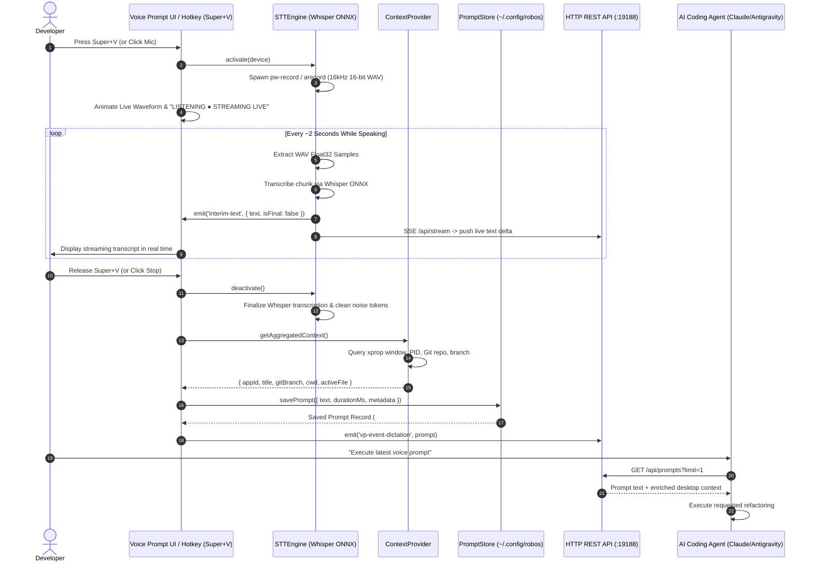

# Voice Prompt Dictation & Audio Input Agent
{: .no_toc }

Real-time, 100% offline neural speech-to-text dictation engineered for AI-first software development. Speak complex instructions, refactor prompts, and task requirements at speaking speed while RobOS automatically captures and attaches active desktop application context, window titles, Git branches, and working directories.
{: .fs-6 .fw-300 }

## Table of contents
{: .no_toc .text-delta }

1. TOC
{:toc}

---

## 1. The Typing Bottleneck in AI-Driven Development

In the era of autonomous coding agents (Claude Code, Google Antigravity, GitHub Copilot, OpenAI Codex), software engineering speed is no longer limited by how fast developers write boilerplate syntax—it is bottlenecked by **prompt authoring bandwidth**:

- **The Speaking vs. Typing Speed Gap**: Average developers type between 40 to 65 words per minute (WPM). Natural speech occurs at 140 to 180 WPM—nearly **3x to 4x faster**.
- **Context Switching Friction**: To instruct an AI agent on a bug or refactor, a developer traditionally must stop, switch windows, open an AI chat, manually type file names, paste error lines, specify the active Git branch, and explain what they were looking at.
- **Privacy & Air-Gap Compliance**: Sending raw audio streams to commercial cloud speech APIs (OpenAI Whisper API, Google Cloud Speech, AWS Transcribe) introduces compliance, latency, cost, and secret leakage risks for enterprise engineering codebases.

### The RobOS Solution: Voice Prompt Agent

The **RobOS Voice Prompt Agent** (`packages/voice-prompt`, CLI: `robos-voice`, binary: `robos-voice-prompt`) turns speech into actionable AI prompts with zero cloud dependencies:

1. **100% Local Neural Whisper STT**: Uses on-device ONNX runtime models via `@xenova/transformers` (`whisper-tiny.en`, `whisper-base.en`). Audio never leaves the local machine.
2. **Real-Time Live Streaming Dictation**: Speech is captured in chunks and transcribed continuously every ~2 seconds. Transcribed text streams live into the UI and via Server-Sent Events (`GET /api/stream`), allowing developers to watch words appear in real-time.
3. **Automated Desktop Context Injection**: The agent silently inspects X11/Wayland window state, active PID, application class (`vscode`, `idea`, `browser`, `terminal`), active file, current working directory, and Git branch. When dictation stops, the prompt is automatically wrapped in high-signal developer context.
4. **Global Push-to-Talk Hotkey (`Super+V`)**: Summon dictation globally from any running RobOS app or terminal without losing keyboard focus.
5. **Universal Headless REST API (`:19188`)**: Exposes full programmatic control to CLI scripts, IDE plugins, and autonomous agent loops.

---

## 2. System Architecture & Multimodal Pipeline

```
┌────────────────────────────────────────────────────────────────────────────────────────┐
│                        ROBOS VOICE PROMPT AGENT ARCHITECTURE                           │
├───────────────────────┬──────────────────────────┬─────────────────────────────────────┤
│ 1. AUDIO CAPTURE      │ 2. NEURAL STT ENGINE     │ 3. CONTEXT ENRICHMENT & ROUTING     │
├───────────────────────┼──────────────────────────┼─────────────────────────────────────┤
│ • PipeWire (pw-record)│ • Xenova Whisper (ONNX)  │ • Active Window (xdotool / xprop)   │
│ • ALSA (arecord)      │ • 100% Offline / Local   │ • Process /proc/<pid>/cwd           │
│ • SoX fallback        │ • 16 kHz Mono Float32    │ • Git branch / dirty status         │
│ • Web Audio Analyser  │ • Streaming Chunk Passes │ • Global Hotkey (Super+V)           │
│ • Real-time Waveform  │ • SSE Stream (:19188)    │ • Store (~/.config/robos/prompts)   │
└───────────────────────┴──────────────────────────┴─────────────────────────────────────┘
```

The pipeline operates across 4 coordinated layers:

### Sequence Diagram: Speech to Context-Enriched Prompt



---

## 3. Core Engine Components

### 3.1 Local Offline Neural STT Engine (`stt-engine.js`)

The speech-to-text core operates completely offline inside the Node.js/Electron environment without external API keys:

- **Model**: OpenAI Whisper (`Xenova/whisper-tiny.en` by default, configurable to `Xenova/whisper-base.en` or `small.en`).
- **Runtime**: ONNX Runtime Node (`onnxruntime-node`) with CPU acceleration. First run downloads the quantized ONNX model weights once to `~/.cache/huggingface/hub/` or bundled local storage; all subsequent runs require zero internet connectivity.
- **Audio Capture Abstraction**:
  - Automatically probes available capture binaries in order: `pw-record` (PipeWire), `arecord` (ALSA), `sox` / `rec`.
  - Captures 16,000 Hz, 16-bit, single-channel (mono) uncompressed PCM WAV.
  - Custom RIFF parser (`readWavToFloat32`) handles live streaming WAV buffers with in-flight zero-length data chunks without corrupting memory.
- **Transcript Sanitization**: Cleans acoustic noise tokens (`[BLANK_AUDIO]`, `[applause]`, `[laughter]`, `[music]`, `(noise)`) and normalizes spacing.

### 3.2 Real-Time Streaming Dictation & Server-Sent Events

During voice recording, `STTEngine` runs an asynchronous interval every 2,000ms:
1. Inspects the active recording file size.
2. If at least 1.5 seconds of new audio is present, parses the Float32 samples and runs an interim transcription pass.
3. Fires `interim-text` events across the Electron IPC bridge to update the UI instantly.
4. Broadcasts server-sent event (SSE) packets over `GET /api/stream` to all connected CLI watchers or external tools.

### 3.3 Active Desktop Context Provider (`context-provider.js`)

Voice instructions are only as good as the context they provide. Saying *"fix the memory leak in this service"* is ambiguous without knowing which file or service is currently open.

The `ContextProvider` automatically queries the X11/Wayland desktop environment:
- **Active Window**: Discovers focused window ID via `xdotool getactivewindow` or root window property `_NET_ACTIVE_WINDOW`.
- **Application Class**: Queries `WM_CLASS` to identify IDEs (`code`, `idea`), terminals (`tilix`, `alacritty`), browsers (`google-chrome`, `firefox`), or RobOS apps.
- **Active Process & Working Directory**: Reads `_NET_WM_PID` and inspects `/proc/<pid>/cwd` to resolve the project repository path on disk.
- **Git Repository & Branch**: Runs `git rev-parse --abbrev-ref HEAD` and `git status --porcelain` to capture branch name, commit hash, and dirty working tree status.
- **Context Output**:
```json
{
  "activeApp": {
    "appId": "kube-studio",
    "name": "Kube Studio",
    "wid": "0x3400012",
    "pid": 48215,
    "wmClass": "kube-studio"
  },
  "windowTitle": "Kube Studio — cluster-prod-us-east (Pods: 42)",
  "workspace": {
    "cwd": "/home/ndipiazza/source/robos",
    "repo": "robos",
    "branch": "main",
    "dirty": true
  },
  "timestamp": "2026-09-22T10:14:00.000Z"
}
```

---

## 4. HTTP REST API Reference

The Voice Prompt Agent embeds an HTTP server on port **`19188`** (configurable via `ROBOS_VOICE_PORT`).

### Summary of Endpoints

| Method | Endpoint | Description |
|:---|:---|:---|
| `GET` | `/api/status` | Current running status, active recording state, and focused app |
| `GET` | `/api/stream` | Server-Sent Events (SSE) live streaming interim speech transcription |
| `POST` | `/api/activate` | Start microphone recording and live streaming |
| `POST` | `/api/deactivate` | Stop recording, finalize Whisper transcription, and save prompt |
| `POST` | `/api/dictate` | Programmatic dictation injection (text payload) with context capture |
| `GET` | `/api/prompts` | List recorded prompts (supports `?limit=N` and `?app=appId`) |
| `POST` | `/api/prompts` | Manually insert a voice prompt record |
| `DELETE` | `/api/prompts/:id` | Delete a single voice prompt by ID |
| `DELETE` | `/api/prompts` | Clear all recorded voice prompts |
| `GET` | `/api/devices` | List detected audio input hardware microphones |
| `GET` | `/api/context` | Query real-time active window and Git context |

---

### Endpoint Details & Examples

#### `GET /api/status`
Returns agent health, recording state, active window, and prompt statistics.

```bash
curl -s http://127.0.0.1:19188/api/status | jq
```

**Response (200 OK):**
```json
{
  "status": "ok",
  "active": false,
  "recording": false,
  "device": "default",
  "activeApp": "vscode",
  "activeWindowTitle": "stt-engine.js — robos",
  "totalPrompts": 14,
  "interimText": "",
  "port": 19188
}
```

---

#### `GET /api/stream` (Server-Sent Events)
Connect to receive real-time interim speech transcription deltas as words are spoken.

```bash
curl -N http://127.0.0.1:19188/api/stream
```

**Stream Output (`text/event-stream`):**
```
data: {"text":"investigate high","isFinal":false,"elapsedMs":2100}

data: {"text":"investigate high memory usage in kubernetes","isFinal":false,"elapsedMs":4150}

data: {"text":"investigate high memory usage in kubernetes cluster pods","isFinal":true,"durationMs":5320}
```

---

#### `POST /api/activate`
Activates microphone listening and begins recording audio to an ephemeral buffer.

```bash
curl -X POST http://127.0.0.1:19188/api/activate \
  -H "Content-Type: application/json" \
  -d '{"device": "default"}'
```

**Response (200 OK):**
```json
{
  "ok": true,
  "active": true,
  "device": "default",
  "startTime": 1726884840120
}
```

---

#### `POST /api/deactivate`
Stops recording, runs final neural Whisper transcription pass, enriches with active window metadata, and saves to storage.

```bash
curl -X POST http://127.0.0.1:19188/api/deactivate
```

**Response (200 OK):**
```json
{
  "ok": true,
  "active": false,
  "durationMs": 4820,
  "text": "Refactor the authentication middleware to use JWT tokens with automatic rotation."
}
```

---

#### `POST /api/dictate`
Programmatically inject a dictation text. Useful for testing, automated agent simulations, or external speech providers.

```bash
curl -X POST http://127.0.0.1:19188/api/dictate \
  -H "Content-Type: application/json" \
  -d '{"text": "Add unit tests for the streaming audio parser"}'
```

**Response (200 OK):**
```json
{
  "ok": true,
  "prompt": {
    "id": "vp-1726884920000",
    "text": "Add unit tests for the streaming audio parser",
    "timestamp": "2026-09-22T10:15:20.000Z",
    "durationMs": 1500,
    "device": "api",
    "status": "recorded",
    "metadata": {
      "activeApp": { "appId": "tilix", "name": "Tilix Terminal" },
      "windowTitle": "robos: packages/voice-prompt",
      "workspace": { "repo": "robos", "branch": "main" }
    }
  }
}
```

---

#### `GET /api/prompts`
List recorded prompt history. Filter by application or limit result size.

```bash
# Get last 5 prompts recorded while using VS Code
curl -s "http://127.0.0.1:19188/api/prompts?app=vscode&limit=5" | jq
```

**Response (200 OK):**
```json
{
  "ok": true,
  "count": 1,
  "prompts": [
    {
      "id": "vp-1726884920000",
      "text": "Refactor the authentication middleware to use JWT tokens",
      "timestamp": "2026-09-22T10:15:20.000Z",
      "durationMs": 3200,
      "metadata": {
        "activeApp": { "appId": "vscode" },
        "windowTitle": "auth.js — robos",
        "workspace": { "branch": "feat/jwt-auth" }
      }
    }
  ]
}
```

---

## 5. CLI Tooling & Terminal Workflows (`robos-voice`)

RobOS includes a fast command-line tool `robos-voice` (`packages/robos-cli/robos-voice`) that communicates with the daemon over HTTP or falls back directly to local libraries if the GUI daemon is stopped:

```bash
# Check status of the Voice Prompt daemon
robos-voice status

# Query real-time active desktop context
robos-voice context

# Start microphone listening (push-to-talk start)
robos-voice activate

# Stop microphone listening and transcribe (push-to-talk stop)
robos-voice deactivate

# Record a prompt directly from the shell with attached context
robos-voice dictate "Generate OpenAPI 3.1 schema for billing service"

# List recent voice prompts
robos-voice list --limit 10

# Clear voice prompt history
robos-voice clear
```

### Piping Voice Prompts to AI Coding Agents

Combine `robos-voice` with AI coding agent CLI tools for a hands-free workflow:

```bash
# 1. Fetch latest voice prompt text and feed into Claude Code
claude "$(robos-voice list --limit 1 | jq -r '.prompts[0].text')"

# 2. Feed prompt + enriched Git context into Antigravity Harness
agy run "$(robos-voice list --limit 1 | jq -r '.prompts[0].text')" \
  --context "$(robos-voice context)"
```

---

## 6. Desktop Integration & Global Hotkeys

### Push-to-Talk Hotkey: `Super + V`

The Voice Prompt Agent registers a global X11 shortcut **`Super+V`** (Windows key + V):
1. **First Press / Hold**: Triggers microphone activation. The system tray icon pulses red, and an overlay audio waveform visualizer displays audio volume levels.
2. **Second Press / Release**: Finalizes audio recording, completes Whisper inference, and places the transcribed text onto the system clipboard while saving to `~/.config/robos/voice-prompts.json`.
3. **Audio Waveform Feedback**: The UI uses the Web Audio API (`AudioContext` and `AnalyserNode`) connected to the local user media stream to render dynamic amplitude bars during recording.

### Desktop Entry & Runner

- **Desktop File**: Installed to `~/.local/share/applications/voice-prompt.desktop` and `/usr/share/applications/voice-prompt.desktop`.
- **System Dock**: Accessible directly from the **RobOS App Launcher** grid under the **Autonomous AI & Agent Workflows** category.
- **Binary**: Standalone runner installed to `/usr/local/bin/robos-voice-prompt`.

---

## 7. Dual-State Knowledge Graph & SHACL Standards

In accordance with RobOS linked-data architecture, the Voice Prompt Agent is registered in the SDLC Knowledge Graph as a first-class `robos:DesktopApp` conforming to W3C SHACL shape `urn:robos:shape:DesktopAppShape` and Schema.org `schema:SoftwareApplication`.

### Canonical JSON-LD Entity

```json
{
  "@id": "urn:robos:app:voice-prompt",
  "@type": [
    "robos:DesktopApp",
    "schema:SoftwareApplication",
    "oslc_am:Resource",
    "c4:Container"
  ],
  "dcterms:title": "Voice Prompt Agent",
  "dcterms:description": "Offline speech-to-text dictation agent with real-time desktop app context capture and REST API.",
  "robos:package": "applications",
  "robos:namespace": "robos.applications",
  "robos:repository": "github.com/nddipiazza/robos",
  "robos:technology": "Electron / Vanilla JS / Whisper ONNX",
  "robos:desktopFramework": "Electron",
  "robos:localPath": "/home/ndipiazza/source/robos/packages/voice-prompt",
  "robos:apiPort": 19188,
  "robos:globalHotkey": "Super+V",
  "robos:ownerTeam": "urn:robos:team:core-platform",
  "robos:hasProject": "urn:robos:project:enterprise-core",
  "robos:schemaOrgType": "https://schema.org/SoftwareApplication",
  "robos:domainStandard": "https://schema.org/SoftwareApplication",
  "robos:refersFrom": "https://schema.org/SoftwareApplication"
}
```

---

## 8. Verification & Testing

The Voice Prompt Agent features a complete dual-tier test suite verifying offline speech processing, HTTP endpoints, IPC bridges, and headless UI rendering:

### Running Unit Tests
Verifies RIFF WAV sample extraction, streaming buffer handling with zero chunkSize, Whisper noise cleaning, HTTP REST routes, and storage operations:
```bash
node --test packages/robos-test/tests/voice-prompt/unit.test.js
```
*Expected: 19 passing tests, 0 failures.*

### Running Headless E2E Tests
Launches the full Electron application in a virtual display, verifies DOM elements (`#status-text`, `#btn-toggle-mic`, `#recording-waveform`, `#streaming-indicator`), selects input devices, simulates activation, and asserts prompt recording:
```bash
node --test packages/robos-test/tests/voice-prompt/e2e.test.js
```
*Expected: 1 suite, 1 test passing, 0 failures.*

---

## Next Steps

- **[Browse All RobOS Apps]({{ site.baseurl }})**: View the full suite of 30+ native developer tools.
- **[RobOS Architecture]({{ site.baseurl }})**: Learn about the 4-tier desktop bridge and Knowledge Graph governance.
- **[Agent Code Review Platform]({{ site.baseurl }})**: Explore the 6-stage PR Review Theater.
