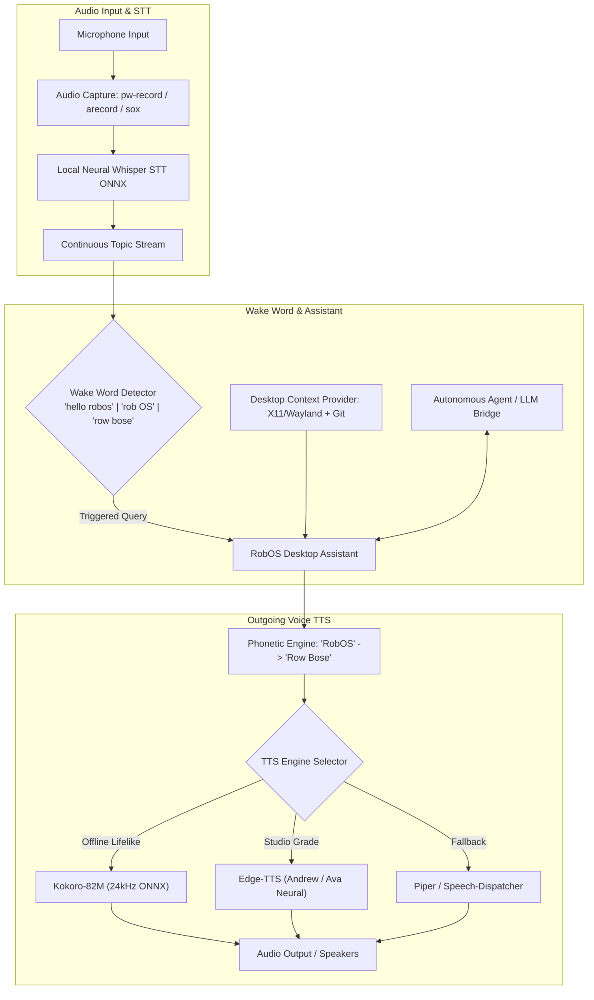

# RobOS Voice — Bi-directional Voice & Desktop Assistant
{: .no_toc }

Bi-directional, 100% privacy-first voice interaction engineered for AI-first software development. Features lifelike neural text-to-speech (Kokoro-82M and Edge-TTS), ambient background stream listening with wake-word detection ("hello robos", "rob OS", "row bose"), desktop context injection, and an interactive out-loud Desktop Assistant.
{: .fs-6 .fw-300 }

## Table of contents
{: .no_toc .text-delta }

1. TOC
{:toc}

---

## 1. Bi-directional Voice in AI-Driven Development

In the era of autonomous coding agents (Claude Code, Google Antigravity, GitHub Copilot, OpenAI Codex), software engineering speed is no longer limited by how fast developers write boilerplate syntax—it is bottlenecked by **prompt authoring and review bandwidth**:

- **The Speaking vs. Typing Speed Gap**: Average developers type between 40 to 65 words per minute (WPM). Natural speech occurs at 140 to 180 WPM—nearly **3x to 4x faster**.
- **Context Switching Friction**: To instruct an AI agent on a bug or refactor, a developer traditionally must stop, switch windows, open an AI chat, manually type file names, paste error lines, specify the active Git branch, and explain what they were looking at.
- **Robotic Audio Fatigue**: Conventional developer TTS engines (espeak, standard Piper voices) sound mechanical and robotic. Developers need warm, lifelike neural voices for long reviews and conversational debugging.
- **Privacy & Air-Gap Compliance**: Sending raw audio streams to commercial cloud speech APIs introduces compliance, latency, cost, and secret leakage risks for enterprise engineering codebases.

### The RobOS Solution: RobOS Voice

The **RobOS Voice** platform (`packages/voice-prompt`, CLI: `robos-voice`, library: `packages/robos-lib/voice.js`) provides a full-duplex bi-directional voice pipeline:

1. **Natural Outgoing Neural Voice (TTS)**: High-fidelity speech synthesis featuring **Kokoro-82M** (24kHz warm open-source offline TTS) and **Edge-TTS** (Microsoft Studio-grade neural voices with zero API keys).
2. **Strict "Row Bose" Phonetic Pronunciation**: Integrated speech normalization guarantees that "RobOS" is phonetically pronounced as *"Row Bose"* across all voice engines.
3. **Continuous Background Topic Stream**: Ambient voice listening emits speech chunks directly to subscriber topics without cluttering disk or prompt storage unless explicitly consumed.
4. **Hands-free Wake-Word Detection**: Listens on the continuous stream for `"hello robos"`, `"rob OS"`, and `"row bose"` (and phonetic variants like *rowbose* and *roh bose*).
5. **Interactive Desktop Assistant**: Connects the wake-word listener, active window context, and AI agent reasoning to speak answers back out loud to the developer.
6. **100% Local Neural Whisper STT**: On-device ONNX runtime models via `@xenova/transformers` (`whisper-tiny.en`). Audio never leaves the local machine.
7. **Automated Desktop Context Injection**: Automatically attaches focused window titles, application class (`vscode`, `idea`, `browser`, `terminal`), active PID, current working directory, and Git branch.

---

## 2. System Architecture & Multimodal Pipeline



<div style="margin: 2rem 0; border: 1px solid #1e293b; border-radius: 12px; overflow: hidden; background: #0b101b; box-shadow: 0 10px 40px rgba(0,0,0,0.6);">
  
  <div style="padding: 0.75rem 1.25rem; font-size: 0.85rem; color: #94a3b8; border-top: 1px solid #1e293b; background: #0d1424; text-align: center;">
    <strong>RobOS Voice Architecture</strong>: Bi-directional neural voice pipeline connecting ambient Whisper stream listening, wake-word detection, context-aware desktop assistant, and lifelike Kokoro/Edge-TTS speech output. <em>(Click image to zoom full screen)</em>
  </div>
</div>

---

## 3. Outgoing Voice (Natural Neural TTS)

RobOS Voice includes a high-performance, non-robotic outgoing speech engine (`lib/tts-engine.js`):

### 3.1 Supported Voice Engines

| Engine | Type | Sample Rate | Description |
|---|---|---|---|
| **Kokoro-82M** (`kokoro`) | Local Offline Neural | 24,000 Hz | State-of-the-art open-source 82M parameter neural TTS. Produces warm, lifelike human cadence. Model stored locally at `~/.local/share/kokoro/kokoro-v1.0.onnx`. |
| **Edge-TTS** (`edge-tts`) | Studio Neural | 24,000 Hz | High-quality Microsoft Azure neural speech voices (`en-US-AndrewMultilingualNeural`, `en-US-AvaMultilingualNeural`) accessible with zero account or API key required. |
| **Piper** (`piper`) | Local Fast Neural | 22,050 Hz | Ultra-fast local neural TTS model (`en_US-lessac-medium`). |
| **Speech Dispatcher** (`speech-dispatcher`) | System Local | Varies | Local Linux standard speech synthesizer fallback (`spd-say`). |

### 3.2 Phonetic Normalization: Pronouncing "Row Bose"

To ensure consistent branding and natural pronunciation, all outgoing speech passes through the phonetic pre-processor (`prepareSpeechText`):

```javascript
// Ensures RobOS is pronounced "Row Bose" like Bose speaker system
text = text.replace(/\bRobOS\b/gi, 'Row Bose');
text = text.replace(/\bRob-OS\b/gi, 'Row Bose');
```

---

## 4. Background Topic Streaming & Wake-Word Detection

### 4.1 Ephemeral Topic Stream Mode

When background mode is enabled (`POST /api/background/start`), the microphone streams continuous audio chunks through the Whisper STT engine:

- **No Disk Pollution**: Speech chunks are emitted live as `stream-text` events to active subscribers.
- **Zero Save Default**: Unlike dictation mode, speech recognized in background mode is **not written** to the persistent `voice-prompts.json` file. It operates strictly like a pub/sub message topic.

### 4.2 Wake-Word Triggers

The wake-word detector (`lib/wake-word.js`) monitors the live stream for trigger phrases:

- **"hello robos"**
- **"rob OS"**
- **"row bose"** (including variants: `row-bose`, `rowbose`, `roh bose`)

When a wake word is detected, it strips the wake phrase and extracts the trailing instruction to immediately dispatch to the Desktop Assistant.

---

## 5. RobOS Desktop Assistant

The **RobOS Desktop Assistant** (`lib/desktop-assistant.js`) provides hands-free pair programming:

1. **Trigger**: Listens for wake words or explicit API prompts (`POST /api/assistant/chat`).
2. **Context Enrichment**: Gathers focused application name, window title, PID, and Git branch from `ContextProvider`.
3. **Agent Reasoning**: Sends the query and desktop context to the RobOS AI Agent loop.
4. **Spoken Response**: Speaks the response out loud using the configured natural neural voice.
5. **State Lifecycle**: Emits real-time state changes (`IDLE`, `WAKE_DETECTED`, `LISTENING`, `PROCESSING`, `SPEAKING`).

---

## 6. RobOS Voice Library (`packages/robos-lib/voice.js`)

Other RobOS Electron applications, CLI scripts, and AI agent skills can interact with the voice engine via the JavaScript client library:

```javascript
const { RobOSVoiceClient, voice } = require('/usr/local/share/robos/robos-lib');
// Or import directly from packages/robos-lib/voice.js

// Speak out loud with lifelike neural voice
await voice.speak('Task completed successfully. All unit tests passed.');

// Query available voices
const voices = await voice.getVoices();

// Send query to Desktop Assistant
const reply = await voice.chatAssistant('What branch am I currently working on?');
console.log('Assistant replied:', reply.response);

// Control background stream listening
await voice.startBackgroundStream();
```

---

## 7. CLI Workflows (`robos-voice`)

The `robos-voice` CLI tool provides complete terminal control:

```bash
# Check daemon status
robos-voice status

# Speak text using natural neural voice
robos-voice speak "Row Bose is online and ready."

# Stop currently playing speech
robos-voice stop-speaking

# List available voices across Kokoro, Edge-TTS, and Piper
robos-voice voices

# Query Desktop Assistant hands-free
robos-voice assistant "What is the git status in the active window?"

# Start / stop background continuous streaming mode
robos-voice background start
robos-voice background stop

# Push-to-talk dictation commands
robos-voice activate
robos-voice deactivate
robos-voice context
robos-voice list --limit 5
```

---

## 8. REST API Reference (`:19188`)

RobOS Voice exposes an HTTP REST server on port `19188`:

| Method | Endpoint | Description |
|---|---|---|
| `POST` | `/api/speak` | Synthesize and speak text out loud (`{ text, engine, voice, rate, pitch }`) |
| `POST` | `/api/stop-speaking` | Stop all active audio playback |
| `GET` | `/api/voices` | List all discovered TTS voices grouped by engine |
| `GET` | `/api/tts/config` | Get current TTS configuration |
| `POST` | `/api/tts/config` | Update default TTS engine, voice, and speed |
| `POST` | `/api/background/start` | Start ephemeral background stream listening |
| `POST` | `/api/background/stop` | Stop background stream listening |
| `POST` | `/api/assistant/chat` | Send a query to the Desktop Assistant (`{ message, speak }`) |
| `GET` | `/api/assistant/history` | Get recent conversation history |
| `DELETE`| `/api/assistant/history` | Clear conversation history |
| `POST` | `/api/wake-word/toggle` | Enable or disable wake word detection (`{ enabled }`) |
| `GET` | `/api/status` | Get daemon health, microphone state, and assistant status |
| `GET` | `/api/context` | Capture real-time focused window and Git context |
| `POST` | `/api/activate` | Start microphone push-to-talk recording |
| `POST` | `/api/deactivate` | Stop recording and transcribe to persistent prompt storage |
| `GET` | `/api/prompts` | Query recorded prompt history |
| `GET` | `/api/stream` | Server-Sent Events (SSE) live speech stream |

---

## 9. Verification & Testing

RobOS Voice includes full test coverage for TTS, background streaming, wake-word detection, and assistant workflows:

```bash
# Run all voice-prompt tests
node --test packages/robos-test/tests/voice-prompt/tts.test.js
node --test packages/robos-test/tests/voice-prompt/stream-assistant.test.js
node --test packages/robos-test/tests/voice-prompt/unit.test.js
node --test packages/robos-test/tests/voice-prompt/agent-streaming.test.js
```

---

## Next Steps

- **[Browse All RobOS Apps]({{ site.baseurl }})**: View the full suite of native developer tools.
- **[RobOS Architecture]({{ site.baseurl }})**: Learn about the 4-tier desktop bridge and Knowledge Graph governance.
- **[Agent Code Review Platform]({{ site.baseurl }})**: Explore the 6-stage PR Review Theater.
