# Real-World Walkthroughs & Proof of Work
{: .no_toc }

See how RobOS automates the entire software delivery lifecycle. Every feature is verified with recorded video walkthroughs, spoken voiceover explanations, and automated tests.
{: .fs-6 .fw-300 }

## Table of contents
{: .no_toc .text-delta }

1. TOC
{:toc}

---

## How RobOS Guarantees That Code Actually Works

In traditional software development, developers write code and hope their unit tests caught everything. In RobOS, AI agents must **prove** their work before requesting your review:

1. **Runs in an Isolated Virtual Screen**: Tests run on a clean 1080p virtual desktop so nothing interrupts your day-to-day work.
2. **Checks the Real Visual UI**: Evaluates the actual user interface, buttons, tables, and forms just like a real user would.
3. **Records Video with Spoken Narration**: Produces a clear video with spoken audio explaining step-by-step what was built and how it was tested.
4. **Instant Verification Packages**: Test videos, subtitles, and test results are packaged together so lead developers can review and approve changes in seconds.

---

## Section 1: The 16-Step Acme Petshop Lifecycle (From Idea to Live Cloud Deployment)

The Acme Petshop reference project shows how a complete multi-service application (frontend web app, backend Java API, database, and event streaming) is designed, coded, tested, and shipped:

```mermaid
flowchart LR
    S1["1. AI Task Planner"] --> S2["2. Visual Architecture"]
    S2 --> S3["3. API Contracts & Mocks"]
    S3 --> S4["4. Git Repos & Setup"]
    S4 --> S5["5. Live Breakpoint & Plan"]
    S5 --> S6["6. PR Review & AI Audit"]
    S6 --> S7["7. Deploy Tracker"]
    S7 --> S8["8. Kubernetes Navigator"]
    S8 --> S9["9. Live Cluster Deploy"]
    S9 --> S10["10. Auto-Deploy & Clean"]
    S10 --> S11["11. REST API Client"]
    S11 --> S12["12. Automated API Tests"]
    S12 --> S13["13. AI Tool Connections"]
    S13 --> S15["15. Database Explorer"]
    S15 --> S16["16. Full Cloud Lifecycle"]
```



---

### Step 1: AI Task Planner & Automated Project Breakdown (Syncing to GitHub & Jira)
- **In Plain English**: You tell the AI in plain English what software you want to build. The AI automatically breaks that big goal down into an ordered, step-by-step checklist of tasks (where prerequisite steps must finish before dependent tasks begin). It automatically creates matching tickets on GitHub Issues, Gitea, or Jira so the whole engineering team stays in sync.
- **Source Demo Script**: [`packages/robos-test/demos/acme-petshop-step1-tasks-demo.js`](https://github.com/nddipiazza/robos/blob/main/packages/robos-test/demos/acme-petshop-step1-tasks-demo.js)

> **What the Developer Typed (AI Architecture Prompt):**
> ```text
> Architect and plan the Acme Petshop distributed polyglot platform:
> - Backend: Java 21 Spring Boot 3 REST API microservice with OpenAPI 3.1 contracts
> - Database: PostgreSQL with Flyway automated migrations for pet catalog, inventory, and orders
> - Frontend: React 18 TypeScript single-page application for customer pet adoption & cart checkout
> - Event Streaming: Apache Kafka topic pipeline for async pet adoption events & real-time inventory sync
> - Compliance & Security: Dedicated rabies vaccination certification gateway validating vet health records
> - Shared Contracts: Reusable TypeSpec models and DTO schemas for cross-service type safety
> ```

| 1. Developer Types High-Level Goal | 2. AI Generates Step-by-Step Task Roadmap |
|:---:|:---:|
|  |  |

| 3. Tasks Ordered by Prerequisites | 4. Synchronized Directly to Issue Tracker (Gitea / Jira) |
|:---:|:---:|
|  |  |

---

### Step 2: Interactive System Architecture & Service Map (C4 Visuals & Backstage)
- **In Plain English**: Instead of static diagrams in drawing tools that go out-of-date the moment they are saved, RobOS maintains a live interactive map of all your services, databases, message queues, and web frontends. It imports your company's existing Backstage service catalogs (`catalog-info.yaml`) and highlights the exact "blast radius" (what other services could break) if you change any part of the system.
- **Source Demo Script**: [`packages/robos-test/demos/acme-petshop-step2-topology-demo.js`](https://github.com/nddipiazza/robos/blob/main/packages/robos-test/demos/acme-petshop-step2-topology-demo.js)

> **What the Developer Typed (System Topology Prompt):**
> ```text
> Synthesizing architecture for Acme Petshop Platform:
> - Java 21 Spring Boot 3 REST API microservice (petstore-api)
> - PostgreSQL 16 relational database with Flyway (petstore-db)
> - React 18 TypeScript web client (petstore-web)
> - Apache Kafka event bus for async pet adoption (event-bus)
> - Dedicated rabies vaccine certification gateway (vaccine-gateway)
> - Reusable TypeSpec & Pact contract models (petstore-common)
> 
> Ask me clarifying questions via the interactive survey to refine service boundaries, event streaming, and compliance gateways.
> ```

| Live Interactive Architecture Canvas | Service Inspector & Blast Radius (What Could Break) |
|:---:|:---:|
|  |  |

| Clean Declarative Architecture Export | Live OpenTelemetry Performance Traces |
|:---:|:---:|
|  |  |

---

### Step 3: API Contracts & Live Mock Servers (REST, Kafka Events & Type Safety)
- **In Plain English**: Define how your services talk to each other before writing application code. RobOS lets you write clean API contracts (OpenAPI for REST APIs and AsyncAPI for Kafka event streams). It automatically spins up live mock servers so frontend engineers can start building screens immediately without waiting for backend engineers to finish writing APIs.
- **Source Demo Script**: [`packages/robos-test/demos/acme-petshop-step3-contracts-demo.js`](https://github.com/nddipiazza/robos/blob/main/packages/robos-test/demos/acme-petshop-step3-contracts-demo.js)

> **What the Developer Typed (API Contract Prompt):**
> ```text
> Author and compile API contracts for Acme Petshop Platform (urn:robos:project:acme-petshop-platform):
> - Compile entities/pet.typespec into OpenAPI 3.1 contract for petstore-api (5 endpoints, AdoptionRequest)
> - Author rabies vaccine verification contract for vaccine-gateway (mTLS security scheme)
> - Define AsyncAPI 3.0 event streams for Apache Kafka (pet.adopted, inventory.delta)
> - Run Spectral style governance, Pact consumer verification, and start local Prism mock server.
> ```

| Centralized API Contract Explorer | Event-Driven Kafka Stream Definitions |
|:---:|:---:|
|  |  |

| Live Mock Server for Instant Frontend Testing | Automated Governance & Compatibility Checks Passed |
|:---:|:---:|
|  |  |

---

### Step 4: Multi-Repo Hub & One-Click Dev Environments
- **In Plain English**: No more spending days configuring local databases, compilers, and secrets when onboarding to a project. RobOS connects all your Git repositories together, securely injects passwords and API keys from your local encrypted vault (Pass / GPG), and writes one-click setup scripts (`dev-setup.sh`) to get all codebases compiling in seconds.
- **Source Demo Script**: [`packages/robos-test/demos/acme-petshop-step4-git-projects-demo.js`](https://github.com/nddipiazza/robos/blob/main/packages/robos-test/demos/acme-petshop-step4-git-projects-demo.js)

> **What the Developer Typed (Multi-Repo Setup Prompt):**
> ```text
> Scaffold and configure all 6 Acme Petshop polyglot repositories from the project graph:
> - petstore-web (React 18 / Vite frontend client)
> - petstore-api (Java 21 Spring Boot 3.3 core REST microservice)
> - petstore-common (Shared TypeSpec domain models & OpenAPI contracts)
> - vaccine-gateway (Node.js 20 Fastify mTLS rabies certification gateway)
> - event-bus (Apache Kafka 3.7 streaming broker & topics)
> - petstore-db (PostgreSQL 16 relational database & Flyway migrations)
> Include Docker devcontainers, local build instructions, and environment secrets.
> ```

| Unified Multi-Repository Workspace Hub | AI-Generated One-Click Setup Scripts |
|:---:|:---:|
|  |  |

| Automated Build & Test Lifecycle Hooks | Encrypted Secret & Password Management |
|:---:|:---:|
|  |  |

---

### Step 5: Automated Bug Reproduction & Live IDE Breakpoints
- **In Plain English**: When you pick up a ticket, RobOS automatically opens your IDE (IntelliJ IDEA or VS Code), launches the required databases and services, and runs a reproduction test that stops execution right at the exact line of code (breakpoint) where the bug occurs. Before writing any fix, the AI drafts a clear plan so you can review and approve its strategy first.
- **Source Demo Script**: [`packages/robos-test/demos/acme-petshop-step5-ide-execution-demo.js`](https://github.com/nddipiazza/robos/blob/main/packages/robos-test/demos/acme-petshop-step5-ide-execution-demo.js)

> **Ticket Requirements & AI Fix Plan (Task PET-105):**
> ```text
> Requirement: Implement Rabies Vaccine Verification Gateway & Certification on petstore-api.
> When adopting a puppy or kitten, verify its certificate via vaccine-gateway over mTLS before approving adoption.
> Repro Breakpoint: Hit breakpoint in AdoptionService.java line 42 when vaccination record is missing or expired.
> ```

| Instant IDE Workspace Launch | Execution Pauses at Reproduction Breakpoint |
|:---:|:---:|
|  |  |

| Live Runtime Variable Inspection | AI Solution Plan Presented for Developer Review |
|:---:|:---:|
|  |  |

---

### Step 6: Pull Request Review & AI Code Quality Inspection
- **In Plain English**: Review code faster and with greater confidence. RobOS provides a clean review dashboard where AI analyzes every code diff for security vulnerabilities, API contract mismatches, and performance regressions. Once verified, lead engineers can approve and merge with one click.
- **Source Demo Script**: [`packages/robos-test/demos/acme-petshop-step6-pr-ci-demo.js`](https://github.com/nddipiazza/robos/blob/main/packages/robos-test/demos/acme-petshop-step6-pr-ci-demo.js)

> **AI Code Review Directive:**
> ```text
> Perform architectural and security risk analysis on PR #42 (feat: PET-105 mTLS Rabies Verification):
> - Audit cryptographic cert parsing in VaccineGatewayClient.java
> - Validate semantic diff against OpenAPI 3.1 AdoptionRequest schema
> - Confirm 100% pass on Pact consumer contract verification and CI pipeline
> ```

| Active Pull Request Queue & Status | Side-by-Side Visual Code Diff |
|:---:|:---:|
|  |  |

| Automated AI Code Review & Risk Report | Automated Test & CI Check Suite |
|:---:|:---:|
|  |  |

---

### Step 7: Deployment Tracker & Safe Rollouts (Canary & Rollback)
- **In Plain English**: Track where your code is running across Development, Staging, and Production environments. View key team health metrics (DORA metrics like deployment frequency and failure rate), monitor gradual (canary) rollouts, and trigger immediate one-click rollbacks if issues arise.
- **Source Demo Script**: [`packages/robos-test/demos/acme-petshop-step7-deploy-tracker-demo.js`](https://github.com/nddipiazza/robos/blob/main/packages/robos-test/demos/acme-petshop-step7-deploy-tracker-demo.js)

| Team Release KPIs & DORA Health Metrics | Staging Environment Deployment Filter |
|:---:|:---:|
|  |  |

| Production Environment Deployment Filter | Visual Release Timeline |
|:---:|:---:|
|  |  |

---

### Step 8: Kubernetes & Cloud Infrastructure Navigator (Pods, Helm & Logs)
- **In Plain English**: A clean visual dashboard for managing your Kubernetes clusters (local Kind clusters, AWS EKS, Google Cloud GKE, Azure AKS). See all running containers, check Helm package versions, verify GitOps sync status (ArgoCD), and stream live server logs without wrestling with complex command-line queries.
- **Source Demo Script**: [`packages/robos-test/demos/acme-petshop-step8-kube-studio-demo.js`](https://github.com/nddipiazza/robos/blob/main/packages/robos-test/demos/acme-petshop-step8-kube-studio-demo.js)

| Real-Time Kubernetes Containers (Pods) Grid | Helm Package Releases & Installed Versions |
|:---:|:---:|
|  |  |

| ArgoCD GitOps Deployment Status | Live Streaming Container Logs |
|:---:|:---:|
|  |  |

---

### Step 9: One-Click Live Kubernetes Cluster Deployment
- **In Plain English**: Deploy your microservices directly onto a live local or cloud Kubernetes cluster in one click. RobOS automatically sets up an isolated namespace, launches the containers, and streams real-time logs so you know with 100% certainty that the software works in a real cloud environment.
- **Source Demo Script**: [`packages/robos-test/demos/acme-petshop-step9-real-kube-e2e-demo.js`](https://github.com/nddipiazza/robos/blob/main/packages/robos-test/demos/acme-petshop-step9-real-kube-e2e-demo.js)

| Connect Live Kubernetes Cluster | Automated One-Click Task Deployment |
|:---:|:---:|
|  |  |

| Live Running Microservices | Real-Time Container Log Stream |
|:---:|:---:|
|  |  |

---

### Step 10: Automatic Deploy on Merge & Zero-Waste Cleanup
- **In Plain English**: The moment a pull request merges into the `main` branch, RobOS automatically spins up the updated microservices in a temporary test environment, verifies that all services respond with healthy status, and cleans up the temporary resources afterwards so you never waste cloud budget on forgotten testing containers.
- **Source Demo Script**: [`packages/robos-test/demos/acme-petshop-step10-continuous-deploy-demo.js`](https://github.com/nddipiazza/robos/blob/main/packages/robos-test/demos/acme-petshop-step10-continuous-deploy-demo.js)

> **What the Developer Asked (Deployment Assistant):**
> ```text
> Explain auto-deployment from Knowledge Graph main branch and verify ephemeral namespace reclamation after verification.
> ```

| Application Catalog & Config Overview | Auto-Deployed Microservice Pods |
|:---:|:---:|
|  |  |

| Real-Time Deployment Progress & Logs | Clean Zero-Waste Namespace Reclamation |
|:---:|:---:|
|  |  |

---

### Step 11: Git-Backed REST API Client (Postman Alternative via Bruno)
- **In Plain English**: A fast, Git-backed API client for testing your endpoints (powered by open-source Bruno). Instead of storing API requests in closed proprietary clouds, RobOS saves plain text `.bru` files right inside your Git repo and automatically generates complete API collections directly from your OpenAPI specifications.
- **Source Demo Script**: [`packages/robos-test/demos/acme-petshop-step11-bruno-rest-client-demo.js`](https://github.com/nddipiazza/robos/blob/main/packages/robos-test/demos/acme-petshop-step11-bruno-rest-client-demo.js)

> **What the Developer Asked (API Test Generator):**
> ```text
> Validate mTLS Fastify headers and payload format across petstore-api and vaccine-gateway endpoints.
> Auto-synthesize declarative .bru collection files and assertions from OpenAPI 3.1 contracts.
> ```

| Git-Backed API Request Tree in Repo | Automatic Request Generation from OpenAPI |
|:---:|:---:|
|  |  |

| Live HTTP 200/201 Success Responses | Built-In Automated Test Assertions |
|:---:|:---:|
|  |  |

---

### Step 12: Automated API Test Runner & Merge Quality Gates
- **In Plain English**: Execute entire suites of API requests automatically across different environments, benchmark endpoint speed and latency, and establish a strict quality gate ensuring that no pull request can be merged if any API test fails.
- **Source Demo Script**: [`packages/robos-test/demos/acme-petshop-step12-collection-runner-demo.js`](https://github.com/nddipiazza/robos/blob/main/packages/robos-test/demos/acme-petshop-step12-collection-runner-demo.js)

| Multi-Endpoint Collection Test Runner | Real-Time Execution Progress & Status |
|:---:|:---:|
|  |  |

| Test Results Matrix & Latency Scorecard | Passed Quality Gate Required for PR Merge |
|:---:|:---:|
|  |  |

---

### Step 13: Universal AI Tool Connections (Model Context Protocol)
- **In Plain English**: Connect any AI coding tool (Anthropic Claude Code, Google Antigravity, GitHub Copilot CLI, Google Gemini) to RobOS. Using the open Model Context Protocol (MCP), AI assistants gain secure access to query databases, read architecture maps, trigger tests, and inspect code.
- **Source Demo Script**: [`packages/robos-test/demos/acme-petshop-step13-agy-mcp-task-demo.js`](https://github.com/nddipiazza/robos/blob/main/packages/robos-test/demos/acme-petshop-step13-agy-mcp-task-demo.js)

> **What the Developer Configured (AI Tool Integration):**
> ```text
> Connect Google Antigravity & Claude Code to RobOS System Topology and Task Manager MCP servers via local IPC bridge.
> Authenticate with OAuth 2.0 PKCE and expose knowledge graph mutations directly into the agent context window.
> ```

| Google Antigravity MCP Server Registry | Add Custom MCP Tool Server with One Click |
|:---:|:---:|
|  |  |

| Secure Interactive OAuth Authentication | Local RobOS Tool Bridge Connected to AI |
|:---:|:---:|
|  |  |

---

### Step 15: Multi-Database Explorer (PostgreSQL, MySQL, Oracle, S3, Kafka)
- **In Plain English**: Manage and explore all your company's data sources in one central hub. Test live database connections, inspect table columns and foreign keys, run exploratory SQL queries, and browse cloud object storage buckets (AWS S3) and streaming message topics (Kafka).
- **Source Demo Script**: [`packages/robos-test/demos/data-sources-demo.js`](https://github.com/nddipiazza/robos/blob/main/packages/robos-test/demos/data-sources-demo.js)

> **Data Source Onboarding Goal:**
> ```text
> Register PostgreSQL 16 petstore-db and AWS S3 analytics bucket into Knowledge Graph.
> Perform live connection handshake, inspect schemas, and query customer pet adoption records.
> ```

| PostgreSQL Database Connection Overview | Live Table Schema & Column Inspector |
|:---:|:---:|
|  |  |

| Interactive SQL Query Results & Performance | AWS S3 Cloud Storage File Browser |
|:---:|:---:|
|  |  |

---

### Step 16: Complete Database & Cloud Lifecycle (Visual Design to Live Deployment)
- **In Plain English**: The complete end-to-end loop in action: add a new database to your visual architecture map, let RobOS automatically generate the Kubernetes deployment configuration and Helm charts, deploy it to a cluster, create database tables with DDL scripts, seed test data, and verify live API endpoints.
- **Source Demo Script**: [`packages/robos-test/demos/topology-db-kube-lifecycle-demo.js`](https://github.com/nddipiazza/robos/blob/main/packages/robos-test/demos/topology-db-kube-lifecycle-demo.js)

> **Data Architecture & Cloud Lifecycle Goal:**
> ```text
> Add PostgreSQL 16 Analytics Warehouse data source node to Acme Petshop System Topology.
> Auto-synthesize deployable Kubernetes StatefulSet manifests and Helm chart templates.
> Deploy to Kind cluster, execute DDL schema, seed test adoption records, and verify REST endpoints.
> ```

| Visual Architecture Map with New Analytics Database | Impact & Blast Radius Inspector |
|:---:|:---:|
|  |  |

| Auto-Generated Kubernetes Manifests & Helm Charts | Fast SQL Console in Relational DB Manager |
|:---:|:---:|
|  |  |

| Live Table Data Grid & Record Insertions | Generated DDL Schema Migration Script |
|:---:|:---:|
|  |  |

---

## Section 2: Core Platform Subsystems & Automated Walkthroughs

Beyond the Acme Petshop reference application, each RobOS core subsystem has dedicated verified test runners:

### Live Architecture Map & Semantic Difference Engine
- **In Plain English**: RobOS tracks two versions of your system at once: "World 1" (what is running in live production on `main`) and "World 2" (what your feature branch is proposing to change). It automatically computes the exact difference and alerts you if an API change would break another team's service.
- **Source Demo Scripts**: [`robos-graph-demo.js`](https://github.com/nddipiazza/robos/blob/main/packages/robos-test/demos/robos-graph-demo.js), [`graph-diff-demo.js`](https://github.com/nddipiazza/robos/blob/main/packages/robos-test/demos/graph-diff-demo.js), [`gitops-schema-demo.js`](https://github.com/nddipiazza/robos/blob/main/packages/robos-test/demos/gitops-schema-demo.js), [`graph-copilot-demo.js`](https://github.com/nddipiazza/robos/blob/main/packages/robos-test/demos/graph-copilot-demo.js)

| Architecture Knowledge Graph Explorer | Dual-State Visual Difference Engine |
|:---:|:---:|
|  |  |

---

### Clean, Isolated AI Workspaces (Zero Clutter on Your Machine)
- **In Plain English**: When an AI agent works on a ticket, it runs in a temporary sandbox stored entirely in RAM (`tmpfs`). When the task finishes, the memory is wiped clean, ensuring zero leftover temporary files or background processes on your machine.
- **Source Demo Scripts**: [`robos-profiled-demo.js`](https://github.com/nddipiazza/robos/blob/main/packages/robos-test/demos/robos-profiled-demo.js), [`robos-profiled-tmpfs-demo.js`](https://github.com/nddipiazza/robos/blob/main/packages/robos-test/demos/robos-profiled-tmpfs-demo.js), [`robos-profiled-display-demo.js`](https://github.com/nddipiazza/robos/blob/main/packages/robos-test/demos/robos-profiled-display-demo.js), [`robos-profiled-zero-residue-demo.js`](https://github.com/nddipiazza/robos/blob/main/packages/robos-test/demos/robos-profiled-zero-residue-demo.js)

| Ephemeral Agent Profile Manager | RAM-Based Filesystem & Zero-Waste Cleanup |
|:---:|:---:|
|  |  |

---

### Desktop AI Agent Supervisor & Status Sidebar
- **In Plain English**: A persistent dock on your desktop where you can watch multiple AI coding assistants work simultaneously, view real-time terminal outputs, and pause or resume agent sessions at any time.
- **Source Demo Scripts**: [`robos-agentd-demo.js`](https://github.com/nddipiazza/robos/blob/main/packages/robos-test/demos/robos-agentd-demo.js), [`desktop-agents-demo.js`](https://github.com/nddipiazza/robos/blob/main/packages/robos-test/demos/desktop-agents-demo.js), [`agent-sidebar-demo.js`](https://github.com/nddipiazza/robos/blob/main/packages/robos-test/demos/agent-sidebar-demo.js), [`agent-session-lib-demo.js`](https://github.com/nddipiazza/robos/blob/main/packages/robos-test/demos/agent-session-lib-demo.js)

| Live Multi-Agent Session Console | Background Process Supervisor |
|:---:|:---:|
|  |  |

---

### Universal Model Context Protocol (MCP) Tool Hub
- **In Plain English**: A central router that allows AI agents to securely call development tools (querying databases, opening files in IDEs, inspecting Kubernetes pods) across any AI model provider.
- **Source Demo Scripts**: [`mcp-manager-demo.js`](https://github.com/nddipiazza/robos/blob/main/packages/robos-test/demos/mcp-manager-demo.js), [`mcp-router-demo.js`](https://github.com/nddipiazza/robos/blob/main/packages/robos-test/demos/mcp-router-demo.js), [`mcp-lib-demo.js`](https://github.com/nddipiazza/robos/blob/main/packages/robos-test/demos/mcp-lib-demo.js), [`system-mcp-demo.js`](https://github.com/nddipiazza/robos/blob/main/packages/robos-test/demos/system-mcp-demo.js)

| Central MCP Tool Router Console | Universal Tool Library & Health Inspector |
|:---:|:---:|
|  |  |

---

### Entity Schema Studio, Team Directory & Package Management
- **In Plain English**: Define your data models once (using Microsoft TypeSpec) and auto-generate TypeScript, Java, and Go types. Manage team permissions and service ownership so everyone knows who owns each component.
- **Source Demo Scripts**: [`schema-studio-demo.js`](https://github.com/nddipiazza/robos/blob/main/packages/robos-test/demos/schema-studio-demo.js), [`people-manager-demo.js`](https://github.com/nddipiazza/robos/blob/main/packages/robos-test/demos/people-manager-demo.js), [`package-manager-demo.js`](https://github.com/nddipiazza/robos/blob/main/packages/robos-test/demos/package-manager-demo.js), [`workspace-orchestrator-demo.js`](https://github.com/nddipiazza/robos/blob/main/packages/robos-test/demos/workspace-orchestrator-demo.js), [`task-dispatcher-demo.js`](https://github.com/nddipiazza/robos/blob/main/packages/robos-test/demos/task-dispatcher-demo.js), [`oss-adapters-demo.js`](https://github.com/nddipiazza/robos/blob/main/packages/robos-test/demos/oss-adapters-demo.js)

| Data Model Studio (TypeSpec to TypeScript/Java/Go) | Team Members & Service Ownership Directory |
|:---:|:---:|
|  |  |

| Language Package & Tool Runtime Manager | Multi-Repo Workspace Switcher |
|:---:|:---:|
|  |  |

| Open-Source Tool Adapters | Automatic Task Dispatcher & Scheduler |
|:---:|:---:|
|  |  |

---

## How to Run Walkthroughs Yourself

You can run any of these automated walkthroughs in headless mode to regenerate the videos and voiceovers on your own machine:

```bash
# Run the complete Acme Petshop end-to-end lifecycle walkthrough
xvfb-run -a -s "-screen 0 1920x1080x24" node packages/robos-test/demos/topology-db-kube-lifecycle-demo.js

# Run the Data Sources explorer walkthrough
xvfb-run -a -s "-screen 0 1920x1080x24" node packages/robos-test/demos/data-sources-demo.js

# Run the Developer Tools Suite walkthrough
xvfb-run -a -s "-screen 0 1920x1080x24" node packages/robos-test/demos/developer-tools-suite-demo.js

# Run the AI Tool Integration (MCP) walkthrough
xvfb-run -a -s "-screen 0 1920x1080x24" node packages/robos-test/demos/agy-mcp-demo.js

# Run the Live Architecture Map walkthrough
xvfb-run -a -s "-screen 0 1920x1080x24" node packages/robos-test/demos/robos-graph-demo.js
```
