# E2E Walkthroughs & Proof of Work
{: .no_toc }

Every RobOS capability is validated through containerized headless E2E test suites with automated video capture, neural voiceovers, and DOM snapshot inspection across 60+ verified scenario archives.
{: .fs-6 .fw-300 }

## Table of contents
{: .no_toc .text-delta }

1. TOC
{:toc}

---

## The End-to-End Driven Development (EDD) Standard

In RobOS, tests are not an afterthought — they are the primary driver of development. Every feature increment is executed against an automated harness:

1. **Headless Compositor (`Xvfb + Picom`)**: Runs at 1920x1080 resolution with hardware compositing emulation.
2. **DOM Snapshot Inspection**: Evaluates DOM hierarchy via snapshot CLI ports (`19100–19182`).
3. **Synchronized Video Generation**: Records 1080p WebM videos with WebVTT subtitle tracks generated via offline Piper neural TTS.
4. **Walkthrough Archive**: Automatically archived to `~/.robos/development/walkthroughs/<slug>/` with timestamped historical snapshots.

---

## Section 1: The 16-Step Acme Petshop Reference Lifecycle

The complete Acme Petshop multi-repo, polyglot microservice ecosystem proves out every stage of the software delivery lifecycle:

```mermaid
flowchart LR
    S1["1. Tasks DAG"] --> S2["2. Topology C4"]
    S2 --> S3["3. Contracts"]
    S3 --> S4["4. Git Projects"]
    S4 --> S5["5. IDE Breakpoint"]
    S5 --> S6["6. PR Review"]
    S6 --> S7["7. Deploy Tracker"]
    S7 --> S8["8. Kube Studio"]
    S8 --> S9["9. Real K8s"]
    S9 --> S10["10. Auto-Deploy"]
    S10 --> S11["11. Bruno REST"]
    S11 --> S12["12. Runner Gate"]
    S12 --> S13["13. MCP OAuth"]
    S13 --> S15["15. Data Sources"]
    S15 --> S16["16. DB & K8s Lifecycle"]
```



---

### Step 1: Task Planner & Gitea DAG Backlog
- **Scope**: Natural language task breakdown into a directed acyclic graph (DAG) of interdependent tasks, synchronized bi-directionally with Gitea and Jira.
- **Test File**: `packages/robos-test/tests/tasks/step1-tasks.test.js`
- **Archive**: `~/.robos/development/walkthroughs/acme-petshop-step1-tasks/`

| Natural Language Goal Input | Generated Dependency DAG |
|:---:|:---:|
|  |  |

| Synced Task Statuses | Gitea Issue Sync |
|:---:|:---:|
|  |  |

---

### Step 2: Polyglot System Topology & Backstage Catalog
- **Scope**: Interactive C4 architecture modeling (Level 1 Context to Level 3 Components), Backstage software catalog synchronization, OpenTelemetry tracing, and blast radius calculation.
- **Test File**: `packages/robos-test/tests/topology/step2-topology.test.js`
- **Archive**: `~/.robos/development/walkthroughs/acme-petshop-step2-topology/`

| Polyglot C4 Architecture Canvas | Microservice Inspector & Blast Radius |
|:---:|:---:|
|  |  |

| Declarative C4 Export | OpenTelemetry Live Traces |
|:---:|:---:|
|  |  |

---

### Step 3: Contract Studio, TypeSpec & AsyncAPI
- **Scope**: API contract-first design supporting OpenAPI 3.1, TypeSpec, and AsyncAPI with live Spectral linting, Prism mock servers, and automated breaking-change detection.
- **Test File**: `packages/robos-test/tests/contracts/step3-contracts.test.js`
- **Archive**: `~/.robos/development/walkthroughs/acme-petshop-step3-contracts/`

| Multi-Contract Studio Explorer | Event-Driven AsyncAPI Definitions |
|:---:|:---:|
|  |  |

| Prism Mock Server Validation | Automated Contract Governance Passed |
|:---:|:---:|
|  |  |

---

### Step 4: Git Projects & Dev-Setup Automation
- **Scope**: Multi-repository synchronization, AI-generated `dev-setup.sh` environment runners, GPG-encrypted secrets management, and automated IDE launch configurations.
- **Test File**: `packages/robos-test/tests/git-projects/step4-git-projects.test.js`
- **Archive**: `~/.robos/development/walkthroughs/acme-petshop-step4-git-projects/`

| Git Projects Multi-Repo Hub | AI-Generated Dev-Setup Scripts |
|:---:|:---:|
|  |  |

| Lifecycle Execution Hooks | GPG-Encrypted Secret Management |
|:---:|:---:|
|  |  |

---

### Step 5: IDE Execution & Breakpoint Reproduction
- **Scope**: IntelliJ IDEA workspace provisioning, local IPC bridge (port 63343), automated run configuration generation, breakpoint reproduction, and AI solution plan review.
- **Test File**: `packages/robos-test/tests/ide-execution/step5-ide-execution.test.js`
- **Archive**: `~/.robos/development/walkthroughs/acme-petshop-step5-ide-execution/`

| IntelliJ IDEA Workspace Provisioning | Breakpoint Reproduction Hit |
|:---:|:---:|
|  |  |

| Runtime Variable Inspection | AI Solution Plan Review |
|:---:|:---:|
|  |  |

---

### Step 6: PR CI Review & AI Code Analysis
- **Scope**: Unified pull request review dashboard, AI-powered semantic diff analysis, security audit, automated CI check validation, and one-click merge approvals.
- **Test File**: `packages/robos-test/tests/pr-review/step6-pr-ci.test.js`
- **Archive**: `~/.robos/development/walkthroughs/acme-petshop-step6-pr-ci/`

| Active PR Queue & Status | Side-by-Side Semantic Diff |
|:---:|:---:|
|  |  |

| AI Code Review & Risk Breakdown | Automated CI Check Suite |
|:---:|:---:|
|  |  |

---

### Step 7: Deploy Tracker & Progressive Rollouts
- **Scope**: Multi-environment deployment pipeline tracking (Development, Staging, Production), canary rollouts, DORA metrics KPI dashboards, and instant rollback triggers.
- **Test File**: `packages/robos-test/tests/deploy-tracker/step7-deploy-tracker.test.js`
- **Archive**: `~/.robos/development/walkthroughs/acme-petshop-step7-deploy-tracker/`

| DORA Metrics & Release KPIs | Staging Environment Deployment Filter |
|:---:|:---:|
|  |  |

| Production Environment Deployment Filter | Progressive Delivery Timeline |
|:---:|:---:|
|  |  |

---

### Step 8: Kube Studio & Cloud Infrastructure Navigator
- **Scope**: Multi-cluster Kubernetes management (Kind, EKS, GKE, AKS), Helm release matrices, ArgoCD GitOps sync, and live container log streaming.
- **Test File**: `packages/robos-test/tests/kube-studio/step8-kube-studio.test.js`
- **Archive**: `~/.robos/development/walkthroughs/acme-petshop-step8-kube-studio/`

| Real-Time Kubernetes Pods Grid | Helm Release Catalog & Versions |
|:---:|:---:|
|  |  |

| ArgoCD GitOps Sync Status | Live Container Log Streaming |
|:---:|:---:|
|  |  |

---

### Step 9: Real Kubernetes Cluster Deployment
- **Scope**: Live deployment onto local Kind clusters, cluster health discovery, live namespace provisioning, and pod lifecycle verification.
- **Test File**: `packages/robos-test/tests/kube-studio/step9-real-kube-e2e.test.js`
- **Archive**: `~/.robos/development/walkthroughs/acme-petshop-step9-real-kube-e2e/`

| Connect Live Kubernetes Cluster | Automated Task-Driven Deploy |
|:---:|:---:|
|  |  |

| Live Running Pods | Streaming Pod Logs Console |
|:---:|:---:|
|  |  |

---

### Step 10: Continuous Deployment & Automatic Reclaim
- **Scope**: Ephemeral microservice deployment upon PR merge, real-time log monitoring, and automated namespace reclamation after verification.
- **Test File**: `packages/robos-test/tests/deploy-tracker/step10-continuous-deploy.test.js`
- **Archive**: `~/.robos/development/walkthroughs/acme-petshop-step10-continuous-deploy/`

| Knowledge Graph Application Catalog | Auto-Deployed Microservice Pods |
|:---:|:---:|
|  |  |

| Real-Time Execution Logs | Clean Ephemeral Reclamation |
|:---:|:---:|
|  |  |

---

### Step 11: Bruno-Powered REST API Client & `.bru` Synthesis
- **Scope**: Git-backed REST collection editor, automatic synthesis of `.bru` files from OpenAPI specifications, environment variable management, and automated test assertions.
- **Test File**: `packages/robos-test/tests/rest-client/step11-bruno-rest-client.test.js`
- **Archive**: `~/.robos/development/walkthroughs/acme-petshop-step11-bruno-rest-client/`

| Git-Backed Collection Tree | Automated `.bru` Synthesis |
|:---:|:---:|
|  |  |

| Live HTTP 200/201 Responses | Declarative Assertion Rules |
|:---:|:---:|
|  |  |

---

### Step 12: REST Collection Runner & PR Verification Gate
- **Scope**: Headless and interactive REST collection suite execution, environment matrices, latency scorecards, and PR verification quality gates.
- **Test File**: `packages/robos-test/tests/rest-client/step12-collection-runner.test.js`
- **Archive**: `~/.robos/development/walkthroughs/acme-petshop-step12-collection-runner/`

| Multi-Request Collection Runner | Real-Time Execution Progress |
|:---:|:---:|
|  |  |

| Test Results Matrix & Latency | Publish PR Verification Quality Gate |
|:---:|:---:|
|  |  |

---

### Step 13: Model Context Protocol (MCP) Agent Management
- **Scope**: Model Context Protocol tool server discovery, configuration, and interactive OAuth popup authentication across Anthropic Claude, Google Antigravity, Copilot CLI, and Gemini.
- **Test File**: `packages/robos-test/tests/mcp-servers/agy-mcp-workflow.test.js`
- **Archive**: `~/.robos/development/walkthroughs/agent-mcp-management/`

| Google Antigravity MCP Registry | Add Custom MCP Tool Server |
|:---:|:---:|
|  |  |

| Interactive OAuth Web Authentication | Local RobOS MCP IPC Bridge Connected |
|:---:|:---:|
|  |  |

---

### Step 15: RobOS Data Sources Multi-Database Explorer
- **Scope**: Knowledge Graph data sources explorer connecting PostgreSQL, MySQL, Oracle, AWS S3 storage buckets, and Kafka streaming topics with live connection handshakes and query consoles.
- **Test File**: `packages/robos-test/tests/data-sources/data-sources.test.js`
- **Archive**: `~/.robos/development/walkthroughs/acme-petshop-step15-data-sources/`

| PostgreSQL Connection Overview | Live Table Schema Inspector |
|:---:|:---:|
|  |  |

| Interactive Query Console Results | AWS S3 Cloud Storage Explorer |
|:---:|:---:|
|  |  |

---

### Step 16: Developer Tools Suite & Topology Database Kubernetes Lifecycle
- **Scope**: Full lifecycle spanning developer protocol clients (Relational DB Manager, NoSQL DB Manager, gRPC Client, GraphQL Client) and adding a new PostgreSQL Analytics Database into the Knowledge Graph, auto-synthesizing Kubernetes manifests, deploying to the cluster, seeding test records, and verifying live API endpoints.
- **Test File**: `packages/robos-test/tests/e2e/topology-db-kube-lifecycle.test.js`
- **Archive**: `~/.robos/development/walkthroughs/acme-petshop-step16-topology-db-e2e/`

| System Topology with Analytics Database | Impact & Blast Radius Inspector |
|:---:|:---:|
|  |  |

| Synthesized Kubernetes & Helm Manifests | Relational DB Manager SQL Console |
|:---:|:---:|
|  |  |

| Live Table Data Grid & Insertions | Generated DDL Script Inspector |
|:---:|:---:|
|  |  |

---

## Section 2: Core Platform Subsystems & Subagent Scenarios

Beyond the reference petshop application, each RobOS core subsystem has dedicated verified scenario archives:

### SDLC Knowledge Graph & Dual-State Diff Engine
- **Archives**: `~/.robos/development/walkthroughs/robos-graph/`, `graph-diff/`, `gitops-schema/`, `graph-copilot/`
- **Scope**: OSLC Core 3.0 / W3C JSON-LD graph parsing, multi-branch world state versioning, Gherkin BDD scenario linking, and AI-assisted graph queries.

| SDLC Knowledge Graph Explorer | Dual-State Graph Semantic Diff |
|:---:|:---:|
|  |  |

---

### Ephemeral Linux Profiles & Zero-Residue Isolation
- **Archives**: `~/.robos/development/walkthroughs/robos-profiled/`, `robos-profiled-tmpfs/`, `robos-profiled-display/`, `robos-profiled-zero-residue/`
- **Scope**: Creation and destruction of sandboxed Linux agent profiles backed by `tmpfs` in-memory filesystems with direct host X11/Wayland display forwarding.

| Ephemeral Profile Manager | Tmpfs Memory Mount & Zero-Residue Cleanup |
|:---:|:---:|
|  |  |

---

### Desktop Agents Daemon & Process Supervision
- **Archives**: `~/.robos/development/walkthroughs/robos-agentd/`, `desktop-agents/`, `agent-sidebar/`, `robos-agent-session/`
- **Scope**: Multi-agent process lifecycle management, terminal multiplexing, agent status telemetry, and host desktop sidebar docks.

| Desktop Agent Session Console | Agent Process Supervisor |
|:---:|:---:|
|  |  |

---

### Model Context Protocol (MCP) Infrastructure
- **Archives**: `~/.robos/development/walkthroughs/mcp-manager/`, `robos-mcp-router/`, `robos-mcp-lib/`, `system-mcp/`, `task-manager-mcp/`, `workspace-manager-mcp/`, `ide-bridge-mcp/`, `ci-monitor-mcp/`
- **Scope**: Universal JSON-RPC MCP routing, tools discovery, live health checks, and cross-IDE communication.

| MCP Router Console | Universal MCP Library Inspector |
|:---:|:---:|
|  |  |

---

### Entity Schema Studio, People & Package Management
- **Archives**: `~/.robos/development/walkthroughs/schema-studio/`, `people-manager/`, `package-manager/`, `workspace-orchestrator/`, `task-dispatcher/`, `oss-adapters/`
- **Scope**: Microsoft TypeSpec schema compilation, team ownership mapping, devcontainer package runtimes, and workspace orchestrator.

| Entity Schema Studio (TypeSpec) | Human & AI Personnel Roster |
|:---:|:---:|
|  |  |

| App, Package & Runtime Manager | Multi-Repo Workspace Orchestrator |
|:---:|:---:|
|  |  |

| Open-Source Ecosystem Adapters | Dynamic DAG Task Dispatcher |
|:---:|:---:|
|  |  |

---

## Running the Automated Walkthrough Walkers

To re-run any walkthrough in headless mode and regenerate full videos with subtitles:

```bash
# Run full Acme Petshop lifecycle demo
xvfb-run -a -s "-screen 0 1920x1080x24" node packages/robos-test/demos/topology-db-kube-lifecycle-demo.js

# Run Data Sources explorer demo
xvfb-run -a -s "-screen 0 1920x1080x24" node packages/robos-test/demos/data-sources-demo.js

# Run Developer Tools Suite demo
xvfb-run -a -s "-screen 0 1920x1080x24" node packages/robos-test/demos/developer-tools-suite-demo.js

# Run MCP Agent Management demo
xvfb-run -a -s "-screen 0 1920x1080x24" node packages/robos-test/demos/agy-mcp-demo.js

# Run SDLC Knowledge Graph demo
xvfb-run -a -s "-screen 0 1920x1080x24" node packages/robos-test/demos/robos-graph-demo.js
```
