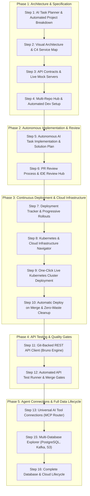
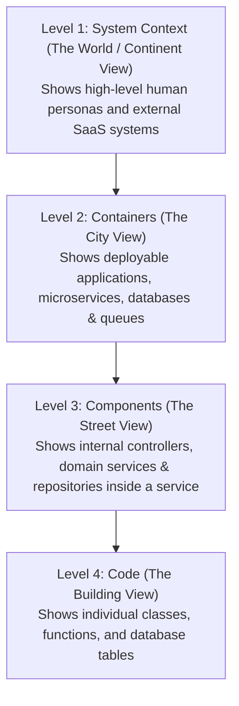
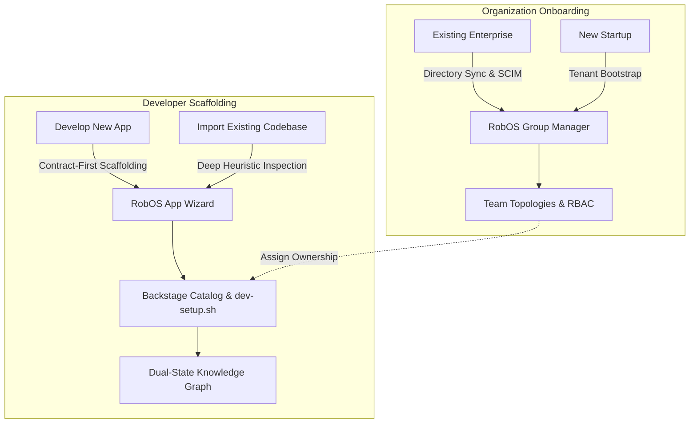

# Real-World Walkthroughs & Proof of Work
{: .no_toc }

Explore the real-world engineering scenarios tested across the RobOS ecosystem. Every capability is validated with high-definition video walkthroughs, spoken voiceovers, DOM assertions, and live test execution logs.
{: .fs-6 .fw-300 }

## Table of contents
{: .no_toc .text-delta }

1. TOC
{:toc}

---

## How RobOS Guarantees That Code Actually Works

In traditional software engineering, developers write code and hope their unit tests catch all regressions before production. In RobOS, autonomous AI agents and automated workflows must **prove** their work before requesting human lead approval:

1. **Dedicated 1080p Virtual Desktop (`Xvfb + Picom`)**: All end-to-end scenarios run in an isolated virtual framebuffer with hardware compositing, ensuring tests click real buttons, render real UI components, and never hijack your active desktop display.
2. **Deterministic Visual & Network Assertions**: Tests wait for DOM elements, verify table schema grids, execute live SQL queries against real databases, and validate HTTP 200/201 response status codes.
3. **Synchronized Video with Spoken Voiceovers**: Generates 1080p WebM recordings accompanied by natural spoken voiceover explanations (synthesized using offline, local neural text-to-speech) and synchronized WebVTT subtitles.
4. **Complete Proof-of-Work Packages**: Walkthrough videos, subtitles, code diffs, and test logs are bundled together so lead developers and architects can review and approve complex features in under 30 seconds.

---

## Section 1: The 16-Step Acme Petshop Lifecycle (From Business Idea to Live Cloud Deployment)

The **Acme Petshop Platform** is a reference distributed polyglot microservice application designed to mirror complex enterprise software delivery. It spans a Java Spring Boot backend, a PostgreSQL relational database, a React TypeScript frontend, an Apache Kafka event streaming pipeline, an mTLS rabies vaccination verification gateway, and a dedicated analytics warehouse.



---

### Step 1: AI Task Planner & Automated Project Breakdown (Syncing to GitHub & Jira)

#### The Real-World Business Scenario
The Acme Pet Adoption Agency wants to modernize its online pet adoption and checkout platform. Currently, customers experience delays because pet inventory is out-of-sync between regional shelters, pet medical records are verified manually by phone with veterinary clinics, and database schemas frequently break when frontend changes are deployed. 

The agency needs a distributed, polyglot system: a high-performance Java Spring Boot backend for checkout and order processing, a React web frontend for customer pet browsing, a PostgreSQL database for relational catalog data, an Apache Kafka message stream for real-time inventory sync across shelters, and a secure veterinary gateway over mutual TLS (mTLS) to automatically verify rabies vaccination health certificates before allowing any puppy or kitten adoption.

#### What the Test Actually Executes Step-by-Step
1. **Developer Input**: The developer opens **RobOS Task Planner** and inputs a high-level natural language prompt describing the multi-service pet adoption architecture.
2. **AI Dependency Analysis**: The AI analyzes the requirements and breaks them down into 6 interdependent technical user stories. It automatically establishes strict prerequisite ordering (for example, shared domain data models must compile before API endpoints can be written; backend API endpoints must exist before frontend UI forms can consume them).
3. **Visual Roadmap Generation**: RobOS renders a visual Directed Acyclic Graph (DAG) showing all task dependencies and milestone gates.
4. **Issue Tracker Synchronization**: RobOS creates and synchronizes corresponding tickets bi-directionally with your organization's issue tracker (GitHub Issues, Gitea, or Jira), complete with story points, labels, and Git repository bindings.
- **Source Demo Script**: [`packages/robos-test/demos/acme-petshop-step1-tasks-demo.js`](https://github.com/nddipiazza/robos/blob/main/packages/robos-test/demos/acme-petshop-step1-tasks-demo.js)

> **What the Developer Typed (AI Architecture Prompt):**
> ```text
> Architect and plan the Acme Petshop distributed polyglot platform:
> - Backend: Java 21 Spring Boot 3 REST API microservice with OpenAPI 3.1 contracts
> - Database: PostgreSQL with Flyway automated migrations for pet catalog, inventory, and orders
> - Frontend: React 18 TypeScript single-page application for customer pet adoption & cart checkout
> - Event Streaming: Apache Kafka topic pipeline for async pet adoption events & real-time inventory sync
> - Compliance & Security: Dedicated rabies vaccination certification gateway validating vet health records
> - Shared Contracts: Reusable TypeSpec models and DTO schemas for cross-service type safety
> ```

| 1. Developer Types High-Level Goal | 2. AI Generates Step-by-Step Task Roadmap |
|:---:|:---:|
|  |  |

| 3. Tasks Ordered by Prerequisites | 4. Synchronized Directly to Issue Tracker (Gitea / Jira) |
|:---:|:---:|
|  |  |

---

## Deep Dive: What are C4 Visuals and Spotify Backstage, and Why Does RobOS Use Them?

Before exploring Step 2, it is essential to understand two open-source standards that form the architectural backbone of RobOS: **The C4 Architecture Model** and **Spotify Backstage**.

### 1. The Problem with Traditional Software Diagrams
In most companies, system architecture diagrams suffer from three fatal flaws:
- **They go stale immediately**: Diagrams drawn in static whiteboard tools (like Miro, Lucidchart, or Visio) are out-of-date the moment a developer merges a pull request.
- **The "Boxes and Lines" Mystery**: Nobody knows what a box represents. Is it a physical server? A Docker container? A single Java class? An entire third-party company?
- **AI Agents Cannot Read Them**: AI coding tools have no way to query or navigate a static PNG or drawing canvas.

---

### 2. What is the C4 Architecture Model? (The "Google Maps" of Software)
Created by engineer Simon Brown, the **C4 Model** solves diagram confusion by creating a standard 4-level zoom hierarchy—exactly like zooming in on Google Maps:



| C4 Level | What It Shows | Real-World Acme Petshop Example |
|---|---|---|
| **Level 1: System Context** | The 30,000-foot view: Who uses the software, and what external services does it talk to? | Customer adopting a pet, Clinic Staff, Third-Party Veterinary Rabies Registry. |
| **Level 2: Containers** | The 10,000-foot view: What deployable applications, microservices, and databases make up our system? *(Note: In C4, a "Container" means any deployable unit, not just Docker).* | `petstore-web` (React SPA), `petstore-api` (Java Spring Boot), `petstore-db` (PostgreSQL), `event-bus` (Kafka), `vaccine-gateway` (Fastify). |
| **Level 3: Components** | The 1,000-foot view: Inside a specific microservice, how is the internal code organized? | `AdoptionController`, `VaccineVerificationService`, `PetRepository`, `KafkaEventPublisher`. |
| **Level 4: Code** | The 1-foot view: Class diagrams, entity attributes, and methods. | Inspected directly in the IDE editor at breakpoints. |

#### Why RobOS Uses the C4 Model:
- **A Shared Language for Humans and AI**: Both human architects and autonomous AI agents need an unambiguous mental model. When an agent plans a task, it knows exactly which C4 Level 2 Container and Level 3 Component it is modifying.
- **Contextual Zooming**: You can zoom out to understand how a customer request travels across the company, or zoom in to inspect a single database query.

---

### 3. What is Spotify Backstage?
Created by Spotify and donated to the Cloud Native Computing Foundation (CNCF), **Backstage** is the industry-standard developer portal for managing software catalogs and team service ownership.

Instead of keeping documentation in wikis that nobody updates, Backstage defines software metadata in a simple, standardized plain-text file called **`catalog-info.yaml`** stored right inside the Git repository alongside the code:

```yaml
# Example: packages/petstore-api/catalog-info.yaml
apiVersion: backstage.io/v1alpha1
kind: Component
metadata:
  name: petstore-api
  description: Core Java Spring Boot REST microservice for pet adoption & orders
  tags: [java, spring-boot, microservice, pci-compliant]
spec:
  type: service
  lifecycle: production
  owner: team-adoption-engineers   # Who owns and maintains this service
  providesApis:
    - petstore-openapi-v1         # API contracts provided to others
  dependsOn:
    - component:default/petstore-db       # Database dependency
    - component:default/event-bus         # Kafka event bus dependency
    - component:default/vaccine-gateway   # Rabies verification gateway
```

---

### 4. Why RobOS Combines C4 Visuals and Spotify Backstage
By combining C4 visual hierarchies with Backstage Git catalogs, RobOS provides unique superpowers:

1. **Zero Manual Diagram Maintenance**: RobOS automatically scans your Git repositories for `catalog-info.yaml` files and draws the live C4 architecture map dynamically. You never have to manually update a diagram again.
2. **Mathematically Proven "Blast Radius"**: Because Backstage defines `dependsOn` and `providesApis`, RobOS knows every upstream consumer and downstream dependency. If you change a database column in `petstore-db`, RobOS immediately highlights that `petstore-api` and `petstore-web` could break.
3. **Clear Team Ownership & AI Routing**: When an AI agent detects an issue or needs approval for an API change, it checks the Backstage `owner` field to notify the right human team directly.
4. **Automatic Kubernetes & Cloud Infrastructure**: Because RobOS knows what containers exist and what databases they connect to, it can auto-generate Kubernetes YAML manifests and Helm chart templates without developers writing boilerplate.

---

### Step 2: Interactive System Architecture & Service Map (C4 Visuals & Backstage)

#### The Real-World Business Scenario
Before writing code across multiple microservices, the lead architect and engineering team need to agree on how services, databases, and message queues communicate. If an engineer later modifies the pet adoption data format, how does the team prevent accidental breaking changes to downstream services or reporting pipelines?

#### What the Test Actually Executes Step-by-Step
1. **Interactive Architecture Studio**: The developer opens the **System Topology & Backstage Studio** and initializes a fresh architecture canvas.
2. **AI Interactive Clarifications**: The developer enters the system architecture prompt. The AI engages the architect with clarifying survey questions regarding service protocols, database isolation, and security boundaries.
3. **Hierarchical C4 Visual Map**: RobOS renders an interactive 3-level C4 model: **Level 1** (High-level customer personas and third-party vet clinic systems), **Level 2** (Polyglot containers: `petstore-web`, `petstore-api`, `petstore-db`, `event-bus`, `vaccine-gateway`), and **Level 3** (Internal controllers and domain repositories).
4. **Spotify Backstage Synchronization**: Reads existing `catalog-info.yaml` files across Git repositories and populates service ownership and dependencies.
5. **Live Blast Radius Calculation**: Selecting any service node highlights exactly which upstream and downstream systems could be affected by changes.
- **Source Demo Script**: [`packages/robos-test/demos/acme-petshop-step2-topology-demo.js`](https://github.com/nddipiazza/robos/blob/main/packages/robos-test/demos/acme-petshop-step2-topology-demo.js)

> **What the Developer Typed (System Topology Prompt):**
> ```text
> Synthesizing architecture for Acme Petshop Platform:
> - Java 21 Spring Boot 3 REST API microservice (petstore-api)
> - PostgreSQL 16 relational database with Flyway (petstore-db)
> - React 18 TypeScript web client (petstore-web)
> - Apache Kafka event bus for async pet adoption (event-bus)
> - Dedicated rabies vaccine certification gateway (vaccine-gateway)
> - Reusable TypeSpec & Pact contract models (petstore-common)
> 
> Ask me clarifying questions via the interactive survey to refine service boundaries, event streaming, and compliance gateways.
> ```

| Live Interactive Architecture Canvas | Service Inspector & Blast Radius (What Could Break) |
|:---:|:---:|
|  |  |

| Clean Declarative Architecture Export | Live OpenTelemetry Performance Traces |
|:---:|:---:|
|  |  |


---

### Step 3: API Contracts & Live Mock Servers (REST, Kafka Events & Type Safety)

#### The Real-World Business Scenario
Frontend and backend teams often get blocked waiting for each other. Frontend engineers cannot build pet checkout screens because backend endpoints are not deployed yet, while backend developers do not know the exact payload format the frontend expects. To eliminate this bottleneck, the team adopts a contract-first development approach.

#### What the Test Actually Executes Step-by-Step
1. **Contract Authoring**: The developer opens **Contract Studio** to define API endpoints and event schemas before writing application code.
2. **Multi-Protocol Compilation**: The AI compiles domain models (`pet.typespec`) into an OpenAPI 3.1 contract containing 5 REST endpoints (including `/pets`, `/pets/{id}/adopt`, `/pets/categories`) and AsyncAPI 3.0 event definitions for Kafka streaming (`pet.adopted`, `inventory.delta`).
3. **Automated Governance & Linting**: Spectral governance rules automatically validate naming conventions, authentication headers (mTLS), and pagination parameters.
4. **Live Mock Server Launch**: RobOS spins up a local Prism mock server returning realistic JSON responses, allowing frontend developers to test interactive adoption forms immediately without a running backend.
- **Source Demo Script**: [`packages/robos-test/demos/acme-petshop-step3-contracts-demo.js`](https://github.com/nddipiazza/robos/blob/main/packages/robos-test/demos/acme-petshop-step3-contracts-demo.js)

> **What the Developer Typed (API Contract Prompt):**
> ```text
> Author and compile API contracts for Acme Petshop Platform (urn:robos:project:acme-petshop-platform):
> - Compile entities/pet.typespec into OpenAPI 3.1 contract for petstore-api (5 endpoints, AdoptionRequest)
> - Author rabies vaccine verification contract for vaccine-gateway (mTLS security scheme)
> - Define AsyncAPI 3.0 event streams for Apache Kafka (pet.adopted, inventory.delta)
> - Run Spectral style governance, Pact consumer verification, and start local Prism mock server.
> ```

| Centralized API Contract Explorer | Event-Driven Kafka Stream Definitions |
|:---:|:---:|
|  |  |

| Live Mock Server for Instant Frontend Testing | Automated Governance & Compatibility Checks Passed |
|:---:|:---:|
|  |  |

---

### Step 4: Multi-Repo Hub & One-Click Dev Environments

#### The Real-World Business Scenario
A software developer joins the engineering team and needs to work across all 6 polyglot repositories (`petstore-web`, `petstore-api`, `petstore-common`, `vaccine-gateway`, `event-bus`, `petstore-db`). In traditional environments, installing compilers, configuring environment variables, creating local databases, and generating SSL certificates can take 2 to 3 days.

#### What the Test Actually Executes Step-by-Step
1. **Multi-Repo Hub Initialization**: The developer opens **Git Projects Multi-Repo Hub**.
2. **Unified Repository Scaffolding**: The AI clones and links all 6 polyglot repositories into a cohesive project workspace.
3. **Automated Setup Script Generation**: RobOS generates standalone `dev-setup.sh` environment runners and Docker devcontainer configurations for each service.
4. **Encrypted Secrets Injection**: Passwords, database connection URIs, and mTLS client certificates are injected automatically from the developer's encrypted vault (Pass / GPG), getting the entire multi-repo suite building in seconds.
- **Source Demo Script**: [`packages/robos-test/demos/acme-petshop-step4-git-projects-demo.js`](https://github.com/nddipiazza/robos/blob/main/packages/robos-test/demos/acme-petshop-step4-git-projects-demo.js)

> **What the Developer Typed (Multi-Repo Setup Prompt):**
> ```text
> Scaffold and configure all 6 Acme Petshop polyglot repositories from the project graph:
> - petstore-web (React 18 / Vite frontend client)
> - petstore-api (Java 21 Spring Boot 3.3 core REST microservice)
> - petstore-common (Shared TypeSpec domain models & OpenAPI contracts)
> - vaccine-gateway (Node.js 20 Fastify mTLS rabies certification gateway)
> - event-bus (Apache Kafka 3.7 streaming broker & topics)
> - petstore-db (PostgreSQL 16 relational database & Flyway migrations)
> Include Docker devcontainers, local build instructions, and environment secrets.
> ```

| Unified Multi-Repository Workspace Hub | AI-Generated One-Click Setup Scripts |
|:---:|:---:|
|  |  |

| Automated Build & Test Lifecycle Hooks | Encrypted Secret & Password Management |
|:---:|:---:|
|  |  |

---

### Step 5: Autonomous AI Task Implementation & Solution Plan Review

#### The Real-World Business Scenario
The team picks up sprint ticket **PET-105**: *"Implement Rabies Vaccine Verification Gateway on petstore-api"*. When a customer adopts a pet, the system must verify its veterinary health certificate over mTLS. If the vaccine certificate is expired or missing, adoption must be blocked with an informative error. The AI agent formulates an implementation plan, generates the required client code, and validates it with automated tests.

#### What the Test Actually Executes Step-by-Step
1. **Task Selection**: The developer selects task **PET-105** from the sprint backlog in Task Implementer.
2. **One-Click Workspace Provisioning**: Clicking "Launch Task Workspace" automatically checks out the feature branch (`feature/PET-105-vaccine-gateway`), provisions an isolated RAM workspace, starts the mock services, and bridges to the dev environment.
3. **Automated Implementation & Plan Presentation**: The AI generates a structured implementation plan, detailing the new `VaccineGatewayClient.java` service, OpenAPI contract links, and Kafka adoption event changes.
4. **Interactive Breakpoint Debugging Feature**: As an optional debugging feature during investigation, RobOS agents can run a reproduction test and pause execution at a **live breakpoint** in the IDE, allowing developers to step through code and inspect variables on demand.
- **Source Demo Script**: [`packages/robos-test/demos/acme-petshop-step5-ide-execution-demo.js`](https://github.com/nddipiazza/robos/blob/main/packages/robos-test/demos/acme-petshop-step5-ide-execution-demo.js)

> **Ticket Requirements & AI Fix Plan (Task PET-105):**
> ```text
> Requirement: Implement Rabies Vaccine Verification Gateway & Certification on petstore-api.
> When adopting a puppy or kitten, verify its certificate via vaccine-gateway over mTLS before approving adoption.
> Optional Debugging: Agents can run tests and stop at breakpoints (e.g. AdoptionService.java:42) for variable inspection.
> ```

| Instant IDE Workspace Launch | Interactive Breakpoint Debugging Feature |
|:---:|:---:|
|  |  |

| Live Runtime Variable Inspection | AI Solution Plan Presented for Developer Review |
|:---:|:---:|
|  |  |

---

### Step 6: PR Review Process & The IDE Review Hub

#### The Real-World Business Scenario
The AI agent has implemented the mTLS rabies certificate validation fix and opened a pull request. The primary developer touchpoint in the RobOS workflow is the **PR Review Process**. The lead architect reviews the changes using the **Agent Code Review Platform**, with the option to open the project directly in **IntelliJ IDEA** or **VS Code** using RobOS to review the PR with all rich IDE context in tow.

#### What the Test Actually Executes Step-by-Step
1. **Pull Request Queue**: The lead engineer opens the **Agent Code Review Platform** and selects PR #42 (`feat: PET-105 mTLS Rabies Verification`).
2. **AI Semantic Diff Audit**: The AI evaluates the code diff, checking cryptographic certificate handling in `VaccineGatewayClient.java` and verifying that the `AdoptionRequest` schema matches OpenAPI 3.1 specifications.
3. **Optional IDE PR Review with Full Context**:
   - **Review in IntelliJ IDEA**: One click triggers the port `63343` IPC bridge, opening the PR directly inside JetBrains' native **Pull Requests tool window** with full syntax analysis, symbol navigation, and debugger support in tow.
   - **Review in VS Code**: Clicking **Review in VS Code** launches the official `GitHub Pull Requests and Issues` extension (`vscode://github.vscode-pull-request-github/open-pr`) for deep in-editor reviewing and inline commenting.
4. **Automated CI Validation**: Confirms that 100% of unit tests, Pact consumer contract tests, and linting checks passed.
5. **1-Click Merge & Dual Sync**: The lead architect reviews the findings and approves the pull request with a single click, merging the Git branch and syncing the Knowledge Graph topology.
- **Source Demo Script**: [`packages/robos-test/demos/agent-code-review-ide-demo.js`](https://github.com/nddipiazza/robos/blob/main/packages/robos-test/demos/agent-code-review-ide-demo.js)

> **AI Code Review Directive:**
> ```text
> Perform architectural and security risk analysis on PR #42 (feat: PET-105 mTLS Rabies Verification):
> - Audit cryptographic cert parsing in VaccineGatewayClient.java
> - Validate semantic diff against OpenAPI 3.1 AdoptionRequest schema
> - Confirm 100% pass on Pact consumer contract verification and CI pipeline
> - Synchronize review status with IntelliJ IDEA (port 63343) and VS Code PR extension
> ```

| Active Pull Request Queue & Status | Side-by-Side Visual Code Diff |
|:---:|:---:|
|  |  |

| Automated AI Code Review & Risk Report | Automated Test & CI Check Suite |
|:---:|:---:|
|  |  |

---

### Step 7: Deployment Tracker & Progressive Rollouts (Canary & Rollback)

#### The Real-World Business Scenario
Deploying updates directly to 100% of production users risks taking down the online pet shop if an unexpected issue occurs. The team uses progressive delivery: deploying first to Development, promoting to Staging, and executing a 10% canary rollout in Production while monitoring key performance indicators (DORA metrics).

#### What the Test Actually Executes Step-by-Step
1. **Pipeline Visualization**: The engineer opens **Deploy Tracker** to observe the multi-stage deployment pipeline across Development, Staging, and Production.
2. **DORA Health Metrics**: The dashboard tracks team performance KPIs: Deployment Frequency, Lead Time for Changes, Mean Time to Recovery (MTTR), and Change Failure Rate.
3. **Environment Filtering**: Inspects active container versions in Staging versus Production.
4. **Automated Rollback Safeguard**: Verifies that if error rates spike during canary testing, a single click triggers an immediate rollback to the previous stable release.
- **Source Demo Script**: [`packages/robos-test/demos/acme-petshop-step7-deploy-tracker-demo.js`](https://github.com/nddipiazza/robos/blob/main/packages/robos-test/demos/acme-petshop-step7-deploy-tracker-demo.js)

| Team Release KPIs & DORA Health Metrics | Staging Environment Deployment Filter |
|:---:|:---:|
|  |  |

| Production Environment Deployment Filter | Visual Release Timeline |
|:---:|:---:|
|  |  |

---

### Step 8: Kubernetes & Cloud Infrastructure Navigator (Pods, Helm & Logs)

#### The Real-World Business Scenario
DevOps and platform engineers need a visual control room to inspect all running Kubernetes pods, Helm releases, and GitOps synchronization without needing to memorize complex `kubectl` command arguments or juggle multiple terminal windows.

#### What the Test Actually Executes Step-by-Step
1. **Multi-Cluster Connection**: The engineer opens **Kube Studio** and connects to local Kind clusters or enterprise clouds (AWS EKS, GCP GKE, Azure AKS).
2. **Live Pod Inspection**: Displays real-time container states, restart counts, and CPU/memory utilization across namespaces.
3. **Helm & GitOps Sync**: Inspects active Helm release versions and verifies synchronization status with ArgoCD GitOps.
4. **Log Streaming Console**: Streams live container logs directly in the UI with instant keyword filtering and error highlighting.
- **Source Demo Script**: [`packages/robos-test/demos/acme-petshop-step8-kube-studio-demo.js`](https://github.com/nddipiazza/robos/blob/main/packages/robos-test/demos/acme-petshop-step8-kube-studio-demo.js)

| Real-Time Kubernetes Containers (Pods) Grid | Helm Package Releases & Installed Versions |
|:---:|:---:|
|  |  |

| ArgoCD GitOps Deployment Status | Live Streaming Container Logs |
|:---:|:---:|
|  |  |

---

### Step 9: One-Click Live Kubernetes Cluster Deployment

#### The Real-World Business Scenario
The engineering team wants to validate microservices inside a real local Kubernetes cluster (Kind) to ensure all container networking, DNS resolution, port mappings, and volume mounts function identically to production cloud environments.

#### What the Test Actually Executes Step-by-Step
1. **Cluster Connection**: Connects to the active local Kind Kubernetes cluster via Kube Studio.
2. **Namespace Provisioning**: Automatically creates an isolated namespace (`acme-petshop-staging`).
3. **Microservice Deployment**: Applies synthesized Kubernetes manifests for the Java API, PostgreSQL database, React web client, and Kafka event streaming broker.
4. **Health Verification**: Streams real-time pod initialization logs until all workloads report healthy status (1/1 Ready).
- **Source Demo Script**: [`packages/robos-test/demos/acme-petshop-step9-real-kube-e2e-demo.js`](https://github.com/nddipiazza/robos/blob/main/packages/robos-test/demos/acme-petshop-step9-real-kube-e2e-demo.js)

| Connect Live Kubernetes Cluster | Automated One-Click Task Deployment |
|:---:|:---:|
|  |  |

| Live Running Microservices | Real-Time Container Log Stream |
|:---:|:---:|
|  |  |

---

### Step 10: Automatic Deploy on Merge & Zero-Waste Cleanup

#### The Real-World Business Scenario
Every merged feature branch needs its own temporary preview environment for automated testing. However, leaving dozens of preview namespaces running overnight leads to ballooning cloud bills and memory exhaustion.

#### What the Test Actually Executes Step-by-Step
1. **Trigger on PR Merge**: The moment a pull request merges into `main`, RobOS triggers an automatic ephemeral microservice deployment.
2. **Smoke Test Execution**: Executes automated health checks against the live preview endpoints.
3. **Automated Resource Reclamation**: Once verification succeeds, RobOS automatically destroys the ephemeral namespace and reclaims all memory and CPU resources, ensuring zero cloud cost waste.
- **Source Demo Script**: [`packages/robos-test/demos/acme-petshop-step10-continuous-deploy-demo.js`](https://github.com/nddipiazza/robos/blob/main/packages/robos-test/demos/acme-petshop-step10-continuous-deploy-demo.js)

> **What the Developer Asked (Deployment Assistant):**
> ```text
> Explain auto-deployment from Knowledge Graph main branch and verify ephemeral namespace reclamation after verification.
> ```

| Application Catalog & Config Overview | Auto-Deployed Microservice Pods |
|:---:|:---:|
|  |  |

| Real-Time Deployment Progress & Logs | Clean Zero-Waste Namespace Reclamation |
|:---:|:---:|
|  |  |

---

### Step 11: Git-Backed REST API Client (Postman Alternative via Bruno)

#### The Real-World Business Scenario
API testing collections in tools like Postman are often trapped in proprietary cloud silos or get desynchronized from the actual code. The team needs Git-backed API requests stored alongside source code in plain text `.bru` format (Bruno).

#### What the Test Actually Executes Step-by-Step
1. **Open REST API Client**: The developer launches the **RobOS REST API Client**.
2. **Automated Request Synthesis**: RobOS reads the OpenAPI 3.1 contract and automatically generates complete `.bru` request files with environment variables, auth tokens, and headers.
3. **Live Endpoint Verification**: Sends live HTTP requests against the running Java backend (`/api/v1/pets`, `/api/v1/pets/adopt`) and displays formatted JSON responses with latency timings.
4. **Declarative Assertions**: Applies built-in assertion rules to verify response headers, status codes (200/201), and payload schema fields.
- **Source Demo Script**: [`packages/robos-test/demos/acme-petshop-step11-bruno-rest-client-demo.js`](https://github.com/nddipiazza/robos/blob/main/packages/robos-test/demos/acme-petshop-step11-bruno-rest-client-demo.js)

> **What the Developer Asked (API Test Generator):**
> ```text
> Validate mTLS Fastify headers and payload format across petstore-api and vaccine-gateway endpoints.
> Auto-synthesize declarative .bru collection files and assertions from OpenAPI 3.1 contracts.
> ```

| Git-Backed API Request Tree in Repo | Automatic Request Generation from OpenAPI |
|:---:|:---:|
|  |  |

| Live HTTP 200/201 Success Responses | Built-In Automated Test Assertions |
|:---:|:---:|
|  |  |

---

### Step 12: Automated API Test Runner & Merge Quality Gates

#### The Real-World Business Scenario
Before any code can be deployed, a full regression suite of 50+ API requests must run in sequence (creating pet records, attempting adoption, checking stock inventory, validating error handling for expired rabies certificates).

#### What the Test Actually Executes Step-by-Step
1. **Collection Runner Launch**: The engineer launches the **REST Collection Runner**.
2. **Batch Suite Execution**: Executes all API requests in parallel/sequential batches across Development and Staging environment matrices.
3. **Latency Scorecards**: Generates a latency scorecard detailing response times and assertion results for every endpoint.
4. **Quality Gate Enforcement**: Pull request merge buttons remain locked until 100% of collection tests pass.
- **Source Demo Script**: [`packages/robos-test/demos/acme-petshop-step12-collection-runner-demo.js`](https://github.com/nddipiazza/robos/blob/main/packages/robos-test/demos/acme-petshop-step12-collection-runner-demo.js)

| Multi-Endpoint Collection Test Runner | Real-Time Execution Progress & Status |
|:---:|:---:|
|  |  |

| Test Results Matrix & Latency Scorecard | Passed Quality Gate Required for PR Merge |
|:---:|:---:|
|  |  |

---

### Step 13: Universal AI Tool Connections (Model Context Protocol)

#### The Real-World Business Scenario
Developers want to use modern AI assistants (Anthropic Claude Code, Google Antigravity, GitHub Copilot CLI, Gemini) without giving them dangerous unconstrained access to their system or hardcoding static credentials.

#### What the Test Actually Executes Step-by-Step
1. **MCP Manager Registry**: The developer opens **MCP Manager**.
2. **Server Registration**: RobOS registers local Model Context Protocol tool servers (System Topology MCP, Task Manager MCP, DB Manager MCP).
3. **Interactive OAuth 2.0 Login**: Launches an interactive OAuth 2.0 PKCE web authentication modal for secure tool authorization.
4. **AI Context Window Binding**: Connects AI models directly to RobOS background tools so agents can query the Knowledge Graph, inspect IDE breakpoints, and trigger test runs safely.
- **Source Demo Script**: [`packages/robos-test/demos/acme-petshop-step13-agy-mcp-task-demo.js`](https://github.com/nddipiazza/robos/blob/main/packages/robos-test/demos/acme-petshop-step13-agy-mcp-task-demo.js)

> **What the Developer Configured (AI Tool Integration):**
> ```text
> Connect Google Antigravity & Claude Code to RobOS System Topology and Task Manager MCP servers via local IPC bridge.
> Authenticate with OAuth 2.0 PKCE and expose knowledge graph mutations directly into the agent context window.
> ```

| Google Antigravity MCP Server Registry | Add Custom MCP Tool Server with One Click |
|:---:|:---:|
|  |  |

| Secure Interactive OAuth Authentication | Local RobOS Tool Bridge Connected to AI |
|:---:|:---:|
|  |  |

---

### Step 15: Multi-Database Explorer (PostgreSQL, MySQL, Oracle, S3, Kafka)

#### The Real-World Business Scenario
The Acme Petshop application uses multiple data stores: PostgreSQL for relational orders and pet profiles, MongoDB for unstructured medical notes, Redis for caching, AWS S3 for pet photo uploads, and Kafka for event streams. Engineers need a single console to inspect all these data sources.

#### What the Test Actually Executes Step-by-Step
1. **Data Sources Hub**: Opens **RobOS Data Sources Explorer**.
2. **Live Connection Handshakes**: Tests live connections across PostgreSQL, MySQL, Oracle, AWS S3 buckets, and Kafka streaming topics.
3. **Schema & Index Inspector**: Inspects table schemas, column data types, foreign key constraints, and index configurations.
4. **Interactive SQL Queries & File Browsing**: Runs SQL queries with sub-millisecond execution times and browses files stored in AWS S3 buckets.
- **Source Demo Script**: [`packages/robos-test/demos/data-sources-demo.js`](https://github.com/nddipiazza/robos/blob/main/packages/robos-test/demos/data-sources-demo.js)

> **Data Source Onboarding Goal:**
> ```text
> Register PostgreSQL 16 petstore-db and AWS S3 analytics bucket into Knowledge Graph.
> Perform live connection handshake, inspect schemas, and query customer pet adoption records.
> ```

| PostgreSQL Database Connection Overview | Live Table Schema & Column Inspector |
|:---:|:---:|
|  |  |

| Interactive SQL Query Results & Performance | AWS S3 Cloud Storage File Browser |
|:---:|:---:|
|  |  |

---

### Step 16: Complete Database & Cloud Lifecycle (Visual Design to Live Deployment)

#### The Real-World Business Scenario
The marketing and analytics team requests a dedicated **PostgreSQL Analytics Warehouse** to track customer adoption trends without running expensive reporting queries against the production transactional database. How quickly can the team design, configure, deploy, and verify this new database in production?

#### What the Test Actually Executes Step-by-Step
1. **Visual Architecture Addition**: The architect opens **System Topology Studio** and adds a new "PostgreSQL 16 Analytics Warehouse" node to the canvas.
2. **Automatic Cloud Manifest Synthesis**: RobOS analyzes downstream impact (blast radius) and automatically synthesizes Kubernetes StatefulSet YAML manifests and Helm chart templates.
3. **Live Cluster Deployment**: Deploys the new database container to the active Kubernetes cluster.
4. **Schema Execution & Data Seeding**: Opens **RobOS Relational DB Manager**, connects to the new database instance, executes the DDL table schema script (`CREATE TABLE adoption_analytics ...`), inserts test adoption records, and runs analytical SQL queries.
5. **Live API Verification**: Verifies live API endpoints using the Bruno REST client, completing the entire end-to-end lifecycle in minutes.
- **Source Demo Script**: [`packages/robos-test/demos/topology-db-kube-lifecycle-demo.js`](https://github.com/nddipiazza/robos/blob/main/packages/robos-test/demos/topology-db-kube-lifecycle-demo.js)

> **Data Architecture & Cloud Lifecycle Goal:**
> ```text
> Add PostgreSQL 16 Analytics Warehouse data source node to Acme Petshop System Topology.
> Auto-synthesize deployable Kubernetes StatefulSet manifests and Helm chart templates.
> Deploy to Kind cluster, execute DDL schema, seed test adoption records, and verify REST endpoints.
> ```

| Visual Architecture Map with New Analytics Database | Impact & Blast Radius Inspector |
|:---:|:---:|
|  |  |

| Auto-Generated Kubernetes Manifests & Helm Charts | Fast SQL Console in Relational DB Manager |
|:---:|:---:|
|  |  |

| Live Table Data Grid & Record Insertions | Generated DDL Schema Migration Script |
|:---:|:---:|
|  |  |

---

## Section 2: Core Platform Subsystems & Automated Walkthroughs

Beyond the Acme Petshop reference application, each RobOS core subsystem has dedicated verified test runners:

### Live Architecture Map & Semantic Difference Engine

#### The Real-World Scenario
In a fast-moving engineering organization with 20+ teams, developers frequently make pull requests that inadvertently change shared data models or API response shapes. RobOS acts as an automated guardian by comparing "World 1" (Live Production `main`) against "World 2" (Feature Branches). If a pull request modifies a required field, RobOS flags every affected microservice across all Git repositories before any code is merged.
- **Source Demo Scripts**: [`robos-graph-demo.js`](https://github.com/nddipiazza/robos/blob/main/packages/robos-test/demos/robos-graph-demo.js), [`graph-diff-demo.js`](https://github.com/nddipiazza/robos/blob/main/packages/robos-test/demos/graph-diff-demo.js), [`gitops-schema-demo.js`](https://github.com/nddipiazza/robos/blob/main/packages/robos-test/demos/gitops-schema-demo.js), [`graph-copilot-demo.js`](https://github.com/nddipiazza/robos/blob/main/packages/robos-test/demos/graph-copilot-demo.js)

| Architecture Knowledge Graph Explorer | Dual-State Visual Difference Engine |
|:---:|:---:|
|  |  |

---

### Clean, Isolated AI Workspaces (Zero Clutter on Your Machine)

#### The Real-World Scenario
Running multiple autonomous AI coding agents on a single laptop can quickly cause chaos: processes left running in the background, temporary files filling the disk, and potential credential leakage. RobOS solves this by provisioning each agent inside an isolated Linux user account backed entirely by RAM (`tmpfs`). When the agent finishes its task, the account is terminated and the RAM is wiped clean with zero leftover clutter.
- **Source Demo Scripts**: [`robos-profiled-demo.js`](https://github.com/nddipiazza/robos/blob/main/packages/robos-test/demos/robos-profiled-demo.js), [`robos-profiled-tmpfs-demo.js`](https://github.com/nddipiazza/robos/blob/main/packages/robos-test/demos/robos-profiled-tmpfs-demo.js), [`robos-profiled-display-demo.js`](https://github.com/nddipiazza/robos/blob/main/packages/robos-test/demos/robos-profiled-display-demo.js), [`robos-profiled-zero-residue-demo.js`](https://github.com/nddipiazza/robos/blob/main/packages/robos-test/demos/robos-profiled-zero-residue-demo.js)

| Ephemeral Agent Profile Manager | RAM-Based Filesystem & Zero-Waste Cleanup |
|:---:|:---:|
|  |  |

---

### Desktop AI Agent Supervisor & Status Sidebar

#### The Real-World Scenario
A lead engineer assigns 3 different feature tasks to AI agents concurrently: one agent builds a new backend API, another writes frontend React components, and a third runs database migration tests. The engineer uses the Desktop Agents Supervisor dock to monitor all 3 agents simultaneously, view live terminal streams, and pause or resume agent sessions.
- **Source Demo Scripts**: [`robos-agentd-demo.js`](https://github.com/nddipiazza/robos/blob/main/packages/robos-test/demos/robos-agentd-demo.js), [`desktop-agents-demo.js`](https://github.com/nddipiazza/robos/blob/main/packages/robos-test/demos/desktop-agents-demo.js), [`agent-sidebar-demo.js`](https://github.com/nddipiazza/robos/blob/main/packages/robos-test/demos/agent-sidebar-demo.js), [`agent-session-lib-demo.js`](https://github.com/nddipiazza/robos/blob/main/packages/robos-test/demos/agent-session-lib-demo.js)

| Live Multi-Agent Session Console | Background Process Supervisor |
|:---:|:---:|
|  |  |

---

### Universal Model Context Protocol (MCP) Tool Hub

#### The Real-World Scenario
An organization wants developers to be free to use any AI coding model (Claude Code from Anthropic, Google Antigravity, GitHub Copilot, Google Gemini) without rewriting tool integrations for each model. RobOS provides a single universal Model Context Protocol (MCP) router that securely bridges all AI models to system capabilities (querying databases, inspecting IDE breakpoints, deploying Kubernetes pods) with interactive OAuth security.
- **Source Demo Scripts**: [`mcp-manager-demo.js`](https://github.com/nddipiazza/robos/blob/main/packages/robos-test/demos/mcp-manager-demo.js), [`mcp-router-demo.js`](https://github.com/nddipiazza/robos/blob/main/packages/robos-test/demos/mcp-router-demo.js), [`mcp-lib-demo.js`](https://github.com/nddipiazza/robos/blob/main/packages/robos-test/demos/mcp-lib-demo.js), [`system-mcp-demo.js`](https://github.com/nddipiazza/robos/blob/main/packages/robos-test/demos/system-mcp-demo.js)

| Central MCP Tool Router Console | Universal Tool Library & Health Inspector |
|:---:|:---:|
|  |  |

---

### Entity Schema Studio, Team Directory & Package Management

#### The Real-World Scenario
When building cross-language microservices (Java backend, TypeScript frontend, Go event worker), writing data transfer objects (DTOs) by hand in 3 different languages is error-prone. In Entity Schema Studio, developers define data models once in Microsoft TypeSpec, and RobOS automatically compiles matching TypeScript, Java Records, and Go struct packages while keeping service ownership records synchronized.
- **Source Demo Scripts**: [`schema-studio-demo.js`](https://github.com/nddipiazza/robos/blob/main/packages/robos-test/demos/schema-studio-demo.js), [`people-manager-demo.js`](https://github.com/nddipiazza/robos/blob/main/packages/robos-test/demos/people-manager-demo.js), [`package-manager-demo.js`](https://github.com/nddipiazza/robos/blob/main/packages/robos-test/demos/package-manager-demo.js), [`workspace-orchestrator-demo.js`](https://github.com/nddipiazza/robos/blob/main/packages/robos-test/demos/workspace-orchestrator-demo.js), [`task-dispatcher-demo.js`](https://github.com/nddipiazza/robos/blob/main/packages/robos-test/demos/task-dispatcher-demo.js), [`oss-adapters-demo.js`](https://github.com/nddipiazza/robos/blob/main/packages/robos-test/demos/oss-adapters-demo.js)

| Data Model Studio (TypeSpec to TypeScript/Java/Go) | Team Members & Service Ownership Directory |
|:---:|:---:|
|  |  |

| Language Package & Tool Runtime Manager | Multi-Repo Workspace Switcher |
|:---:|:---:|
|  |  |

| Open-Source Tool Adapters | Automatic Task Dispatcher & Scheduler |
|:---:|:---:|
|  |  |

---

## Section 3: Company Setup & App Developer Wizards (Hardened Workflows)

RobOS provides purpose-built wizards and governance engines for enterprise onboarding and rapid application scaffolding. Each workflow is verified end-to-end with real processes, live directory synchronization, and zero mocking.



---

### Step 17: Existing Company Setup & Directory Sync (Okta, Azure AD, LDAP)

#### The Real-World Business Scenario
An established enterprise with 500+ engineers across multiple divisions needs to onboard their entire organization onto RobOS without manual user provisioning. They need automated directory synchronization via SCIM/LDAP (Okta, Microsoft Entra/Azure AD, Google Workspace), GitHub/GitLab team mapping, Team Topologies classification (`stream-aligned`, `platform`, `enabling`, `complicated-subsystem`), and role-based access control (RBAC).

#### What the Test Actually Executes Step-by-Step
1. **Inspect Unlinked Identity**: Opens **RobOS Group Manager** and inspects the active developer identity badge (`Guest / Unlinked`).
2. **Open Enterprise Directory Sync Modal**: Clicks **🏢 Sync Directory** to launch the onboarding wizard.
3. **Configure Developer Credentials**: Enters `Sarah Connor`, `sarah.connor@acmeglobal.com`, GitHub handle `sconnor`, enterprise organization `Acme Enterprise Global`, and directory provider `Okta SCIM 2.0`.
4. **Execute Directory Synchronization**: Ingests enterprise user rosters, sets global git author credentials, and binds active identity in `~/.config/robos/identity.json`.
5. **Verify Activated Identity**: Asserts updated active badge showing `Sarah Connor · Lead Architect & Approver · core-platform`.
6. **Inspect Team Topologies & Members**: Verifies Core Platform team and cryptographic GPG commit signers.
7. **GitOps & Knowledge Graph Sync**: Persists team definitions to `.robos/teams.yaml` and synchronizes developer/team nodes into `.robos/knowledge-graph.jsonld`.
- **Source Demo Script**: [`packages/robos-test/demos/existing-company-setup-demo.js`](https://github.com/nddipiazza/robos/blob/main/packages/robos-test/demos/existing-company-setup-demo.js)
- **Dedicated Documentation**: [Existing Company Setup Guide]({{ '/existing-company-setup.html' | relative_url }})

<video controls preload="metadata" width="100%" style="border-radius: 8px; border: 1px solid #30363d; margin: 16px 0;">
  <source src="{{ '/assets/videos/existing-company-setup-final.webm' | relative_url }}" type="video/webm">
  Your browser does not support the video tag.
</video>

| Enterprise Organization Structure | Okta & SCIM Directory Synchronization |
|:---:|:---:|
|  |  |

| Team Topologies (.robos/teams.yaml) | Role-Based Access Control (RBAC) |
|:---:|:---:|
|  |  |

---

### Step 18: New Company Setup & Greenfield Startup Bootstrap

#### The Real-World Business Scenario
A greenfield startup or new engineering division is setting up their software delivery ecosystem from scratch. They need an instant, turnkey foundation: provisioning root administrator credentials, initializing primary VCS organizations (GitHub, GitLab, Gitea), creating foundational engineering squads, establishing GPG/SSH security keyrings, and configuring shared AI coding models.

#### What the Test Actually Executes Step-by-Step
1. **Inspect Greenfield State**: Opens **RobOS Group Manager** displaying an unlinked workspace (`No Tenant / Unlinked`).
2. **Open Greenfield Bootstrap Wizard**: Clicks **🚀 Bootstrap** to launch organization initialization.
3. **Configure Company & Root Administrator**: Enters company legal entity `Acme Cloud Innovations`, domain `acmecloud.io`, root administrator `Alex Rivera`, and role `Chief Architect & VP Engineering`.
4. **Execute Bootstrap**: Provisions company tenant in `~/.config/robos/company.json`, generates administrator keyrings in `~/.gnupg`, and activates root identity in `~/.config/robos/identity.json`.
5. **Verify Activated Root Admin**: Asserts updated active badge showing `Alex Rivera · Chief Architect & VP Engineering · founding-core`.
6. **Inspect Foundational Squads**: Validates `Founding Core Engineering` and `Cloud Platform` teams in `.robos/teams.yaml`.
7. **Security Baselines & Knowledge Graph Registration**: Materializes administrator and squad nodes into `.robos/knowledge-graph.jsonld` and registers corporate AI models.
- **Source Demo Script**: [`packages/robos-test/demos/new-company-setup-demo.js`](https://github.com/nddipiazza/robos/blob/main/packages/robos-test/demos/new-company-setup-demo.js)
- **Dedicated Documentation**: [New Company Setup Guide]({{ '/new-company-setup.html' | relative_url }})

<video controls preload="metadata" width="100%" style="border-radius: 8px; border: 1px solid #30363d; margin: 16px 0;">
  <source src="{{ '/assets/videos/new-company-setup-final.webm' | relative_url }}" type="video/webm">
  Your browser does not support the video tag.
</video>

| Greenfield Bootstrap Modal | Organization & Admin Configuration |
|:---:|:---:|
|  |  |

| Foundational Teams Scaffolding | Security & AI Provider Baseline |
|:---:|:---:|
|  |  |

---

### Step 19: Develop a New App — RobOS App Creation Wizard

#### The Real-World Business Scenario
An engineer is tasked with building a new microservice or desktop utility. Instead of spending hours writing boilerplate build configurations, Dockerfiles, and CI scripts, the developer launches the **RobOS App Wizard**. The wizard guides the developer through archetype selection, API contract definition (OpenAPI 3.1, TypeSpec, Protobuf, GraphQL), team ownership assignment, and synthesizes an executable developer environment (`dev-setup.sh`) and Spotify Backstage catalog.

#### What the Test Actually Executes Step-by-Step
1. **Launch App Wizard**: Opens **RobOS App Wizard** in Greenfield App Creation mode.
2. **Select Multi-App Archetype**: Selects `Microservice` from 6 core archetypes (`DesktopApp`, `Microservice`, `ConsoleApp`, `MobileApp`, `DataPipeline`, `Library`).
3. **App Identity & Team Ownership**: Names the service `Payment Gateway`, sets technology to `Node.js 20 / TypeScript`, and binds ownership to `Core Platform Team`.
4. **Contract Specification**: Chooses OpenAPI 3.1 specification for contract-first API development.
5. **Generate Scaffolding**: Synthesizes `catalog-info.yaml`, Dockerfile, runnable `dev-setup.sh`, and automatically registers the application node in `.robos/packages.yaml` and the Knowledge Graph.
- **Source Demo Script**: [`packages/robos-test/demos/new-app-wizard-demo.js`](https://github.com/nddipiazza/robos/blob/main/packages/robos-test/demos/new-app-wizard-demo.js)
- **Dedicated Documentation**: [New App Wizard Guide]({{ '/new-app-wizard.html' | relative_url }})

<video controls preload="metadata" width="100%" style="border-radius: 8px; border: 1px solid #30363d; margin: 16px 0;">
  <source src="{{ '/assets/videos/new-app-wizard-final.webm' | relative_url }}" type="video/webm">
  Your browser does not support the video tag.
</video>

| 6 Multi-App Archetypes Selection | App Identity & Team Assignment |
|:---:|:---:|
|  |  |

| API Contract Specification (OpenAPI 3.1) | Scaffolding & Knowledge Graph Registration |
|:---:|:---:|
|  |  |

---

### Step 20: Import Existing Apps — Codebase Ingestion & Archetype Detection

#### The Real-World Business Scenario
An engineering organization adopting RobOS has dozens of existing legacy and brownfield repositories across GitHub and internal GitLab servers. They need to import these codebases into the RobOS ecosystem effortlessly: auto-detecting language runtimes, identifying framework dependencies, extracting existing API contracts, assigning team ownership, and generating Backstage catalog manifests without manual YAML editing.

#### What the Test Actually Executes Step-by-Step
1. **Switch to Import Mode**: Switches RobOS App Wizard to **Import Existing App** mode.
2. **Deep Automated Codebase Inspection**: Scans source directory files (`package.json`, `pom.xml`, `go.mod`, etc.) without mocking.
3. **Heuristic Archetype & Stack Inference**: Accurately infers archetype (`robos:DesktopApp`), Node.js 20 runtime, Electron framework, and Bruno REST capabilities.
4. **Team Topology Mapping**: Assigns team ownership to Core Platform Team in `.robos/teams.yaml`.
5. **Catalog & Dev-Setup Synthesis**: Generates `catalog-info.yaml`, creates executable `dev-setup.sh`, updates `~/.config/robos/git-projects.json`, and links the component into the SDLC Knowledge Graph.
- **Source Demo Script**: [`packages/robos-test/demos/app-import-wizard-demo.js`](https://github.com/nddipiazza/robos/blob/main/packages/robos-test/demos/app-import-wizard-demo.js)
- **Dedicated Documentation**: [App Import Wizard Guide]({{ '/app-import-wizard.html' | relative_url }})

<video controls preload="metadata" width="100%" style="border-radius: 8px; border: 1px solid #30363d; margin: 16px 0;">
  <source src="{{ '/assets/videos/app-import-wizard-final.webm' | relative_url }}" type="video/webm">
  Your browser does not support the video tag.
</video>

| Source Selection & Git Repository Scan | Deep Dependency & Runtime Inspection |
|:---:|:---:|
|  |  |

| Team Ownership Assignment | Ingestion & Backstage Catalog Synthesis |
|:---:|:---:|
|  |  |

---

## How to Run Walkthroughs Yourself

You can run any of these automated walkthroughs in headless mode to regenerate the videos and voiceovers on your own machine:

```bash
# Run the complete Acme Petshop end-to-end lifecycle walkthrough
xvfb-run -a -s "-screen 0 1920x1080x24" node packages/robos-test/demos/topology-db-kube-lifecycle-demo.js

# Run the Existing Company Setup & SCIM Directory Sync walkthrough
xvfb-run -a -s "-screen 0 1920x1080x24" node packages/robos-test/demos/existing-company-setup-demo.js

# Run the New Company Setup & Greenfield Startup Bootstrap walkthrough
xvfb-run -a -s "-screen 0 1920x1080x24" node packages/robos-test/demos/new-company-setup-demo.js

# Run the Develop a New App (App Creation Wizard) walkthrough
xvfb-run -a -s "-screen 0 1920x1080x24" node packages/robos-test/demos/new-app-wizard-demo.js

# Run the Import Existing Apps (Codebase Ingestion) walkthrough
xvfb-run -a -s "-screen 0 1920x1080x24" node packages/robos-test/demos/app-import-wizard-demo.js

# Run the Data Sources explorer walkthrough
xvfb-run -a -s "-screen 0 1920x1080x24" node packages/robos-test/demos/data-sources-demo.js

# Run the Developer Tools Suite walkthrough
xvfb-run -a -s "-screen 0 1920x1080x24" node packages/robos-test/demos/developer-tools-suite-demo.js

# Run the AI Tool Integration (MCP) walkthrough
xvfb-run -a -s "-screen 0 1920x1080x24" node packages/robos-test/demos/agy-mcp-demo.js

# Run the Live Architecture Map walkthrough
xvfb-run -a -s "-screen 0 1920x1080x24" node packages/robos-test/demos/robos-graph-demo.js
```
