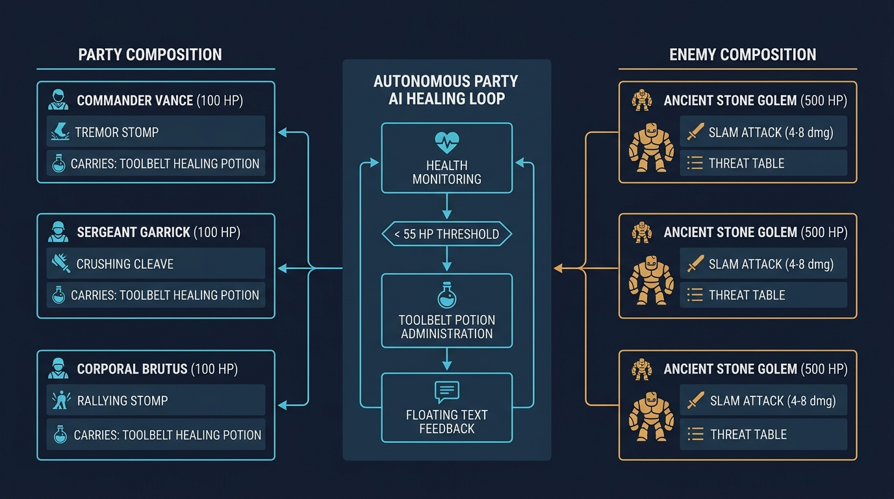
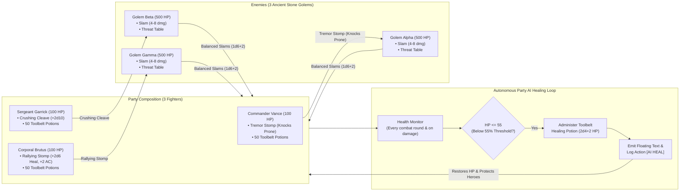

# Tactical Attrition Combat & Autonomous Party AI Healing Engine

The RobOS cRPG engine supports high-stakes tactical attrition encounters where parties of characters face durable, high-health opponents across prolonged real-time-with-pause (RTwP) combat rounds. To prevent player micromanagement fatigue and ensure survivability during attrition battles, the engine features an **Autonomous Party AI Healing Loop** paired with class-specific D&D 5e martial maneuvers.

---

## Technical Architecture Overview

---

## Fighter Martial Maneuvers

Each fighter possesses a specialized D&D 5e martial ability:

1. **Tremor Stomp** (`tremor-stomp`):
   - **School**: Martial Maneuver
   - **Effect**: Colossal ground slam dealing `2d8` bludgeoning damage and knocking the target **Prone**.
   - **Advantage Mechanic**: In `CombatManager.gd`, any melee attacks targeted at a creature with the `prone` condition roll with **Advantage** (taking the higher of two d20 rolls).

2. **Crushing Cleave** (`crushing-cleave`):
   - **School**: Martial Maneuver
   - **Effect**: Overpowering greatsword cleave adding `+2d10` slashing damage.

3. **Rallying Stomp** (`rallying-stomp`):
   - **School**: Martial Maneuver
   - **Effect**: War cry and defensive stomp restoring `2d6+2` hit points across all living party members and conferring a +2 AC defensive resolve bonus.

---

## Autonomous AI Healing Loop

During attrition combat against high-HP adversaries:
- Whenever a party member suffers damage or during regular combat ticks, `GameState.execute_party_auto_heal(55)` evaluates the health of all fighters.
- If any fighter's HP drops to or below **55 HP**, a party member consumes a `potion-healing` directly from their toolbelt.
- Potion consumption restores `2d4+2` (8–12 HP), logs `🧪 [AI HEAL] <Fighter> drinks Healing Potion! Restored X HP (Y -> Z/100)`, and floats green restorative numbers above their sprite.
- With 50 potions per fighter (150 total), the party can sustain hundreds of golem strikes without any risk of death.

---

## Balanced Golem Tuning

Ancient Stone Golems have 500 Hit Points each and an Armor Class of 14. Their Slam attack is tuned to `1d6+2` (4–8 damage) with a +4 attack bonus against the fighters' 18 AC:
- Moderate damage prevents any single-round burst deaths.
- The 100 HP fighters have ample rounds to react, allowing the autonomous healing engine to preserve all three heroes throughout the battle.
