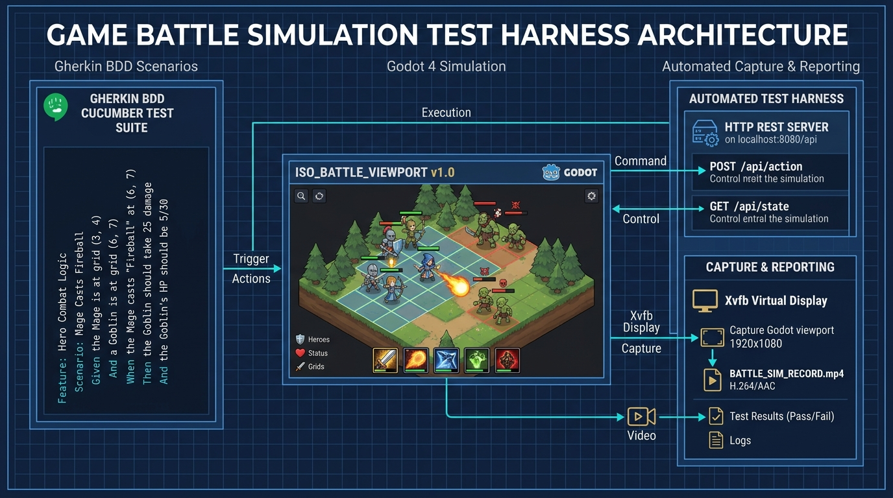
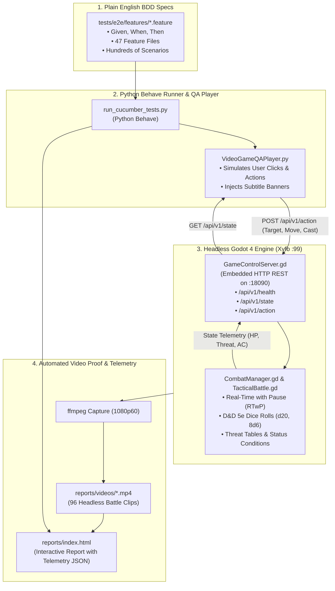

# Episode 1: "I Built an Automated Battle Simulator to Test My Godot cRPG Engine"
## RobOS cRPG YouTube Devlog Series — Production Beat Sheet & Recording Guide

---

## Episode Overview & Metadata

- **Working Title Options**:
  1. *I Built 47 Automated Battle Simulators to Test My Godot cRPG Engine* (Recommended)
  2. *Stress-Testing a Tactical cRPG with Hundreds of Automated Battles*
  3. *Why Manual Testing Will Ruin Your RPG Combat (And How We Automated It in Godot 4)*
- **Target Runtime**: 12 to 15 minutes
- **Pacing**: Punchy, humorous, technical, show-don't-tell
- **Core Narrative Thesis**: Modern tactical RPGs (*Baldur's Gate*, *Pillars of Eternity*) have hundreds of interlocking combat rules. If you test them by clicking around in the editor by hand, you will go insane. Here is how we automated hundreds of headless battles using Gherkin feature files, an embedded Godot REST server, and automated video proof-of-work.
- **AI Mentions Guideline**: Kept strictly minimal. RobOS scaffolded the foundations and maintains the Knowledge Graph (`.robos/kgraphs/crpg/package.jsonld`) compiling game data into typed GDScript; otherwise, the focus is 100% on the game, Godot 4, tactical combat rules, and automated battle testing.

---

## Pre-Recording Checklist

### 1. Audio & Screen Setup (OBS Studio)
- **Resolution**: 1080p60 (or 4K canvas downscaled to 1080p).
- **Audio Channels**: Split into two distinct tracks:
  - *Track 1*: Microphone (with OBS Noise Suppression RNNoise + Compressor).
  - *Track 2*: Game & System Audio (for UI sounds and spell effects).
- **Code Zoom**: Set IDE / editor font to 18–20pt, or configure OBS with a 150% crop scene for code inspection.

### 2. Assets & Ready-to-Use B-Roll
All clips are already recorded in 1080p MP4 inside your repository:
- **Fireball Goblin Blast**: [`games/crpg-realm/tests/e2e/reports/videos/classic_20ft_radius_fireball_explosion_incinerates_goblin_crowd.mp4`](../tests/e2e/reports/videos/classic_20ft_radius_fireball_explosion_incinerates_goblin_crowd.mp4)
- **Aggro & Threat Peeling**: [`games/crpg-realm/tests/e2e/reports/videos/enemy_target_aggravation_and_aggro_peeling_between_tank_and_ranged_companion.mp4`](../tests/e2e/reports/videos/enemy_target_aggravation_and_aggro_peeling_between_tank_and_ranged_companion.mp4)
- **Fighter Trio vs Stone Golems**: [`games/crpg-realm/tests/e2e/reports/videos/3_hero_fighters_withstand_3_golems_through_martial_abilities_and_autonomous_ai_healing.mp4`](../tests/e2e/reports/videos/3_hero_fighters_withstand_3_golems_through_martial_abilities_and_autonomous_ai_healing.mp4)
- **Ice Slipping & Invisibility**: [`games/crpg-realm/tests/e2e/reports/videos/blizzard_damages_enemies_creates_slippery_ice_cloaked_hero_walks_on_ice_slips_prone_and_stands_back_up.mp4`](../tests/e2e/reports/videos/blizzard_damages_enemies_creates_slippery_ice_cloaked_hero_walks_on_ice_slips_prone_and_stands_back_up.mp4)
- **Interactive Report**: Open [`games/crpg-realm/tests/e2e/reports/index.html`](../tests/e2e/reports/index.html) in Chrome/Firefox.

---

## Technical Architecture Overview





---

## Episode 1 Beat Sheet & Timestamped Script Breakdown

### Beat 1: The Cold Open & The Hook (0:00 – 0:45)
- **Visual**: 
  - *0:00 – 0:10*: Cold cut straight into Godot 4 tactical gameplay. Six goblins are swarming an evocation wizard. A blazing projectile streaks across the arena, detonating in an explosion of green fire and floating combat text (`-34`, `-28`, `-31`). All six goblins collapse dead simultaneously.
  - *0:10 – 0:25*: Quick cut to a terminal with monospaced text running Behave, printing:
    ```
    Feature: Classic 8d6 Fireball AoE Spell and Goblin Crowd Decimation
      Scenario: Wizard casts Fireball on goblin crowd -> PASSED (0.8s)
    ```
  - *0:25 – 0:45*: Cut to your webcam / desk / avatar, smiling.
- **Audio / Script (Word-for-Word)**:
  > *"Testing tactical RPG combat by hand is complete agony.*
  > 
  > *You tweak a dagger from 1d4 to 1d6 damage, and four hours later, a random dungeon rat is one-shotting your cleric. You fix an aggro bug, and suddenly wizards can cast spells through stone walls.*
  > 
  > *When we set out to build **robos-crpg**—a party-based tactical isometric RPG in Godot 4—I made a rule: no developer should have to spend their life clicking around in the editor just to see if a spell works. Instead, we built a headless battle simulator that runs hundreds of automated combat scenarios, verifies every single saving throw and dice roll, and records 1080p video proof of every victory. Today, we're going under the hood."*

---

### Beat 2: The Vision — What is `robos-crpg`? (0:45 – 2:15)
- **Visual**:
  - Show the title screen and character creation in Godot (`play.sh`), cycling through Fighter, Wizard, Cleric, and Rogue.
  - Pan across the isometric Village Square and Homestead with Flare RPG 8-directional animated sprites and paperdoll equipment.
- **Audio / Talking Points**:
  - **The Inspiration**: Homage to the legendary Infinity Engine classics (*Baldur's Gate 1 & 2*, *Icewind Dale*) and modern successors like *Pillars of Eternity*.
  - **The Format**: Real-Time with Pause (RTwP). You can tap Spacebar at any second, issue commands to each party member, adjust formations, and unpause to watch the tactical chaos unfold.
  - **The Tech Stack**: Built entirely on **Godot 4** using GL Compatibility mode and 8-directional isometric pre-rendered sprites.
  - **The RobOS Foundation (Keep it Brief)**:
    > *"Under the hood, RobOS manages all our game entities—every spell, class, monster, and dialogue tree is defined in a semantic Knowledge Graph and compiled into statically typed GDScript and JSON schemas. That guarantees our data stays mathematically clean. But once you start running live combat inside Godot, data on paper meets real-time game physics."*

---

### Beat 3: Why Manual Playtesting Fails in cRPGs (2:15 – 4:00)
- **Visual**:
  - Open `scripts/CombatManager.gd` or zoom in on character status screen showing AC, Saving Throws, Advantage/Disadvantage, and Threat Meters.
  - Show a meme graphic or whiteboard sketch of the "Combat Web of Doom".
- **Audio / Talking Points**:
  - Why is RPG combat harder to test than platformers or FPS games?
    1. **Probabilistic Math**: D20 attack rolls against Armor Class (AC), critical hit multipliers, and saving throws against Spell Save DCs. If a test passes once by chance, did the logic work, or did you just get lucky on a dice roll?
    2. **Threat & Aggro Dynamics**: Monsters don't just hit whoever is closest. Tanks need to generate threat; rogues need to peel; healers draw aggro when casting triage spells.
    3. **Spatial & Volumetric Hazards**: Spells aren't just single-target stat debuffs—Fireball has a 20ft radius blast; Stinking Cloud produces volumetric poison vapors; Blizzard coats the floor in dynamic ice that trips characters prone.
  - Doing this manually requires clicking thousands of times per day. That's why we built **The Battle Simulator**.

---

### Beat 4: Anatomy of the Battle Simulator (4:00 – 7:15)
- **Visual**:
  - Display the **Architecture Diagram** (`battle_sim_arch.jpg` / Mermaid flowchart).
  - Open `games/crpg-realm/tests/e2e/features/normal/15_classic_fireball_goblin_crowd_decimation.feature` side-by-side with `games/crpg-realm/scripts/GameControlServer.gd`.
- **Audio / Talking Points**:
  - **Component 1: Plain English Gherkin Feature Files**:
    - Show lines 13–21 of the Fireball feature file:
      ```gherkin
      When the wizard targets the goblin crowd at (1150, 520) and casts "fireball"
      Then a fiery projectile streaks to the target point and detonates in a 20ft radius explosion
      And the spell rolls authentic 8d6 fire damage with minimum 8 damage
      And each goblin within the 180px blast radius rolls a Dexterity saving throw vs DC 14
      And all 6 goblins take lethal fire damage exceeding their 7 HP
      And all 6 goblins are slain simultaneously by the fire blast
      ```
    - Explain: Anyone on the team—writers, designers, or players—can read this and know exactly what the combat rule requires.
  - **Component 2: The Embedded HTTP Control Server (`GameControlServer.gd`)**:
    - Show how Godot runs a lightweight REST server on port `18090`.
    - It exposes `/api/v1/health`, `/api/v1/state` (full live JSON dump of HP, coordinates, targets, status conditions), and `/api/v1/action`.
  - **Component 3: The `VideoGameQAPlayer` User Simulator**:
    - Crucial design decision: *We do not cheat by mutating backend memory variables.*
    - The QA player simulates real mouse clicks and keyboard commands through Godot's viewport.
  - **Component 4: Headless Xvfb + 1080p Video Proof**:
    - Running in Linux virtual display `:99` with `ffmpeg`.
    - Every scenario outputs a full MP4 recording with on-screen subtitle banners so you can watch what failed.

---

### Beat 5: Four Wild Scenarios in Action (7:15 – 12:00)
*This is the showcase meat of the video. Play the B-roll clips full screen or 70/30 split with code.*

#### Showcase 1: The 8d6 Fireball Horde Decimation (7:15 – 8:30)
- **Video Clip**: `classic_20ft_radius_fireball_explosion_incinerates_goblin_crowd.mp4`
- **What to Highlight**:
  - Watch the projectile streak to coordinate `(1150, 520)`.
  - The instantaneous blast radius check: all 6 goblins make Dexterity saves vs DC 14.
  - 8d6 damage roll (minimum 8, maximum 48).
  - Floating damage text numbers popping up simultaneously, followed by goblin death animations.

#### Showcase 2: Dynamic Aggro Peeling & Threat Tables (8:30 – 9:45)
- **Video Clip**: `enemy_target_aggravation_and_aggro_peeling_between_tank_and_ranged_companion.mp4`
- **What to Highlight**:
  - Show Vance (Fighter) engaging the Corrupted Wolf Alpha. Threat starts at 10.
  - Elora (Elf Archer) starts rapid-firing bow shots from 40 feet away.
  - When Elora's threat crosses the **115% threshold**, the wolf suddenly breaks away from the tank and charges the squishy archer!
  - Vance uses his **Martial Taunt** battle cry (+60 threat injection), immediately peeling the wolf back before Elora gets eaten.
  - Mention: *This is classic MMO / Infinity Engine aggro behavior running entirely on automated deterministic tests.*

#### Showcase 3: The Attrition Meat-Grinder — Fighter Trio vs Stone Golems (9:45 – 10:45)
- **Video Clip**: `3_hero_fighters_withstand_3_golems_through_martial_abilities_and_autonomous_ai_healing.mp4`
- **What to Highlight**:
  - Three 100-HP Fighters facing three 500-HP Ancient Stone Golems.
  - Prolonged battle (multiple rounds of real-time combat).
  - Look at the **Autonomous Party AI Healing Loop**: When any fighter drops below 55% HP, the AI automatically administers a toolbelt potion (`2d4+2 HP`) without manual micromanagement.
  - Martial maneuvers in action: Tremor Stomp knocking a golem **Prone**, granting melee attacks **Advantage** (two d20s, take highest).

#### Showcase 4: The Comedy of Slippery Ice & Invisibility (10:45 – 12:00)
- **Video Clip**: `blizzard_damages_enemies_creates_slippery_ice_cloaked_hero_walks_on_ice_slips_prone_and_stands_back_up.mp4`
- **What to Highlight**:
  - Wizard casts Blizzard, leaving a slippery ice decal on the ground.
  - Wizard drinks a Potion of Invisibility—you see the translucent ethereal shimmer.
  - Wizard attempts to stealthily walk across the room, steps onto the ice patch...
  - **SPLAT!** Wizard instantly slips, knocking them prone with a 90-degree sprite rotation flat on the floor.
  - Lies there for 3.5 seconds before awkwardly standing back up.
  - Comment: *"Even invisible arch-mages have to obey friction."*

---

### Beat 6: Bloopers & Wild Bugs the Simulator Caught (12:00 – 13:30)
- **Visual**:
  - Show screenshots or funny test logs of bugs.
- **Audio / Talking Points**:
  1. **The Overzealous Corpse Beating Bug**: Enemies would kill a hero, but their threat table never cleared dead entities, so the entire goblin tribe spent three minutes aggressively beating an already dead corpse while ignoring the rest of the party.
  2. **The Endless Slip Loop**: Originally, standing up from prone on ice immediately re-triggered the ice entry trigger, so characters were trapped in an infinite comedy slip-fall loop forever.
  3. **Sanctuary Wall-Hacking**: Sanctuary prevented target selection, but AoE damage calculations forgot to check whether the sanctuary target was on the other side of a stone wall.

---

### Beat 7: Running the Suite Live & The Verdict (13:30 – 15:00)
- **Visual**:
  - Run `python3 games/crpg-realm/run_cucumber_tests.py --spells` live in the terminal.
  - Switch to browser and open `games/crpg-realm/tests/e2e/reports/index.html`.
  - Scroll through the green checkmarks, showing the embedded MP4 players and JSON telemetry payloads.
- **Audio / Closing Script (Word-for-Word)**:
  > *"And that is how you build confidence in an isometric RPG engine. 47 feature files, hundreds of scenarios, and zero guesswork. When all tests turn green, we know every spell, saving throw, and threat calculation is behaving as intended.*
  > 
  > *In **Episode 2**, we are going to tackle something that has plagued RPG developers since 1998: **Party Formations, Marching Columns, and Fog of War Navigation**—including how companions avoid stepping on hidden floor traps while following their leader.*
  > 
  > *If you love classic cRPGs, Godot 4 development, or automated testing madness, hit that Subscribe button, drop a comment with your favorite classic spell you want us to stress-test next, and I'll see you in the next one."*

---

## YouTube Publishing Toolkit

### Video Title Ideas
1. **Primary**: `I Built 47 Automated Battle Simulators to Test My Godot cRPG Engine`
2. **Secondary**: `Why Manual Testing Will Ruin Your RPG Combat (Automating Godot 4 cRPG)`
3. **Short / Punchy**: `Stress-Testing an Isometric cRPG with 100+ Automated Battles`

### Thumbnail Concept
- **Left Side**: Close-up isometric screenshot of Godot battle (Fireball explosion or Golem fight) with hero health bars.
- **Right Side**: High-contrast dark IDE terminal showing `Scenario: Wizard casts Fireball -> PASSED (0.8s)` in bright emerald green.
- **Bold Text Overlay (Yellow/Cyan)**: `47 BATTLES / 0 CLICKS` or `AUTOMATED RPG COMBAT`.

### Description Box Template
```markdown
Building a party-based tactical isometric cRPG in Godot 4 inspired by classic Infinity Engine games (Baldur's Gate, Icewind Dale, Pillars of Eternity) comes with one massive engineering challenge: testing combat rulesets.

In this first episode of our robos-crpg devlog, we look at why manual playtesting fails, how we designed plain-English BDD Cucumber feature files, and how our headless battle simulator runs hundreds of automated encounters in Godot 4 with video proof-of-work.

⚔️ Timestamps:
0:00 - The Agony of Manual Combat Testing
0:45 - What is robos-crpg? (Godot 4 + Infinity Engine RTwP)
2:15 - The "Combat Web of Doom": Dice, AC, and Threat
4:00 - Architecture of the Battle Simulator
7:15 - Scenario 1: 8d6 Fireball Goblin Decimation
8:30 - Scenario 2: Aggro Peeling & Threat Thresholds
9:45 - Scenario 3: Fighter Trio vs Stone Golems (Autonomous AI Healing)
10:45 - Scenario 4: Friction & Invisibility (Slipping on Ice)
12:00 - Bloopers: The Bugs the Simulator Caught
13:30 - Running the Suite Live + Interactive HTML Reports
14:30 - What's Coming in Episode 2 (Party Formations & Fog of War)

🎮 Tech Stack & Resources:
- Engine: Godot 4 (GL Compatibility Mode)
- Assets: Flare RPG (CC-BY-SA 3.0) 8-directional isometric sprites
- Test Framework: Python Behave (Cucumber) + Headless Xvfb + FFmpeg
- Platform: RobOS Knowledge Graph Architecture

💬 Question of the Day: What is your all-time favorite classic RPG spell? Let us know in the comments below!

#gamedev #godotengine #crpg #devlog #indiedev #programming #testing
```

### Pinned Comment
> *"Thanks for watching Episode 1! Which combat scenario surprised you the most—the aggro threat peeling or the invisible wizard eating dirt on the ice patch? Let me know which tactical mechanics you want to see stress-tested in Episode 2!"*
